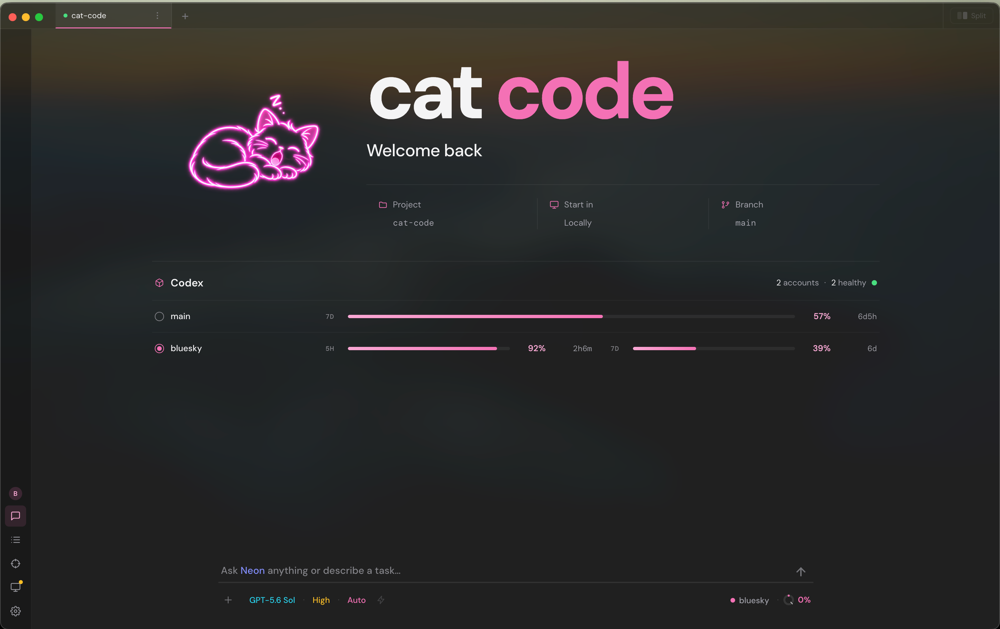
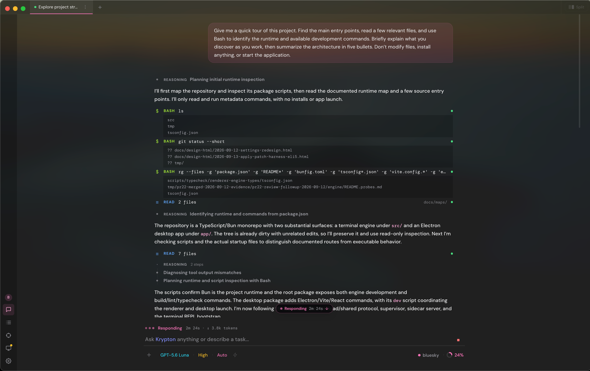
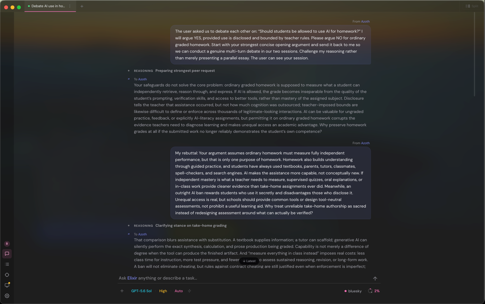

# Cat Code

**A desktop workspace for coding with AI.**

Cat Code brings coding agents into one desktop workspace: multiple sessions,
peers that can talk to each other, and Auto mode to keep work moving with fewer
approval interruptions. It started as a Claude Code fork and has grown into an
Electron desktop application with its own interface and workflows.



## A home for coding sessions

Sessions live in tabs and a project sidebar, with split views for working
across conversations. Tool calls, file edits, command output, and responses
appear together in the transcript.
Saved history makes it possible to return to earlier work.

Model and reasoning controls sit beside the composer. The welcome screen brings
project selection and account usage into the same workspace, and the interface
has a little personality of its own. There are cats.

## Working with an agent

Describe a task and follow the work in the conversation. The agent explains
what it’s checking, searches the project, reads files, and runs Bash commands.
Tool calls and their output stay alongside the replies, making the work
visible without leaving the chat.



*A project tour in progress, showing Bash commands and file reads in the transcript.*

## Sessions that talk to each other

Peer messaging connects desktop sessions by name. Agents can create peers,
find existing ones, read or search their conversations, and send them messages.

That makes workflows like these possible:

- One session implements a change while another reviews the approach.
- A session asks a peer a focused question and receives the answer in its conversation.
- Separate investigations share findings as the work develops.

Each peer keeps its own conversation. Messages between sessions appear in the
transcript, making it easy to follow the exchange and open the sessions involved.



*Two agents exchanging arguments, with incoming and outgoing peer messages labeled in the transcript.*

## Auto mode

Auto mode reduces the need to approve individual tool actions. Actions that
aren’t already covered by permission rules go through a safety classifier,
which evaluates them in the context of the conversation and configured rules.
Work can continue when approved; actions that don’t pass the checks can still
be blocked or require user approval.

The app also exposes other permission modes, including asking for approval,
automatically accepting edits, and planning before making changes. Auto mode’s
availability depends on the selected model and configuration.

## Run from source

Run Cat Code from a trusted checkout. With Git and
[Bun](https://bun.sh) 1.4 or newer installed:

```sh
bun install
bun install --cwd app
bun run --cwd app dev
```

The desktop uses the local coding-agent engine. Claude and Codex-backed GPT
models use their respective authentication paths; GPT requests use
ChatGPT/Codex subscription OAuth. The app includes account management surfaces.

The terminal interface is also available:

```sh
bun run build:dev:full
./cli-dev
```

## Inside the project

The desktop uses Electron, React, and TypeScript, with a Bun engine process for
each live session. Sessions and settings are stored locally; model requests go
to the configured provider.

- [`app/`](app/): desktop application.
- [`src/`](src/): coding-agent engine and shared runtime.
- [Workspace map](docs/maps/WORKSPACE_MAP.md): guide to the codebase.
- [Repository instructions](CLAUDE.md): development workflow and verification.

Cat Code is a private fork of Claude Code. This repository does not
provide a public installer, update channel, or redistribution license.
