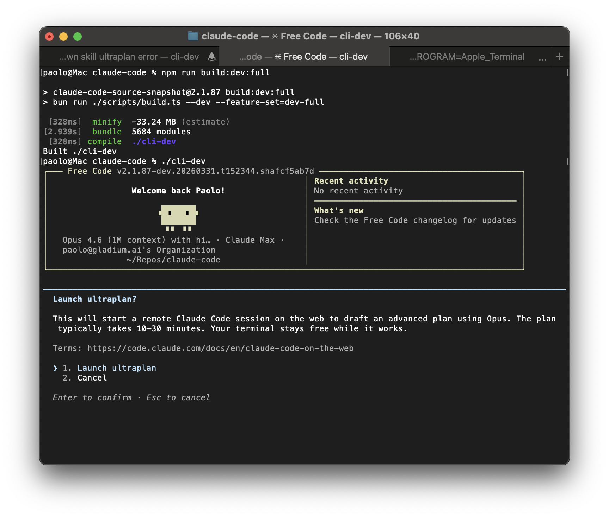

# Cat Code

<p align="center">
  
</p>

<h1 align="center">Cat Code</h1>

<p align="center">
  <strong>A personal always-on agent system.</strong><br>
  Built on a Claude Code fork. All telemetry stripped. All guardrails removed. All experimental features unlocked.<br>
  One binary, zero callbacks home.
</p>

---

## Quick Install

```bash
git clone https://github.com/paoloanzn/free-code.git
cd free-code
bun install
bun run build:dev:full
./cli-dev
```

Then run `cat-code` and use the `/login` command to authenticate with your preferred model provider.

---

## Table of Contents

- [What is this](#what-is-this)
- [Model Providers](#model-providers)
- [Quick Install](#quick-install)
- [Requirements](#requirements)
- [Build](#build)
- [Usage](#usage)
- [Experimental Features](#experimental-features)
- [Project Structure](#project-structure)
- [Tech Stack](#tech-stack)
- [Contributing](#contributing)
- [License](#license)

---

## What is this

Cat Code is a personal always-on agent system, forked from Anthropic's [Claude Code](https://docs.anthropic.com/en/docs/claude-code) CLI. It is being transformed from a coding assistant into a general-purpose personal agent that also codes.

See [docs/vision/GOAL_PLAN.md](docs/vision/GOAL_PLAN.md) for the full vision and milestones.

### Telemetry removed

All outbound telemetry endpoints are dead-code-eliminated or stubbed. No crash reports, no usage analytics, no session fingerprinting.

### Security-prompt guardrails removed

The upstream system-level prompt-injection restrictions are stripped. The model's own safety training still applies.

### Experimental features unlocked

All 54 working feature flags are unlocked in the `build:dev:full` build. See [docs/reference/feature-flags-audit.md](docs/reference/feature-flags-audit.md) for the full audit.

---

## Model Providers

Cat Code supports **five API providers** out of the box. Set the corresponding environment variable to switch providers.

### Anthropic (Direct API) -- Default

| Model | ID |
|---|---|
| Claude Opus 4.6 | `claude-opus-4-6` |
| Claude Sonnet 4.6 | `claude-sonnet-4-6` |
| Claude Haiku 4.5 | `claude-haiku-4-5` |

### OpenAI Codex

```bash
export CLAUDE_CODE_USE_OPENAI=1
cat-code
```

### AWS Bedrock

```bash
export CLAUDE_CODE_USE_BEDROCK=1
export AWS_REGION="us-east-1"
cat-code
```

### Google Cloud Vertex AI

```bash
export CLAUDE_CODE_USE_VERTEX=1
cat-code
```

### Anthropic Foundry

```bash
export CLAUDE_CODE_USE_FOUNDRY=1
export ANTHROPIC_FOUNDRY_API_KEY="..."
cat-code
```

---

## Requirements

- **Runtime**: [Bun](https://bun.sh) >= 1.3.11
- **OS**: macOS or Linux (Windows via WSL)
- **Auth**: An API key or OAuth login for your chosen provider

---

## Build

```bash
bun install
bun run build:dev:full
./cli-dev
```

### Build Variants

| Command | Output | Features | Description |
|---|---|---|---|
| `bun run build` | `./cli` | `VOICE_MODE` only | Production-like binary |
| `bun run build:dev` | `./cli-dev` | `VOICE_MODE` only | Dev version stamp |
| `bun run build:dev:full` | `./cli-dev` | All 54 experimental flags | Full unlock build |
| `bun run compile` | `./dist/cli` | `VOICE_MODE` only | Alternative output path |

---

## Usage

```bash
# Interactive REPL (default)
cat-code

# One-shot mode
cat-code -p "what files are in this directory?"

# Specify a model
cat-code --model claude-opus-4-6

# OAuth login
cat-code /login
```

---

## Experimental Features

The `bun run build:dev:full` build enables all 54 working feature flags. See [docs/reference/feature-flags-audit.md](docs/reference/feature-flags-audit.md) for the complete audit.

---

## Project Structure

For a routing-oriented inspection map aimed at AI agents, see [docs/reference/WORKSPACE_MAP.md](docs/reference/WORKSPACE_MAP.md).

```
scripts/
  build.ts                # Build script with feature flag system

src/
  entrypoints/cli.tsx     # CLI entrypoint
  commands.ts             # Command registry (slash commands)
  tools.ts                # Tool registry (agent tools)
  QueryEngine.ts          # LLM query engine
  screens/REPL.tsx        # Main interactive UI (Ink/React)

  commands/               # /slash command implementations
  tools/                  # Agent tool implementations (Bash, Read, Edit, etc.)
  components/             # Ink/React terminal UI components
  hooks/                  # React hooks
  services/               # API clients, MCP, OAuth, analytics
  state/                  # App state store
  utils/                  # Utilities
  skills/                 # Skill system
  plugins/                # Plugin system
  bridge/                 # IDE bridge
  voice/                  # Voice input
  tasks/                  # Background task management
```

---

## Tech Stack

| | |
|---|---|
| **Runtime** | [Bun](https://bun.sh) |
| **Language** | TypeScript |
| **Terminal UI** | React + [Ink](https://github.com/vadimdemedes/ink) |
| **CLI Parsing** | [Commander.js](https://github.com/tj/commander.js) |
| **Schema Validation** | Zod v4 |
| **Code Search** | ripgrep (bundled) |
| **Protocols** | MCP, LSP |
| **APIs** | Anthropic Messages, OpenAI Codex, AWS Bedrock, Google Vertex AI |

---

## Contributing

Contributions are welcome.

1. Fork the repository
2. Create a feature branch (`git checkout -b feat/my-feature`)
3. Commit your changes
4. Open a Pull Request

---

## Private repo publish checklist

Before pushing this project to any remote (including a private GitHub repo):

1. Verify no secrets are staged:
   - `git status`
   - `git diff --staged`
2. Confirm sensitive local files are ignored by git:
   - `.env`, `.env.*`
   - `*.pem`, `*.key`, `*.p12`, `*.pfx`, `*.jks`, `*.keystore`
3. Confirm your remote target:
   - `git remote -v`
   - ensure `origin` points to your own private repository
4. If available, run a history secret scan before first publish:
   - `gitleaks git --verbose`

---

## License

The original Claude Code source is the property of Anthropic. This fork exists because the source was publicly exposed through their npm distribution. Use at your own discretion.
