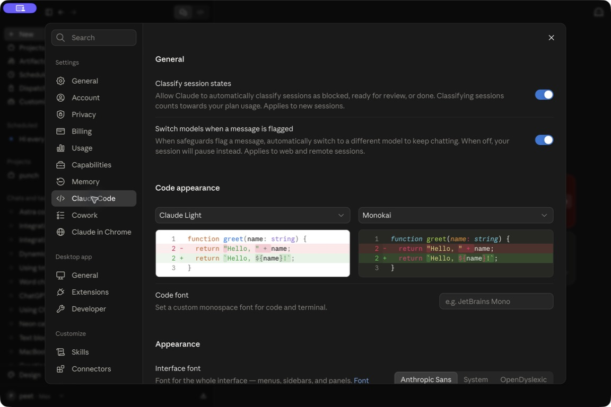
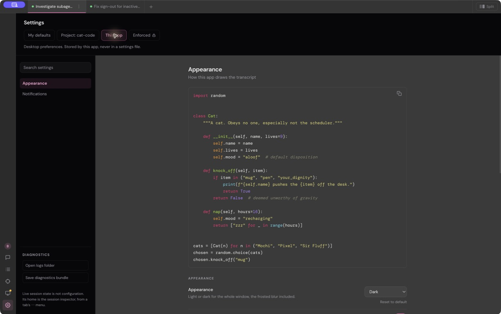
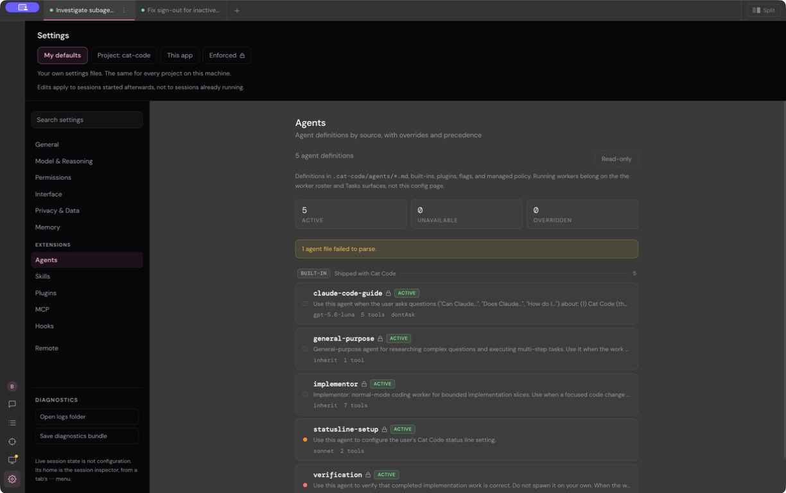
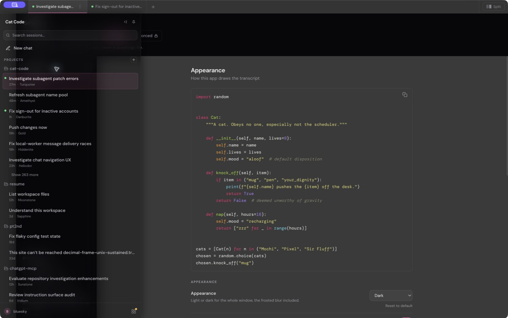
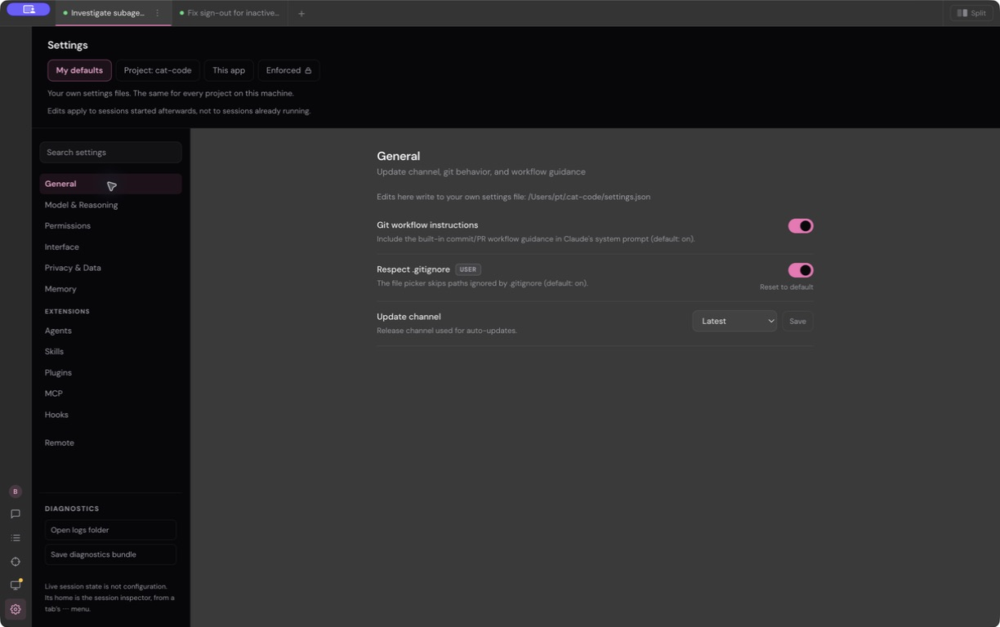

# Cat Code settings: comparison and proposed redesign

Reviewed September 12, 2026. Scope: report and design proposal only.

**The main problem is hierarchy. Cat Code makes you understand its storage layers and internal inventories before it helps you change a preference.** The large previews, small text, uneven surfaces, and unreliable search make that structural problem more visible. A useful redesign needs to change navigation and discovery as well as spacing.

My recommendation is to borrow the clear rows and compact, control-adjacent previews from **Claude desktop → Settings → Claude Code**, retain Cat Code’s own typography and accent, and provide stronger search and scope handling than either app currently offers.

[Interactive proposed design](../design-html/2026-09-12-settings-redesign.html)

## What I actually inspected

| Reference | Evidence | Limits |
| --- | --- | --- |
| Cat Code Dev | Live Settings: Agents landing, General, Model & Reasoning, This app → Appearance, and search. Screenshots and accessibility labels recorded. Source reviewed around HEAD `d73afe99608bb68286d6e2ef5ad298c8f8c251ed`. | Running development app and a shared working tree with other sessions’ edits. No saved preference was intentionally changed. Save persistence, keyboard traversal, and alternate window sizes were not tested in the production app. |
| Claude desktop → Claude Code | Live installed app, version **1.52386.3**. Opened Settings → Claude Code; inspected sections, controls, previews, and search. | This is the desktop Code settings page, not the terminal `/config` dialog. No preference, permission, account, or token was changed. |
| Claude Code terminal | Current official settings documentation and changelog. | Documentation comparison only; terminal UI not launched. |
| Zed | Official settings-design illustration viewed in the browser, plus current AI-settings documentation. | The December 12, 2025 illustration is explicitly a design comparison, not a current installed-app capture. |
| VS Code | Official settings documentation and its expanded settings screenshot, viewed in the browser. | Supporting reference for search and scope; not the primary harness comparison. |
| Cursor | Official version 1.0 changelog inspected in the browser. | Historical June 4, 2025 material. Settings images did not render during inspection, so no visual conclusions rely on Cursor. |

Screenshots use the apps’ existing window sizes and zoom levels. They support observations about grouping and order, not a controlled pixel-size or contrast-ratio comparison.

## The most useful comparison: Claude Code



Claude’s Code page presents ordinary section headings, setting names on the left, and consistent controls on the right. In the captured viewport, **Code appearance** contains two theme pickers with short previews immediately below them. The relationship between action and result is apparent. The **Code font** control follows in the same section.

Cat Code’s Appearance page reverses that relationship: a long Python sample comes first, while its **Code theme** control is much farther down, below other transcript controls. The preview consumes most of the first viewport before a person reaches their first setting.



Claude is not an ideal template in every respect. Its Code page is long, the broader settings sidebar has two General entries, and **searching “theme” returned “No matching settings” while theme pickers were visible**. That search failure is directly observed, not inferred from source.


The terminal provides another useful distinction: `/config` is a curated set of personal preferences, while detailed configuration lives in scoped files. The desktop uses its own settings interface. That supports a focused front page with advanced configuration available behind it; it does not justify copying a JSON reference onto the page. [Claude Code settings documentation](https://code.claude.com/docs/en/settings)

Claude’s changelog records settings filtering in terminal `/config` in version 2.1.6, January 13, 2026. This is evidence for filtering actual options, not evidence that the desktop search above works. [Claude Code changelog](https://code.claude.com/docs/en/changelog)

## Cat Code findings and concrete fixes

### 1. The first page is an agent inventory

**Confirmed live and in source.** Opening Settings leads to **Agents**, with definition counts, a read-only label, technical descriptions, and an agent-file parse warning. These may be useful in an agent manager; they are a poor first answer to “change my settings.” The entry point explicitly passes `initialCategory="agents"`: [App.tsx:4302](/Users/pt/cat-code/app/renderer/src/App.tsx:4302).

**Proposed fix:** open General on first entry and remember the last useful category during the app run. Keep Agents in the Extensions group, with the inventory’s source information intact. An agent error should be actionable in that destination, rather than defining the whole settings experience.



### 2. Search promises more than it does

**Confirmed live and in source.** In This app → Appearance, typing **code theme** produces **No matches** in the sidebar, although the accessibility tree contains an actual **Code theme** control. The main page remains visible and unchanged.

Search filters the current scope’s navigation. Its index excludes Appearance’s individual control labels, and the page body is rendered independently of the query: [settingsScope.ts:428](/Users/pt/cat-code/app/renderer/src/settingsScope.ts:428), [SettingsShell.tsx:391](/Users/pt/cat-code/app/renderer/src/SettingsShell.tsx:391).

**Proposed fix:** search across actual setting names, descriptions, and useful synonyms. Results must show the setting, its category, and where it applies. Selecting **Code theme · Appearance · This app** should reveal and focus that control. Keep the navigation stable. A missing result must replace the results area with a clear empty state, not contradict the page underneath.



### 3. Scope is acting as a second navigation system

**Confirmed live and in source.** My defaults and Project expose one collection of categories; This app replaces it with Appearance and Notifications. Appearance is hidden from the initial navigation, while Interface is elsewhere. This requires knowing where a setting is stored before knowing where to find it.

The mismatch is deeper for extension inventories: My defaults and Project receive the same complete Agents/Skills/Plugins/MCP/Hooks snapshots without a corresponding scope filter. See [settingsScope.ts:384](/Users/pt/cat-code/app/renderer/src/settingsScope.ts:384) and [SettingsShell.tsx:585](/Users/pt/cat-code/app/renderer/src/SettingsShell.tsx:585).

**Proposed fix:** keep category navigation stable. Put target selection beside the editable category heading: **My defaults / Project**; Project adds **Shared / Just me**. Appearance carries **This app**. Combined inventories state the project context and offer source filters of their own. Keep policy read-only and surface a lock on affected rows.

This changes presentation, not precedence. Never merge personal, shared-project, local-project, and app storage or silently redirect a write.

### 4. Layout and text hierarchy make the page feel unfinished

**Observed design problem, with source measurements.** Cat Code’s large dark header and rail meet a much lighter gray content area in the captured appearance. The content floats in the middle of the available space. A General page with only three settings leaves most of the screen unused while instructions and diagnostics remain prominent.

Source uses a 240px rail and centered 660px maximum content width. Labels are 13px; descriptions are 11.5px; some notes are 10.5px. See [SettingsShell.tsx:305](/Users/pt/cat-code/app/renderer/src/SettingsShell.tsx:305), [SettingsShell.tsx:377](/Users/pt/cat-code/app/renderer/src/SettingsShell.tsx:377), [SettingsField.tsx:158](/Users/pt/cat-code/app/renderer/src/SettingsField.tsx:158). The screenshot reflects the existing frosted-window appearance; it does not establish a particular hardcoded gray or an accessibility contrast failure.

**Proposed fix:** a compact title/search header, a stable rail, and a readable content column aligned nearer that rail. Target approximately 14px setting labels and 13px descriptions, with generous line height. Use one coherent settings background, restrained dividers, and the existing pink only for selection and control state. Preserve the user’s overall appearance choice. Move file paths and uncommon provenance details into row details.



### 5. Saving and resetting need clearer meaning

**Source-confirmed behavior; persistence not exercised.** Toggles and selects write on change. Numeric fields commit on blur or Enter. An unset select also shows **Save** to pin the value already displayed. That button does not mean the surrounding page has unsaved changes: [SettingsEditors.tsx:406](/Users/pt/cat-code/app/renderer/src/SettingsEditors.tsx:406).

**Reset to default** removes an override from the chosen layer, which can reveal an inherited value rather than a factory default: [SettingsField.tsx:184](/Users/pt/cat-code/app/renderer/src/SettingsField.tsx:184). Successful write acknowledgements intentionally produce no toast, and there is no per-row save state supplied here: [verbAckResultState.ts:294](/Users/pt/cat-code/app/renderer/src/verbAckResultState.ts:294).

**Proposed fix:** retain immediate saving for ordinary preferences, add restrained Saving/Saved/Failed feedback based on the real acknowledgement, and rename pinning to **Set for this scope**. Use **Use inherited value** for layered overrides and **Reset to default** only when that is the actual result. Retain validation and confirmation for destructive retention changes. Do not add a global Save button unless the whole form truly stages edits.

### 6. The page advertises unavailable or misleading controls

**Source-confirmed.** Notifications says **Not built yet**; keyboard shortcuts have an unknown-value placeholder; Permissions does not provide rule editing. [SettingsShell.tsx:716](/Users/pt/cat-code/app/renderer/src/SettingsShell.tsx:716), [SettingsShell.tsx:750](/Users/pt/cat-code/app/renderer/src/SettingsShell.tsx:750), [SettingsShell.tsx:662](/Users/pt/cat-code/app/renderer/src/SettingsShell.tsx:662).

There is also a concrete dependency defect: the terminal syntax-highlighting preference disables the desktop Code theme picker even though the desktop transcript still installs highlighting. [SettingsShell.tsx:954](/Users/pt/cat-code/app/renderer/src/SettingsShell.tsx:954), [markdownPlugins.ts:6](/Users/pt/cat-code/app/renderer/src/markdownPlugins.ts:6), [CodeThemePreview.tsx:26](/Users/pt/cat-code/app/renderer/src/CodeThemePreview.tsx:26). This was not triggered in the live inspection.

**Proposed fix:** omit empty primary destinations, give read-only destinations useful explanations and supported actions, and remove the false theme dependency. Keep genuine policy locks. Adding permission-rule editing is separate work with its own security requirements.

### 7. Some preferences depend on having a chat session

**Source-confirmed, not reproduced by closing live sessions.** Settings snapshots and writes route through the active session. Without one, the editor asks for a session and substitutes unknown values. [App.tsx:4299](/Users/pt/cat-code/app/renderer/src/App.tsx:4299), [SettingsEditors.tsx:128](/Users/pt/cat-code/app/renderer/src/SettingsEditors.tsx:128).

**Proposed fix:** ultimately load durable settings independently of a chat. That requires an explicit read/write ownership change; a visual redesign cannot honestly solve it by enabling disconnected controls. Until then, use one clear empty state and a route to open a session. Do not silently start a model task.

## Supporting patterns worth borrowing

| Reference | Useful pattern | Cat Code application |
| --- | --- | --- |
| [Zed settings redesign](https://zed.dev/blog/settings-ui) | Category navigation, controls on the right, and a focused settings surface. The published comparison explores a separate window versus a tab. | Keep settings internally coherent. A new native window is optional and is not required for this proposal. |
| [Zed AI settings](https://zed.dev/docs/ai/agent-settings) | AI configuration routes providers, external agents, and MCP servers into dedicated subpages. | Give complex extension inventories their own details instead of making each look like a generic preference row. |
| [VS Code settings](https://code.visualstudio.com/docs/configure/settings) | Search filters real settings; User/Workspace scope, changed-setting markers, reset actions, and a modified-settings filter are explicit. | Adopt these discovery and recovery ideas without importing the editor’s full category tree. |

## Proposed navigation and behavior

The HTML proposal makes the structure tangible. It demonstrates General, Appearance, Model & reasoning, cross-category search, and scope selection. Other destinations use representative examples or empty states. It uses sample values kept only in page memory. It is not connected to Cat Code and does not establish implementation completeness. The browser security policy blocked opening its local file URL; the preview has not been visually verified or driven in the browser.

| Group | Destinations |
| --- | --- |
| Preferences | General, Appearance, Model & reasoning, Permissions, Privacy & data, Memory |
| Extensions | Agents, Skills, Plugins, MCP servers, Hooks |
| Advanced | Remote, Diagnostics, Policies |

Preserve Interface’s existing settings by regrouping each deliberately: app appearance in Appearance; response behavior in Model & reasoning or General; terminal-only preferences clearly identified. **Reasoning display** and **Reasoning layout** remain different settings. Keep active-session model/effort controls in the session; the prototype must not invent an editable persisted effort field. Accounts remains in its existing dedicated app destination.

The demonstrated layout keeps DM Sans, DM Mono, and Cat Code’s existing pink accent. Appearance controls come before their associated compact previews. Scope is local to the relevant settings. Search crosses categories and leads to the actual control.

## Suggested implementation order and acceptance

1. **First visible improvement:** correct the landing destination, shorten the header, improve row readability, and move previews beside their controls. Verify General, Appearance, and Model pages at the user’s normal window size and in a narrower window.
2. **Navigation and search:** build a shared index of actual settings, preserve stable categories, and make results focus their controls. Verify `code theme`, `accent`, `default model`, and `retention`, including no matches and keyboard selection.
3. **Scope and save clarity:** verify My defaults, Shared project, and Just me write to exactly their chosen targets; exercise inherited values, policy locks, saving failures, reset, and pinning an unchanged inherited value.
4. **Finish misleading states:** remove empty navigation entries, fix the false theme dependency, and make extension inventories’ context honest. Test no-session behavior without pretending the underlying session dependency is gone.
5. **Separate architectural follow-up:** make durable settings independent of chat sessions, preserving the validated settings writer and trust boundaries. This should not delay the basic visual improvements.

No implementation estimate is given: scope/state work is materially larger than layout work, and there are concurrent changes in the shared tree. No production implementation, STATUS entry, or DONE entry is part of this report.

## Verification

Live labels recorded: Cat Code **Settings**, **Agents**, **General**, **Model & Reasoning**, **This app**, **Appearance**, **Code theme**, **No matches**; Claude **Claude Code**, **Code appearance**, **Code font**, **No matching settings**. Search text was cleared after inspection; Claude’s settings dialog was closed. No save, permission, billing, account, or token action was used.

The report and preview are checked as documentation/design artifacts. Production app acceptance remains pending implementation. The standalone HTML remains untracked so the design can be revised or discarded separately from the evidence report.

```text
VERIFICATION
- git -c core.fsmonitor=false diff --check: clean.
- Report local-link check: 26 links, zero missing targets; no trailing whitespace.
- bun run maps:lint: passed, 17 maps, 7 warnings in unrelated map files.
- node --check /private/tmp/catcode-settings-proposal-check.js: passed (script extracted from HTML).
- node - (preview script in Node vm with stub document): 10 checks passed for inheritance,
  reset, app isolation, search-result markup, policy read-only markup, and destination rendering.
- Preview resource checks: both local fonts exist; no remote URLs or trailing whitespace.
Stale-reference sweep: not applicable; no production rename or interface change.
Not run: preview visual/interaction checks; browser security blocked its local file URL.
Not run: production builds and tests; no production source edited by this task.
```

The Node checks exercise data and generated markup only. They do not verify real DOM events,
keyboard focus, scrolling, responsive layout, or persistence in Cat Code.
