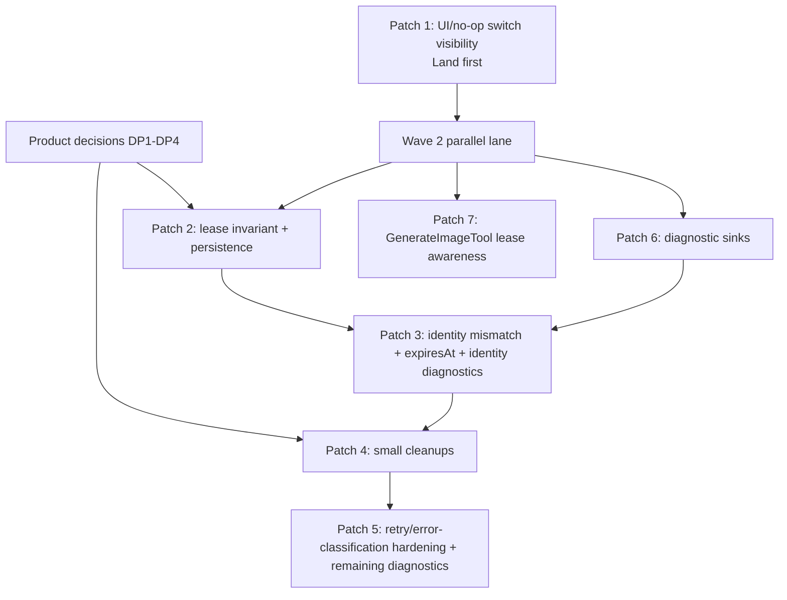

# Account Switching Fixes Implementation Plan

> **For agentic workers:** REQUIRED SUB-SKILL: Use superpowers:subagent-driven-development (recommended) or superpowers:executing-plans to implement this plan task-by-task. Steps use checkbox (`- [x]`) syntax for tracking.

**Goal:** Fix Codex account switching drift across UI, lease routing, persistence, identity refresh, diagnostics, retry behavior, and image generation.

**Architecture:** Treat the Codex lease map as request-routing truth and `pool.activeIndex` as global active-session state. Manual/global account changes may update and persist active state; lease-local failover must stay lease-local. Diagnostic additions must be observable before new emitters are added.

**Tech Stack:** Bun tests, TypeScript, Ink/React terminal UI, Codex account pool/lease modules, SDK stream-json diagnostics, bridge transport, dedicated app runtime.

---

## Source Inputs

- Primary investigation: `docs/reports/2026-05-20-account-switching-bug-report.md`, especially §§15-16.
- Routing maps read before planning: `docs/maps/WORKSPACE_MAP.md`, `docs/maps/auth-accounts-oauth.md`, `docs/maps/codex-core.md`, `docs/maps/terminal-ui-state.md`, `docs/maps/analytics-diagnostics.md`, `docs/maps/bridge-remote-cli.md`, `docs/maps/dedicated-app.md`.
- Repo rule: docs-only changes should run `git diff --check`; behavior changes should use `bun run build:dev:full` rather than `bun run build`.

This plan intentionally contains no implementation code. The writing-plans skill normally asks for code snippets, but the direct user instruction for this deliverable was plan only.

## Decision Points From §16.3

These are product decisions. Do not implement gated behavior until the owner chooses an answer.

| ID | Question | Blocks | Notes |
|---|---|---|---|
| DP1 | Manual `/switch-account` propagation scope: only main, main + follow-main subagents, all subagents, or only future subagents? | Patch 2 | The report recommends main + follow-main subagents, leaving spread leases alone on switch. Do not bake this in without product confirmation. |
| DP2 | Should `fetchPoolUsage` be observational only, or may usage polling mutate account health and active selection? | Patch 2, Patch 5 | Current behavior mutates account health and may reroll active account. |
| DP3 | Turn-based rotation: keep and wire `codexAccountRotationThreshold`, or delete it completely? | Patch 4 | Partial cleanup is not acceptable. |
| DP4 | Is it acceptable that `/accounts` can change active account as a read-side effect? | Patch 2, Patch 5 | This is a specific case of DP2 and should be answered explicitly because `/accounts` appears read-only to users. |

Applied implementation decisions:

- DP1: manual Codex switches reassign the main lease and active follow-main subagent leases; spread leases keep their existing account.
- DP2/DP4: usage display and `/accounts` are observational by default; only explicit background refresh paths update routing hints.
- DP3: turn-based account rotation was deleted rather than wired.

Resolved §16.3 items that still affect sequencing:

- Diagnostic sink installation is confirmed required. Patch 6 must land before Patch 3 diagnostic additions and before Patch 5 adds more diagnostic emitters.
- `GenerateImageTool` lease-unawareness is confirmed accidental. Patch 7 should make request-time image auth lease-aware.

## Serialization Matrix

Any patches sharing a file must not be implemented in parallel unless the assigned workers coordinate a branch integration point first.

| File | Patches |
|---|---|
| `src/components/Messages.tsx` | Patch 1 |
| `src/components/LogoV2/LogoV2.tsx` | Patch 1 |
| `src/components/LogoV2/AccountsPanel.tsx` | Patch 1 |
| `src/commands/switch-account/switch-account.ts` | Patch 1, Patch 2, Patch 4, Patch 5 |
| `src/commands/delete-account/delete-account.ts` | Patch 2 |
| `src/services/api/codexAccountLeaseManager.ts` | Patch 2, Patch 3, Patch 5 |
| `src/services/api/codexAccountPool.ts` | Patch 2, Patch 3, Patch 4, Patch 5 |
| `src/services/api/codexUsage.ts` | Patch 2, Patch 5 |
| `src/services/api/withRetry.ts` | Patch 2, Patch 5 |
| `src/services/api/codexTokenRefresh.ts` | Patch 3, Patch 5 |
| `src/codex-core/accounts.ts` | Patch 3 |
| `src/services/api/accountDiagnostics.ts` | Patch 3, Patch 5, Patch 6 |
| `src/entrypoints/sdk/coreSchemas.ts` | Patch 3, Patch 5, Patch 6 |
| `src/entrypoints/sdk/coreTypes.generated.ts` | Patch 3, Patch 5, Patch 6 |
| `src/services/api/cat-code-account-diagnostics.golden.json` | Patch 3, Patch 5, Patch 6 |
| `src/services/api/codex-fetch-adapter.ts` | Patch 5 |
| `src/services/api/client.ts` | Patch 7 only if the existing exported resolver is insufficient |
| `src/tools/GenerateImageTool/GenerateImageTool.ts` | Patch 7 |
| `src/bridge/initReplBridge.ts` | Patch 6 |
| `src/app-runtime/AppSessionController.ts` | Patch 6 |
| `src/app-runtime/sessionEvents.ts` | Patch 6 only if event typing must change |
| `src/main.tsx` or `src/entrypoints/init.ts` | Patch 6 |
| `src/services/api/claudeAccountPool.ts` | Patch 4 |
| `src/commands/rename-account/rename-account.ts` | Patch 4 |
| `src/commands/accounts/accounts.ts` | Patch 4 |
| `src/utils/settings/types.ts` | Patch 4 |
| `src/query.ts` | Patch 4 only if DP3 keeps turn rotation |

## Wave Diagram

True parallelism:

- Patch 1 should land first by itself. It is the low-risk visibility fix and makes later state drift visible.
- After Patch 1, Patches 6 and 7 can run in parallel because they have disjoint write sets.
- Patch 2 can run in parallel with Patches 6 and 7 after DP1, DP2, and DP4 are answered.
- Patch 3 must wait for Patch 6. It should also serialize after Patch 2 because both touch pool/lease invariants.
- Patch 4 must wait for DP3 and should serialize after Patch 2 and Patch 3 because it shares `codexAccountPool.ts` and command surfaces.
- Patch 5 should land last. It shares retry, pool, lease, diagnostics, and command files with earlier patches and depends on the sink work.

## Patch 1: UI Fix And No-Op Switch Visibility

**Goal:** Make the terminal account UI update after account changes and prevent explicit no-op switches from running cache/session side effects.

**Files:**

- Modify: `src/components/Messages.tsx`
- Modify: `src/components/LogoV2/LogoV2.tsx`
- Modify: `src/components/LogoV2/AccountsPanel.tsx`
- Modify: `src/commands/switch-account/switch-account.ts`
- Test: `src/components/LogoV2/LogoV2.test.tsx`
- Test: create or extend `src/commands/switch-account/switch-account.test.ts`

**Hard prerequisites:** None. This is the first implementation patch.

**Subagent brief:**

You are implementing Patch 1 from `docs/reports/2026-05-20-account-switching-bug-report.md` §16.1. The current `LogoHeader` in `src/components/Messages.tsx` is memoized in a way that keeps `LogoV2` stale across account switches. `/switch-account` bumps `authVersion`, so key the logo header on both `conversationId` and `authVersion`. In `LogoV2`, do not derive Codex account label text from `getGlobalConfig().oauthAccount`; use active Codex pool identity for Codex surfaces. In `AccountsPanel`, make usage/active-account fetch effects respond to `authVersion`. In `performCodexSwitch`, detect explicit no-op switches before `reassignCodexLeaseToActiveAccount`, `resetCodexCacheContext`, `clearAuthRelatedCaches`, and `applyPostSwitchAccountStateRefresh`; return `Already on <label>`. Keep the no-arg rotate path unchanged.

**Steps:**

- [x] Inspect current `LogoHeader`, `LogoV2`, `AccountsPanel`, and `performCodexSwitch` behavior.
- [x] Add or update tests proving `authVersion` causes the Logo/AccountsPanel account display to refresh.
- [x] Add command tests proving `/switch-account <current>` returns `Already on <label>` and does not call side-effect hooks.
- [x] Implement the minimal UI key/effect/account-label changes.
- [x] Implement the no-op switch guard before side effects.
- [x] Run focused tests.
- [x] Run the full documented build if focused tests pass.

**Verification:**

- `bun test src/components/LogoV2/LogoV2.test.tsx`
- `bun test src/commands/switch-account/switch-account.test.ts`
- `bun run build:dev:full`

**§16.2 test mapping:**

- UI/state surfaces after switch: StatusLine, LogoV2, AccountsPanel, and web status if applicable.
- `/switch-account`: explicit no-op returns `Already on X` and skips side effects; bare switch still rotates to a different healthy account.

## Patch 2: Lease Invariant And Persistence

**Goal:** Separate lease-local routing from global active account state and repair stale leases after manual switch/delete.

**Files:**

- Modify: `src/services/api/codexAccountLeaseManager.ts`
- Modify: `src/services/api/codexAccountPool.ts`
- Modify: `src/services/api/codexUsage.ts` if DP2/DP4 choose observational usage polling or explicit persisted mutation
- Modify: `src/services/api/withRetry.ts`
- Modify: `src/commands/switch-account/switch-account.ts`
- Modify: `src/commands/delete-account/delete-account.ts`
- Test: `src/services/api/codexAccountLeaseManager.test.ts`
- Test: `src/services/api/codexAccountPool.test.ts`
- Test: `src/services/api/codexUsage.test.ts` if usage polling behavior changes
- Test: create or extend `src/commands/delete-account/delete-account.test.ts` if command-level delete behavior is not fully covered by lease-manager tests

**Hard prerequisites:**

- Patch 1 landed.
- DP1 answered for manual switch propagation scope.
- DP2 and DP4 answered for usage polling and `/accounts` side effects.

**Subagent brief:**

You are implementing Patch 2 from the account-switching report. `failoverCodexLease` currently calls `setActiveAccount`, which mutates global `pool.activeIndex` from a lease-local failure. Remove that coupling. Main-thread/global failover paths in `withRetry.ts` should explicitly persist intentional active-account changes. Add a bulk lease repair helper in `codexAccountLeaseManager.ts`: manual `/switch-account` must update the main lease and, depending on DP1, the selected subagent strategies; `/delete-account` must re-resolve or release any lease pointing at the deleted account regardless of strategy. Respect `resolveMainAccountId` ordering by moving the main lease before follow-main subagent leases. Handle `resetCodexCacheContext` or owner-scoped cache reset for affected owners according to available APIs. For `markPoolAccountStatus` and usage polling, implement the product decision from DP2/DP4: either make the mutation explicit and persisted, or make usage polling observational.

**Steps:**

- [x] Write failing lease-manager tests for manual switch propagation: main + follow-main leases update; spread leases follow the DP1 answer.
- [x] Write failing lease-manager tests for `/delete-account`: all leases on the removed account are re-resolved or released.
- [x] Write failing tests showing subagent `failoverCodexLease` changes only that lease and leaves `pool.activeIndex` unchanged.
- [x] Write failing tests for the chosen usage polling invariant from DP2/DP4.
- [x] Implement lease-local `failoverCodexLease`.
- [x] Add bulk switch/delete lease repair helpers and update command call sites.
- [x] Update main-thread/global failover handling in `withRetry.ts` so intentional global active changes persist.
- [x] Implement the chosen usage polling invariant.
- [x] Run focused tests, then the documented build.

**Verification:**

- `bun test src/services/api/codexAccountLeaseManager.test.ts`
- `bun test src/services/api/codexAccountPool.test.ts`
- `bun test src/services/api/codexUsage.test.ts`
- `bun run build:dev:full`

**§16.2 test mapping:**

- `codexAccountLeaseManager`: manual switch propagation rebinds main + selected subagent leases; subagent failover changes only that lease; global `activeIndex` unchanged for lease-local failover; main-thread failover updates lease + active + persistence atomically.
- `codexAccountPool`: `markPoolAccountStatus` reroll behavior matches DP2/DP4.
- Integration: manual `/switch-account` with a running async subagent; follow-main and spread behavior matches DP1.
- Restart persistence: after global failover or usage-driven reroll, restart and verify restored active matches intended state.
- Stress: manual switch while subagent request is in flight; concurrent subagent failovers; usage polling racing with retry failover.

## Patch 6: Diagnostic Sink Wiring

**Goal:** Make existing and future account diagnostics observable in terminal, bridge, and dedicated app modes before adding new diagnostic codes.

**Files:**

- Modify: `src/services/api/accountDiagnostics.ts`
- Modify: `src/main.tsx` or `src/entrypoints/init.ts` for terminal interactive startup
- Modify: `src/bridge/initReplBridge.ts`
- Modify: `src/app-runtime/AppSessionController.ts`
- Modify: `src/app-runtime/sessionEvents.ts` only if event typing requires it
- Test: `src/services/api/accountDiagnostics.test.ts`
- Test: `src/app-runtime/AppSessionController.test.ts`
- Test: add bridge-focused coverage if an appropriate test harness exists; otherwise document the source-inspection fallback in the patch notes

**Hard prerequisites:** Patch 1 landed. This must land before Patch 3 and before Patch 5 diagnostic additions.

**Subagent brief:**

You are implementing Patch 6 from §16.1. `emitAccountDiagnostic` currently drops diagnostics when no stream-json sink is installed. SDK stream-json already works in `src/cli/print.ts`; leave that behavior intact. Add production sinks for terminal interactive mode, bridge mode, and dedicated app mode. Do not use raw stderr for terminal mode because it pollutes the Ink UI. If `accountDiagnostics.ts` needs a scoped or restorable sink API to avoid global sink leaks across app turns, add that API with tests. Bridge diagnostics should be forwarded through `handle.writeSdkMessages([message])` after `initBridgeCore()` returns. Dedicated app diagnostics emitted during `AppSessionController.submit()` should become normal `message` events using `createMessageEvent(message)`.

**Steps:**

- [x] Write tests proving no-sink drop behavior still exists only when no mode-specific sink is installed.
- [x] Add tests for a scoped/restorable diagnostic sink if needed for app turns.
- [x] Add or update `AppSessionController` tests proving an emitted account diagnostic during a turn becomes a `message` event.
- [x] Install the terminal sink without raw stderr output.
- [x] Install the bridge sink after bridge handle creation and ensure teardown does not leave stale handles.
- [x] Install the dedicated app per-turn sink and restore the previous sink after submit finishes.
- [x] Run focused diagnostics/app tests and SDK schema tests.

**Verification:**

- `bun test src/services/api/accountDiagnostics.test.ts`
- `bun test src/app-runtime/AppSessionController.test.ts src/app-runtime/sessionEvents.test.ts`
- `bun test src/entrypoints/sdk/accountDiagnosticsSchema.test.ts`
- `bun run build:dev:full`

**§16.2 test mapping:**

- Diagnostic events are visible in the modes that previously dropped them.
- This patch provides the prerequisite infrastructure for identity mismatch, switch, usage, active reroll, and retry diagnostics in later patches.

## Patch 7: GenerateImageTool Lease Awareness

**Goal:** Route image-generation Codex auth through the same lease-aware account selection used by chat requests.

**Files:**

- Modify: `src/tools/GenerateImageTool/GenerateImageTool.ts`
- Modify: `src/services/api/client.ts` only if the existing exported `resolveCodexOAuthTokensForLeaseOwner` API cannot satisfy image auth cleanly
- Test: `src/tools/GenerateImageTool/GenerateImageTool.test.ts`

**Hard prerequisites:** Patch 1 landed. No dependency on Patches 2, 3, 4, 5, or 6.

**Subagent brief:**

You are implementing Patch 7 from §16.1 and §15.5.6. `GenerateImageTool` currently uses `getActiveAccount()` / `getCodexOAuthTokens()`, bypassing leases. Actual Codex request-time auth should be lease-aware. Reuse the existing resolver in `src/services/api/client.ts` where possible. Preserve explicit `CAT_CODE_IMAGE_BACKEND=openai-api` and `OPENAI_API_KEY` behavior. When running under a subagent lease, the Codex image request should use the leased account, not global `pool.activeIndex`; when no lease exists, it may use the normal active-account fallback. Add a short comment near image auth explaining why request-time auth must use leases.

**Steps:**

- [x] Add a failing test where a subagent/current lease points to one account and `pool.activeIndex` points to another; assert `chatgpt-account-id` uses the lease account.
- [x] Add or keep tests proving `OPENAI_API_KEY` and `CAT_CODE_IMAGE_BACKEND=openai-api` bypass pooled Codex auth.
- [x] Update image auth to use the lease-aware resolver.
- [x] Audit the intentional bypass sites listed in report §15.5.6 and confirm no other request-time tool bypass remains in scope.
- [x] Run focused GenerateImageTool tests and the documented build.

**Verification:**

- `bun test src/tools/GenerateImageTool/GenerateImageTool.test.ts`
- `bun run build:dev:full`

**§16.2 test mapping:**

- `GenerateImageTool`: define and assert intended behavior when lease account and `pool.activeIndex` disagree.

## Patch 3: Identity-Mismatch Hardening And Real Expiry

**Goal:** Reconcile identity changes in both refresh paths, persist real token expiry, and emit visible identity-mismatch diagnostics.

**Files:**

- Modify: `src/codex-core/accounts.ts`
- Modify: `src/services/api/codexTokenRefresh.ts`
- Modify: `src/services/api/codexAccountPool.ts`
- Modify: `src/services/api/codexAccountLeaseManager.ts` if main-lease reassignment is needed for active/main identity replacement
- Modify: `src/services/api/accountDiagnostics.ts`
- Modify: `src/entrypoints/sdk/coreSchemas.ts`
- Regenerate: `src/entrypoints/sdk/coreTypes.generated.ts`
- Modify: `src/services/api/cat-code-account-diagnostics.golden.json`
- Test: `src/services/api/codexTokenRefresh.test.ts`
- Test: create `src/codex-core/accounts.test.ts` or equivalent focused coverage
- Test: `src/services/api/accountDiagnostics.test.ts`
- Test: `src/entrypoints/sdk/accountDiagnosticsSchema.test.ts`

**Hard prerequisites:**

- Patch 6 landed.
- Patch 2 landed or the worker explicitly coordinates with Patch 2’s lease-helper API before editing shared files.

**Subagent brief:**

You are implementing Patch 3 from §16.1. `codex-core/accounts.maybeRefreshAccount` already saves the refreshed token to the vault, but on identity mismatch it does not mark the old live pool account dead, append the replacement to the live pool, or emit a structured diagnostic. Mirror the live-pool reconciliation already present in `codexTokenRefresh.ts`, without redundant vault writes. In `codexTokenRefresh.ts`, snapshot whether the old account was active or the main lease account before marking it dead; activate the replacement only when the old account was active or main. Reassign the main lease in that same case. Fix both same-account and identity-mismatch refresh paths to use a real future `expiresAt` from the OAuth response instead of `Date.now()`. Persist and reload real expiry in `codexAccountPool.ts`; do not reconstruct access-token expiry from `last_refresh`. Add `account.identity_mismatch` to diagnostics and SDK schema/types/golden fixtures.

**Steps:**

- [x] Add tests for `codexTokenRefresh` same-account refresh: pool `expiresAt` is future and greater than the refresh skew.
- [x] Add tests for `codexTokenRefresh` identity mismatch: active/main old account activates replacement; inactive old account does not steal active slot.
- [x] Add tests for `codex-core/accounts` identity mismatch: old pool account dead, replacement appended, vault persistence remains correct, diagnostic emitted through the Patch 6 sink.
- [x] Add tests for real expiry persistence and reload in `codexAccountPool`.
- [x] Add `account.identity_mismatch` to schema/diagnostics, regenerate SDK types, and update golden fixtures.
- [x] Implement refresh-path reconciliation and expiry fixes.
- [x] Run focused tests, SDK generation/tests, then the documented build.

**Verification:**

- `bun test src/services/api/codexTokenRefresh.test.ts`
- `bun test src/services/api/codexAccountPool.test.ts`
- `bun test src/codex-core/accounts.test.ts`
- `bun test src/services/api/accountDiagnostics.test.ts`
- `bun test src/entrypoints/sdk/accountDiagnosticsSchema.test.ts`
- `bun scripts/generate-sdk-types.ts`
- `bun run build:dev:full`

**§16.2 test mapping:**

- `codexTokenRefresh`: future `expiresAt`; no immediate second refresh; active/main identity mismatch activates replacement; inactive mismatch does not steal active slot.
- `codex-core/accounts`: mismatch persists, emits diagnostic, reconciles live pool, and stops selecting stale identity indefinitely.
- Integration: active mismatch updates active bullet, main lease, and routed account consistently; inactive mismatch does not change active session.
- Stress: periodic `touchAll` identity mismatch racing with manual switch.

## Patch 4: Small Cleanups

**Goal:** Remove or wire the dead turn-rotation feature and make account prefix resolution ambiguity-aware across switch and rename commands.

**Files:**

- Modify: `src/services/api/codexAccountPool.ts`
- Modify: `src/services/api/claudeAccountPool.ts`
- Modify: `src/commands/switch-account/switch-account.ts`
- Modify: `src/commands/rename-account/rename-account.ts`
- Modify: `src/commands/accounts/accounts.ts`
- Modify: `src/utils/settings/types.ts`
- Modify: `src/query.ts` only if DP3 keeps turn-based rotation
- Test: `src/services/api/codexAccountPool.test.ts`
- Test: create or extend `src/services/api/claudeAccountPool.test.ts`
- Test: create or extend `src/commands/switch-account/switch-account.test.ts`
- Test: create or extend `src/commands/rename-account/rename-account.test.ts`

**Hard prerequisites:**

- Patch 2 and Patch 3 landed to avoid overlapping pool and command edits.
- DP3 answered.

**Subagent brief:**

You are implementing Patch 4 from §16.1. For Bug #8, either delete turn rotation completely or wire it into `src/query.ts` at the turn boundary. The product owner must choose DP3 first. If deleting, remove `selectAccountForTurn`, `setTurnThreshold`, `pool.turnThreshold`, the `codexAccountRotationThreshold` setting, and `/accounts` display together. If keeping, make `codexAccountRotationThreshold` actually affect request turns and test the behavior. For Bug #10, replace first-match prefix selection in both account pools and in `/switch-account` / `/rename-account` with ambiguity-aware resolvers. Exact matches win. Ambiguous same-specificity prefixes must return a user-facing candidate list instead of silently picking the first account. Preserve current delete-account ambiguity behavior unless the shared resolver makes it simpler and safer to reuse.

**Steps:**

- [x] Record the DP3 answer in the patch description.
- [x] Add failing tests for same-pool ambiguity in Codex alias/account ID prefixes.
- [x] Add failing tests for same-pool ambiguity in Claude alias/email/UUID prefixes.
- [x] Add failing command tests for `/switch-account` and `/rename-account` ambiguous prefixes.
- [x] Add deletion or keep-and-wire tests for turn rotation according to DP3.
- [x] Implement shared resolver behavior or focused pool helpers, keeping exact-match precedence.
- [x] Implement the DP3 turn-rotation decision completely.
- [x] Run focused tests and the documented build.

**Verification:**

- `bun test src/services/api/codexAccountPool.test.ts`
- `bun test src/services/api/claudeAccountPool.test.ts`
- `bun test src/commands/switch-account/switch-account.test.ts`
- `bun test src/commands/rename-account/rename-account.test.ts`
- `bun test src/query.test.ts` if turn rotation is kept and wired into query
- `bun run build:dev:full`

**§16.2 test mapping:**

- `codexAccountPool`: `switchToAccount` rejects ambiguous prefixes.
- `/switch-account`: ambiguous prefix returns ambiguity error.
- `selectAccountForTurn`: either covered as real behavior or removed completely.

## Patch 5: Retry And Error-Classification Hardening

**Goal:** Bound pathological retry/failover loops, avoid false-positive cap/revoke classification, and add remaining diagnostics now that sinks exist.

**Files:**

- Modify: `src/services/api/withRetry.ts`
- Modify: `src/services/api/codex-fetch-adapter.ts`
- Modify: `src/services/api/accountDiagnostics.ts`
- Modify: `src/entrypoints/sdk/coreSchemas.ts`
- Regenerate: `src/entrypoints/sdk/coreTypes.generated.ts`
- Modify: `src/services/api/cat-code-account-diagnostics.golden.json`
- Modify: `src/commands/switch-account/switch-account.ts` if manual switch diagnostics are added here
- Modify: `src/services/api/codexUsage.ts` for usage-driven cap/uncap diagnostics
- Modify: `src/services/api/codexAccountPool.ts` for active-reroll diagnostics
- Modify: `src/services/api/codexAccountLeaseManager.ts` for lease-failover diagnostics if not already emitted from `withRetry`
- Modify: `src/services/api/codexTokenRefresh.ts` only if identity diagnostics need additional refresh-path fields beyond Patch 3
- Test: `src/services/api/codexAccountLeaseManager.test.ts`
- Test: `src/services/api/codex-fetch-adapter.test.ts`
- Test: `src/services/api/accountDiagnostics.test.ts`
- Test: `src/entrypoints/sdk/accountDiagnosticsSchema.test.ts`

**Hard prerequisites:**

- Patch 6 landed.
- Patch 2 landed.
- Patch 3 landed.
- Patch 4 landed if manual switch diagnostics share the command file.

**Subagent brief:**

You are implementing Patch 5 from §16.1. In `withRetry.ts`, bound repeated connection-error failovers in unattended retry mode so a set of accounts returning repeated failures exits with a clear terminal error rather than looping forever. Use an explicit per-account or rolling-window failover cap that works with existing retry attempt accounting. In `codex-fetch-adapter.ts` and retry classification, inspect 429/403 response bodies before treating errors as permanent usage caps or revoked credentials; keep true Codex cap paths distinct from generic throttles/auth failures. Add structured diagnostics for manual switch start/success/no-op/failure, usage-driven cap/uncap, active rerolls, lease failover, and any remaining identity-mismatch fields not covered by Patch 3. Diagnostics must use sanitized `accountDiagnostics.ts` fields and updated SDK schema/types/golden fixtures.

**Steps:**

- [x] Add a failing unattended-retry stress test with several accounts returning repeated connection errors; assert bounded failovers and a clear terminal error.
- [x] Add adapter/retry tests for non-cap 429 bodies and distinct 403 bodies.
- [x] Add diagnostics tests and golden fixtures for the new codes.
- [x] Implement retry loop bounds without changing normal capped-account failover behavior.
- [x] Implement body-aware 429/403 classification.
- [x] Add remaining diagnostic emits only after schema and sink support exist.
- [x] Run focused retry/adapter/diagnostic tests and the documented build.

**Verification:**

- `bun test src/services/api/codexAccountLeaseManager.test.ts`
- `bun test src/services/api/codex-fetch-adapter.test.ts`
- `bun test src/services/api/accountDiagnostics.test.ts`
- `bun test src/entrypoints/sdk/accountDiagnosticsSchema.test.ts`
- `bun scripts/generate-sdk-types.ts`
- `bun run build:dev:full`

**§16.2 test mapping:**

- Stress: repeated connection errors across multiple healthy accounts; assert bounded failovers and clear terminal error.
- Stress: cap exhaustion across all accounts; assert failover count bounded by healthy-account count.
- Retry/error classification: false 429/403 cap/revoke paths do not mark accounts capped/dead incorrectly.
- Diagnostics: manual switch, usage cap/uncap, active reroll, lease failover, and identity-mismatch events are emitted through the Patch 6 sinks.

## Final Cross-Patch Verification

Run after all selected patches are integrated:

- `bun test src/services/api/codexAccountLeaseManager.test.ts src/services/api/codexAccountPool.test.ts src/services/api/codexTokenRefresh.test.ts src/services/api/codexUsage.test.ts`
- `bun test src/services/api/codex-fetch-adapter.test.ts src/services/api/accountDiagnostics.test.ts src/entrypoints/sdk/accountDiagnosticsSchema.test.ts`
- `bun test src/components/LogoV2/LogoV2.test.tsx src/tools/GenerateImageTool/GenerateImageTool.test.ts`
- `bun test src/app-runtime/AppSessionController.test.ts src/app-runtime/sessionEvents.test.ts`
- `bun run build:dev:full`

Manual or integration checks to perform once a real multi-account environment is available:

- Start with two healthy Codex accounts, switch manually, and confirm StatusLine, LogoV2, AccountsPanel, web status if applicable, and `/accounts` agree without restart.
- Run an async follow-main subagent, switch accounts, trigger another subagent request, and confirm the outbound account matches DP1.
- Run a spread subagent through the same flow and confirm it follows DP1.
- Trigger main-thread cap failover and confirm active account persists after restart.
- Trigger active identity mismatch and confirm active bullet, main lease, and routed account agree.
- Trigger inactive identity mismatch and confirm it does not steal the active session.
- Run image generation from a sync subagent whose lease differs from global active and confirm `chatgpt-account-id` uses the lease.

## Implementation Handoff

Recommended execution mode: subagent-driven development with one worker per patch lane:

- Worker A: Patch 1 only, land first.
- Worker B: Patch 6 after Patch 1.
- Worker C: Patch 7 after Patch 1.
- Worker D: Patch 2 after Patch 1 and DP1/DP2/DP4 answers.
- Worker E: Patch 3 after Patch 6 and Patch 2.
- Worker F: Patch 4 after DP3 and after Patch 3.
- Worker G: Patch 5 last.

Workers must not edit files already owned by another in-flight patch unless the parent orchestrator explicitly serializes the merge point.
