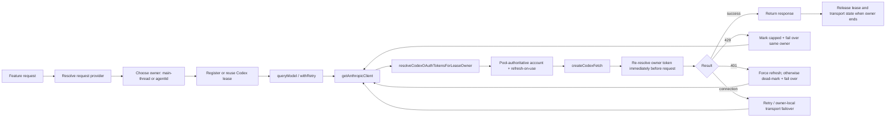

# Codex multi-account routing audit

**Date:** 2026-08-13

**Scope:** All production Cat Code features that can spend Codex/ChatGPT subscription usage, with session labeling treated as one example rather than the primary focus.

**Reviewed state:** Current working tree, including pre-existing uncommitted changes. This review did not modify implementation code.

**Repository snapshot:** branch `migration`, `HEAD` `34b2aee8be5b5ce174a440464cb91230787c9795`.

**Working-tree caveat:** the repository was already broadly dirty. The account-relevant pre-existing changes visible during this audit were `src/utils/sessionTitle.ts`, `src/utils/sessionTitle.test.ts`, and `src/services/api/codex-fetch-adapter.test.ts`. Findings describe the working tree that was actually executed, not a clean reconstruction of `HEAD`.

## How to use this report

This report is intended to be sufficient input for a repair session. A new session should not need to repeat the repository-wide discovery pass before beginning implementation.

Start with:

1. `src/services/api/codexAccountLeaseManager.ts` for lease creation, selection, failover, and release.
2. `src/services/api/client.ts` for pool-authoritative, lease-aware credential resolution.
3. `src/services/api/claude.ts` and `src/services/api/withRetry.ts` for the correct shared request and failover path.
4. The finding-specific entry points and tests listed below.

The report distinguishes three different concepts that must not be collapsed:

- **Pool:** account inventory, credential authority, account health, active account, and usage hints.
- **Lease:** runtime ownership and pinning of one account to the main thread or a subagent.
- **Request retry:** classification and transition after a real 401, 429, or transport failure.

An implementation is only uniform when it handles all three, plus owner cleanup.

## Verdict

**RED — rework before claiming uniform multi-account support.**

Cat Code's central request path correctly supports pool-authoritative credential selection, per-owner leases, refresh-on-use, and account-local failover. Main chat requests and ordinary managed subagents use that path successfully. Session labeling also uses it correctly in the reviewed working tree.

The behavior is not uniform across every Codex-consuming feature. Ephemeral forked agents leak leases, several subagent secondary calls lose their owner identity, `sideQuery` bypasses pool-aware retry/failover, and image generation only performs initial account selection. The terminal exhaustion contract also conflicts with its focused regression test.

## Contract

The source and repository maps establish these routing expectations:

1. When a Codex account pool exists, it is the credential authority; stale raw config credentials must not be used as fallback (`src/services/api/client.ts:341-391`).
2. Main and subagent work should resolve credentials through their lease owner (`src/services/api/client.ts:355-386`).
3. The shared `withRetry()` path owns 429 cap handling, 401 refresh/auth handling, connection failover, and terminal classification (`src/services/api/withRetry.ts:619-735`).
4. Finished owners must release leases so `spread` reflects live concurrency rather than historical work (`src/services/api/codexAccountLeaseManager.ts:329-331`, `src/services/api/codexAccountLeaseManager.ts:532-591`).
5. Usage/status observations are advisory and intentionally do not reserve accounts or spend inference usage.

The repository maps explicitly document one current exception: image generation shares the resolver and refresh route, while image-endpoint 401/429 pool-state reporting is deferred (`docs/maps/auth-accounts-oauth.md:113`, `docs/maps/codex-core.md:109`). F4 is therefore a documented limitation relative to the current map, but it still violates the broader goal that all Codex-consuming features switch accounts consistently.

## Reference architecture: the correct path



### Layer-by-layer behavior

1. **Provider resolution.** `resolveRequestProvider()` always recognizes GPT-family models as OpenAI. Claude/custom IDs inherit the supplied base provider or the current session provider (`src/utils/model/providers.ts:182-195`). This is why a helper that passes a Claude-named model can still spend Codex usage in an OpenAI session unless it explicitly pins `provider: 'firstParty'`.
2. **Lease acquisition.** Main work prefers the user-selected healthy `activeIndex`; subagents default to `spread`, unless configured for `follow-main` (`src/services/api/codexAccountLeaseManager.ts:152-191`, `src/services/api/codexAccountLeaseManager.ts:483-592`).
3. **Subagent ranking.** `spread` first minimizes active lease count, then recent-error cooldown, then main-account penalty, fresh usage score, last-use time, and account ID (`src/services/api/codexAccountLeaseManager.ts:532-584`). Stale leases therefore directly change future routing decisions.
4. **Credential authority.** With any managed pool inventory, the resolver uses a lease, repaired lease, active account, or another selectable pool account and refuses raw-config fallback (`src/services/api/client.ts:341-391`).
5. **Refresh-on-use.** Resolution calls `maybeRefreshAccount()` best-effort before use. If proactive refresh fails, the current access token is allowed to reach the server so a real 401 can enter the classified recovery path (`src/services/api/client.ts:286-325`).
6. **Per-request re-resolution.** `createCodexFetch()` receives an async resolver callback, so a retry does not remain stuck on the client-construction token (`src/services/api/client.ts:469-491`, `src/services/api/codex-fetch-adapter.ts:3289-3303`).
7. **Owner binding.** Shared model calls pass `options.agentId` as the subagent owner or use the main owner, and `withRetry()` executes under that owner through async-local context (`src/services/api/claude.ts:1976-1986`, `src/services/api/claude.ts:2039-2049`).
8. **429 behavior.** A hard Codex cap reassigns only the current lease when possible; an unleased request rotates the global active account. The failed account is marked capped (`src/services/api/withRetry.ts:619-709`).
9. **401 behavior.** Recovery force-refreshes the account that actually made the failed request. A definitive auth failure dead-marks/fails over; a transient refresh failure is classified separately (`src/services/api/withRetry.ts:713-805`).
10. **Connection behavior.** Connection errors do not become quota caps. Repeated failures can move the owner to another account, while failures across two accounts trigger network-outage handling (`src/services/api/withRetry.ts:911-970`).
11. **Conversation/cache identity.** Default conversation identity is scoped by account and model; explicit overrides are used for subagents and session titles. The adapter records the async-local lease owner in request metadata (`src/services/api/codex-fetch-adapter.ts:3289-3343`).
12. **Lifecycle cleanup.** Main query cleanup releases `main-thread` (`src/query.ts:1960-1963`). Managed agent completion, failure, and kill release both lease and WebSocket state (`src/tasks/LocalAgentTask/LocalAgentTask.tsx:366-395`, `src/tasks/LocalAgentTask/LocalAgentTask.tsx:545-588`).

### Account failure semantics

| Observed failure | Correct state mutation | Correct retry target | Correct terminal family if recovery fails |
|---|---|---|---|
| Hard Codex 429 / usage-limit event | Mark exact request account capped | Same owner's replacement lease | `quota_exhausted` or `account_recovery`, subject to the unresolved F5 policy |
| Codex 401 | Force-refresh exact request account; dead-mark only on definitive auth failure | Same owner, refreshed account or replacement lease | `account_recovery` for auth; `transient_network` for refresh transport failure |
| API/WebSocket connection failure | Record transient error; do **not** cap | Same owner on another healthy account after retry threshold | Transient network failure |
| Completed `response.failed` policy/invalid-request result | No account health mutation | Do not resend deterministic failure | Original response failure |

## Conformance matrix

| Surface | Initial account selection | Refresh/failover | Owner lifecycle | Result |
|---|---|---|---|---|
| Main chat / normal query loop | Main-thread lease | Shared `withRetry()` | Released by query loop | Implemented |
| Managed AgentTool subagents | Subagent lease | Shared `withRetry()` | Explicit cleanup when LocalAgentTask registration exists; sync/background-disabled branch leaks | Partial (F1) |
| Session title / label | Main-thread lease | Shared `queryModelWithoutStreaming()` / `withRetry()` | Isolated conversation cleared | Implemented |
| Rename, away summary, teleport naming, agent generation | Main-thread lease | Shared query path | Main-scoped | Implemented |
| Prompt/API hooks | Preserves `toolUseContext.agentId` | Shared query path | Uses owning agent | Implemented |
| Ephemeral `runForkedAgent()` services | New subagent lease | Shared retry while running | Lease/WebSocket not released | Partial |
| `sideQuery` callers | Current pooled account | No pool-aware retry or failover | No explicit owner | Partial |
| WebFetch secondary summarization in a subagent | Falls back to main account | Main lease can rotate | Subagent identity dropped | Partial |
| Compact streaming fallback in a subagent | Falls back to main account | Main lease can rotate | Subagent identity dropped | Partial |
| Codex image generation | Correct main/subagent lease initially | No 401/429 pool transition or failover | One-shot request | Partial |
| Usage/status polling | Explicit observation target | Not applicable | Non-inference | Implemented by design |
| Standalone `codex-core` client | Explicit account only | Intentionally non-rotating | Script/test use only | Implemented by contract |

## Production surface inventory

This is the repository-wide inventory used for the verdict. “Codex-applicable” means the call can resolve to `provider === 'openai'` in a Codex subscriber session and therefore spend subscription usage.

### Primary shared query path

| Surface | Entry point | Owner source | Codex behavior | Audit disposition |
|---|---|---|---|---|
| Main interactive/headless turn | `src/query.ts:366-375` | Fixed `main-thread` | Registers main lease, uses shared resolver/retry, releases in outer `finally` | Correct |
| Async AgentTool subagent | `src/tools/AgentTool/AgentTool.tsx:1232-1250` | `asyncAgentId` | Registers subagent lease before execution | Correct; cleanup owned by LocalAgentTask |
| Foreground AgentTool subagent | `src/tools/AgentTool/AgentTool.tsx:1354-1385` | `syncAgentId` | Registers explicit lease only when background-task registration is enabled; otherwise shared query auto-registers it | Correct with LocalAgentTask lifecycle; leaked when `CLAUDE_CODE_DISABLE_BACKGROUND_TASKS` is true (F1) |
| Agent completion/failure/kill | `src/tasks/LocalAgentTask/LocalAgentTask.tsx:366-395`, `:545-588` | Task ID | Releases lease and `${sessionId}/${taskId}` WebSocket session | Correct |
| Prompt hook evaluator | `src/utils/hooks/execPromptHook.ts:90-111` | `toolUseContext.agentId` | Shared non-streaming request preserves subagent owner | Correct |
| API query hook helper | `src/utils/hooks/apiQueryHookHelper.ts:103-132` | `context.toolUseContext.agentId` | Shared non-streaming request preserves subagent owner | Correct |

### Main/session-scoped secondary calls through the shared retry path

These calls do not carry an `agentId`; that is correct only because their product meaning is session/main scoped.

| Surface | Entry point | Model/provider behavior | Conversation behavior | Result |
|---|---|---|---|---|
| Session title / sidebar label | `src/utils/sessionTitle.ts:89-164` | `getSmallFastModelForProvider()` selects GPT-5.6 Luna for Codex | Unique `side/title/<uuid>` override, cleared in `finally` | Correct |
| Away summary | `src/services/awaySummary.ts:40-81` | Provider-aware small model, explicit low effort | Main shared path | Correct |
| `/rename` generated name | `src/commands/rename/generateSessionName.ts:43-74` | Provider-aware small model | Main shared path | Account routing correct |
| Teleport title/branch | `src/utils/teleport.tsx:124-155` | Provider-aware small model | Main shared path | Account routing correct |
| Agent definition generation | `src/components/agents/generateAgent.ts:145-176` | Caller-selected model, provider resolved from model/session | Main shared path | Account routing correct |
| Skill-improvement rewrite | `src/utils/hooks/skillImprovement.ts:248-272` | Uses shared model request | Main-scoped workflow | Account routing correct for its current caller context |
| Tool-use summary | `src/services/toolUseSummary/toolUseSummaryGenerator.ts:45-81` | `queryHaiku()` becomes provider-aware internally | Main only by explicit guard `!toolUseContext.agentId` at `src/query.ts:1592-1597` | Correct; absence of `agentId` is intentional |
| Feedback/date-time UI helpers | `src/components/Feedback.tsx:449`, `src/utils/mcp/dateTimeParser.ts:68` | `queryHaiku()` shared path | Main/UI scoped | No owner mismatch found |

The generated-content shape of rename and teleport was not reviewed here; only account selection and failover were in scope.

### Ephemeral forked-agent calls

Every row below enters `runForkedAgent()`, which creates a fresh isolated `agentId`. All inherit F1 unless the wrapper lifecycle is fixed.

| Feature | Call site | Frequency/trigger | Intended cache relationship | Current account-lifecycle result |
|---|---|---|---|---|
| Auto dream | `src/services/autoDream/autoDream.ts:233-241` | Background auto-memory workflow | Fork of current context | Leaked ephemeral lease; transcript disabled does not disable lease ID creation |
| Extract memories | `src/services/extractMemories/extractMemories.ts:421-429` | Memory extraction | Fork of current context | Leaked ephemeral lease |
| Compaction preferred path | `src/services/compact/compact.ts:1266-1282` | Compact request | Explicitly tries to preserve parent prompt-cache shape | Leaked ephemeral lease; fallback has separate F2 owner bug |
| Prompt speculation | `src/services/PromptSuggestion/speculation.ts:469-476` | Speculative suggestion execution | Forked cache-safe parameters | Leaked ephemeral lease |
| Prompt suggestion | `src/services/PromptSuggestion/promptSuggestion.ts:314-330` | Suggestion generation | Comments explicitly protect prompt-cache compatibility | Leaked ephemeral lease |
| Agent progress summary | `src/services/AgentSummary/agentSummary.ts:1-10`, `:101-117` | Approximately every 30 seconds per coordinator subagent | Intended to share the subagent's cache-safe prefix | Repeated leaked leases; highest amplification risk |
| Session memory, in-session | `src/services/SessionMemory/sessionMemory.ts:320-330` | Session-memory extraction | Forked current context | Leaked ephemeral lease |
| Session memory, reconstructed | `src/services/SessionMemory/sessionMemory.ts:421-436` | Manual/reconstructed memory extraction | Forked reconstructed context | Leaked ephemeral lease |
| Side question | `src/utils/sideQuestion.ts:79-90` | User side-question helper | Intentionally retains parent's thinking/cache shape | Leaked ephemeral lease |

Important identity detail for the fix: the account lease belongs to `isolatedToolUseContext.agentId` created at `src/utils/forkedAgent.ts:448-453`. The separate `agentId` created at `src/utils/forkedAgent.ts:530-545` is only for sidechain transcript recording and may be `undefined` when `skipTranscript` is true. Cleanup must use the isolated tool-context ID, not the transcript ID.

### `sideQuery` direct-client calls

`sideQuery()` has an optional provider override but no owner field. It passes `maxRetries` to the Anthropic SDK client; this may cause transport retries, but it does not execute the pool transitions in Cat Code's `withRetry()`. The adapter may re-resolve credentials before each SDK retry, yet without marking or moving the failed lease/active account it normally resolves the same account again.

| Feature | Call site | Codex applicability | Result |
|---|---|---|---|
| Relevant-memory selection | `src/memdir/findRelevantMemories.ts:105-125` | Uses `getDefaultSonnetModel()` without provider override. Claude-family IDs inherit the OpenAI session provider, so this is Codex-applicable. Started once near main query entry (`src/query.ts:357-364`). | No pool-aware failover; failure is swallowed/degraded by caller |
| Auto-mode rule critique | `src/cli/handlers/autoMode.ts:108-143` | Defaults to main-loop model; therefore GPT/OpenAI in a Codex session | No pool-aware failover |
| Agentic session search | `src/utils/agenticSessionSearch.ts:258-272` | Uses `getSmallFastModel()` without provider override; under OpenAI session the ambiguous Claude ID inherits OpenAI | No pool-aware failover |
| Permission explanation | `src/utils/permissions/permissionExplainer.ts:175-186` | Uses main-loop model | No pool-aware failover |
| Chrome MCP secondary request | `src/utils/claudeInChrome/mcpServer.ts:181-197` | Uses caller's model and session provider | No pool-aware failover |
| Model validation probe | `src/utils/model/validateModel.ts:44-82` | Known Codex models short-circuit; unknown/custom allowed models can still reach `sideQuery()` | Limited Codex reachability; no failover if reached |
| Insights facet/section generation | `src/commands/insights.ts:1026-1029`, `:1686-1689` | Explicit `provider: 'firstParty'` | **Not** Codex usage; excluded from findings |

### Direct non-text and standalone calls

| Surface | Entry point | Account contract | Result |
|---|---|---|---|
| Codex image generation | `src/tools/GenerateImageTool/GenerateImageTool.ts:476-500`, `:803-850` | Main/subagent lease and refresh-on-use for initial auth | Initial selection correct; response failure bypasses transitions (F4) |
| OpenAI API-key image generation | Same tool with `CAT_CODE_IMAGE_BACKEND=openai-api` | Explicit `OPENAI_API_KEY`, not subscription pool | Out of scope for account switching |
| Standalone `runCodexLLM()` | `src/codex-core/client.ts:11` | Explicit alias/account ID; intentionally no silent rotation | Only production callers found are scripts: `scripts/test-codex-core.ts` and `scripts/test-codex-core-conversation.ts`; no app feature depends on it |
| `cat-code codex status --json` and usage polling | `src/services/api/codexStatus.ts`, `src/services/api/codexUsage.ts` | Advisory observation only | Correctly does not reserve, rotate, or promise that state is shared with the next process |

## Findings

| ID | Severity | Defect | Evidence | Concrete failure scenario | Proposed owner / disposition |
|---|---|---|---|---|---|
| F1 | **High** | Automatically registered subagent leases are not always paired with cleanup: ephemeral `runForkedAgent()` owners leak, and synchronous AgentTool owners leak when background-task registration is disabled. | `createSubagentContext()` assigns a new `agentId` at `src/utils/forkedAgent.ts:448-453`; the shared query path auto-registers at `src/services/api/claude.ts:1167-1179`; fork cleanup at `src/utils/forkedAgent.ts:603-608` omits account cleanup. AgentTool skips LocalAgentTask registration at `src/tools/AgentTool/AgentTool.tsx:1354-1385` when background tasks are disabled, and its `finally` only unregisters when `foregroundTaskId` exists (`src/tools/AgentTool/AgentTool.tsx:1856-1890`). Active leases are counted at `src/services/api/codexAccountLeaseManager.ts:616-630`. | Internal forks and background-disabled synchronous agents leave historical owners marked active. After enough work, `spread` ranks accounts using stale concurrency and `/accounts` reports dead holders. | **Account-routing/AgentTool owners:** pair every auto-created owner with lease and WebSocket cleanup on success, error, and cancellation. Test both fork and background-disabled sync-agent public paths. |
| F2 | **Medium** | Some secondary calls made for a subagent omit `agentId`, so they spend and fail over the main-thread account instead of the subagent's lease. | Compact fallback options omit `context.agentId` at `src/services/compact/compact.ts:1407-1432`. WebFetch destructures away the rest of `ToolUseContext` at `src/tools/WebFetchTool/WebFetchTool.ts:208-211`, then `applyPromptToMarkdown()` calls `queryHaiku()` without an owner at `src/tools/WebFetchTool/utils.ts:503-514`. | A subagent whose assigned account is healthy invokes WebFetch or compact fallback. The secondary call consumes the main account; a 429 can move the main lease while leaving the subagent lease unchanged, defeating per-owner distribution. | **Tool/compact owners:** thread `agentId` through both public call paths and add main-vs-subagent routing tests. |
| F3 | **Medium** | The `sideQuery` family resolves an initial pooled credential but bypasses the pool-aware retry/failover layer. | `sideQuery()` creates a client at `src/utils/sideQuery.ts:140-146` and calls `client.beta.messages.create()` directly at `src/utils/sideQuery.ts:207-231`. It does not call `withRetry()` or carry a lease owner. Production callers include relevant-memory lookup, auto mode, session search, permission explanation, and Chrome integration. | The currently selected account first reaches a hard cap during relevant-memory prefetch or another side query. That feature fails without marking the account capped or selecting a healthy backup. A later main request must rediscover the cap before the pool heals. | **Shared API owner:** route `sideQuery` through the common retry contract or add an equivalent explicitly tested account-transition wrapper. |
| F4 | **Medium** | Codex image generation chooses the correct initial lease account but treats 401/429 as generic terminal errors. | Auth resolution is owner-aware at `src/tools/GenerateImageTool/GenerateImageTool.ts:476-495`. The backend performs one direct `fetch()` at `src/tools/GenerateImageTool/GenerateImageTool.ts:803-838`, and every non-OK response becomes a generic `Error` at `src/tools/GenerateImageTool/GenerateImageTool.ts:841-845`. | A subagent's leased account is exhausted while another account is healthy. Image generation fails immediately and the pool never records or fails over that account. | **Image/API owner:** normalize Codex image 401/429 into the shared account errors, then retry after refresh/failover under the same owner lease. |
| F5 | **Medium** | Terminal exhaustion classification has contradictory source and test contracts for a capped usable account plus another dead account. | `getCodexExhaustionDiagnosticCode()` returns quota exhaustion only when `capped === total` at `src/services/api/withRetry.ts:171-193`. The regression test at `src/services/api/codexAccountLeaseManager.test.ts:2396-2457` requires the typed hard-cap decision to remain `quota_exhausted` even when another account is dead. The test currently receives `account_recovery`. | The only usable account is capped and an unrelated account is dead. Cat Code emits account-repair guidance instead of the wait-for-reset terminal state, preventing the normal continue-after-limit behavior even though the capped account's reset can recover the session. | **Account-routing/product owner:** decide and document the intended terminal contract, then align implementation, diagnostics, and test. Do not leave the current contradiction as an implicit policy decision. |

## Finding details and repair specifications

### F1 — Auto-registered subagent lease and transport-state leaks

#### Exact failure sequence

1. `runForkedAgent()` calls `createSubagentContext()` (`src/utils/forkedAgent.ts:518-522`).
2. Unless explicitly overridden, that helper creates a new `agentId` (`src/utils/forkedAgent.ts:448-453`).
3. The fork invokes the normal `query()` loop with the isolated context (`src/utils/forkedAgent.ts:547-560`).
4. The shared API layer sees an OpenAI request with `options.agentId`, no current async-local lease, and managed pool credentials, then registers a subagent lease (`src/services/api/claude.ts:1166-1179`). `registerCodexLease()` keeps the lease in the process-global `codexLeasesByOwnerId` map (`src/services/api/codexAccountLeaseManager.ts:152-191`).
5. `withRetry()` correctly uses that owner while the request is active.
6. When the fork returns, throws, or is aborted, its `finally` only clears `readFileState` and the local message array (`src/utils/forkedAgent.ts:603-608`). There is no `releaseCodexLease(isolatedToolUseContext.agentId)` and no `clearWebSocketSession(`${getSessionId()}/${isolatedToolUseContext.agentId}`)`.
7. `getCodexLeaseSnapshot()` continues exposing the stale holder in `/accounts` (`src/services/api/codexAccountLeaseManager.ts:194-214`), and `getLiveLeaseCountsByAccountId()` continues including it in `spread` ranking (`src/services/api/codexAccountLeaseManager.ts:616-630`).

#### Second affected path: background-disabled synchronous AgentTool

`CLAUDE_CODE_DISABLE_BACKGROUND_TASKS` is captured at AgentTool module load (`src/tools/AgentTool/AgentTool.tsx:230-236`). When true, synchronous subagent execution skips `registerAgentForeground()` and the explicit `registerCodexLease()` block (`src/tools/AgentTool/AgentTool.tsx:1354-1385`). The subagent still carries `syncAgentId`, so the shared query layer auto-registers a Codex lease on its first OpenAI request.

At completion, AgentTool's `finally` calls `unregisterAgentForeground()` only when `foregroundTaskId` exists (`src/tools/AgentTool/AgentTool.tsx:1856-1890`). In this branch it is undefined, so no LocalAgentTask cleanup runs. The lease and `${sessionId}/${syncAgentId}` WebSocket session survive exactly like a forked-agent owner.

#### Why this is High

- It affects many background/internal features, not one optional edge.
- Agent-summary polling can create new leaked owners repeatedly during a long coordinator session.
- Users or harnesses that disable background tasks leak every synchronous Codex subagent owner, not only optional internal helpers.
- The lease map can grow for the life of the process.
- Routing gradually represents historical task count rather than current concurrency.
- A stale lease attached to an account that later recovers from cap/auth state can keep that account artificially “crowded.”
- `/accounts` lease-holder display can report jobs that no longer exist.
- Explicit subagent conversation overrides can leave transport-session entries after the logical owner is gone.

#### Safe patch boundary

Prefer lifecycle cleanup in the logical owner wrappers rather than unconditional cleanup inside `queryModel()`. `queryModel()` can be called more than once during one fork or AgentTool multi-turn loop; releasing after each API turn would allow one logical subagent to reacquire a different account mid-conversation.

The wrapper already owns the isolated context and has a single outer `finally`. Add cleanup there using **`isolatedToolUseContext.agentId`**, not the transcript-only `agentId`. Cleanup should be idempotent and run on success, thrown API error, tool error, and abort. Reuse the same two operations as `releaseAgentCodexResources()` in `LocalAgentTask.tsx`.

For AgentTool's background-disabled branch, ensure its outer sync-agent `finally` releases `syncAgentId` and clears `${getSessionId()}/${syncAgentId}` when no LocalAgentTask owns cleanup. A cleaner long-term design would factor one idempotent account-resource cleanup helper shared by AgentTool, LocalAgentTask, and forked-agent wrappers. Do not make UI task registration a prerequisite for account-resource lifecycle.

#### Required regression proof

Add a public-entry test for `runForkedAgent()` that:

1. Seeds two healthy pool accounts and OpenAI session provider.
2. Runs a minimal fork through the real lease registration seam.
3. Captures the isolated owner ID or inspects the lease snapshot while the mocked query is active.
4. After normal completion, asserts that owner is absent from `getCodexLeaseSnapshotForTest()` and its conversation session is cleared.
5. Repeats for thrown error and aborted execution.
6. Acquires a subsequent `spread` lease and proves the completed fork no longer affects account choice.
7. Covers `skipTranscript: true`, proving cleanup does not accidentally depend on the transcript ID.
8. Imports/runs AgentTool with `CLAUDE_CODE_DISABLE_BACKGROUND_TASKS` enabled, executes a synchronous Codex subagent, and proves its auto-registered lease and WebSocket session are removed on success, error, and abort.

Pre-fix failure: the lease remains in the snapshot after the fork resolves/rejects, and the next `spread` selection sees an extra live holder.

#### Acceptance criteria

- No fork-created lease survives logical fork completion.
- No fork-created WebSocket session survives completion or abort.
- Managed AgentTool subagent leases remain alive for the entire task and are not prematurely released.
- Background-disabled synchronous AgentTool subagents release account resources even though no LocalAgentTask exists.
- Multi-turn forks remain pinned to one owner lease until the wrapper finishes.
- `/accounts` holders represent live work only.

### F2 — Subagent ownership is dropped by compact fallback and WebFetch

#### Compact fallback sequence

The preferred compact route uses `runForkedAgent()` (`src/services/compact/compact.ts:1266-1282`) and therefore currently has F1. If that route fails, compact builds a direct streaming request at `src/services/compact/compact.ts:1385-1433`. Its `options` object carries model/provider and query source but omits `agentId: context.agentId`.

Consequences under OpenAI:

- `getAnthropicClient()` receives `codexLeaseOwnerType: 'main'` (`src/services/api/claude.ts:1983-1985`).
- `getRetryOwnerId()` returns `main-thread` rather than the subagent ID (`src/services/api/claude.ts:770-779`).
- The fallback can consume or move the main lease even though compaction belongs to a subagent.

#### WebFetch sequence

`WebFetchTool.call()` destructures only `{ abortController, options: { isNonInteractiveSession } }` (`src/tools/WebFetchTool/WebFetchTool.ts:208-211`). When fetched content needs model processing, it calls `applyPromptToMarkdown()` without the agent identity (`src/tools/WebFetchTool/WebFetchTool.ts:263-277`). That helper calls `queryHaiku()` without `options.agentId` (`src/tools/WebFetchTool/utils.ts:484-514`), so the shared request path treats it as main work.

#### Safe patch boundary

- Compact: add `agentId: context.agentId` to the direct fallback options.
- WebFetch: retain `agentId` from `ToolUseContext`, add it to `applyPromptToMarkdown()`'s parameters, and pass it into `queryHaiku()` options.
- Do not create a new lease manager or manually select accounts in either feature; owner propagation is enough because the shared path already registers/resolves/retries.

#### Required regression proof

For each feature, seed main lease on account A and subagent lease on account B, execute the public feature as the subagent, and inspect the outgoing `chatgpt-account-id` header:

- First request must use B.
- A mocked 429 from B must move only the subagent lease to a replacement.
- Main lease and `activeIndex` must remain on A.
- A main-thread invocation must continue using A.

Pre-fix failure: the first request uses A and any failover mutates the main owner.

#### Acceptance criteria

- All model work causally owned by a subagent carries the same `agentId` through nested helpers.
- Main-only helpers remain explicitly main-scoped rather than acquiring fabricated subagent IDs.

### F3 — `sideQuery` does not participate in account transitions

#### Exact failure sequence

1. `sideQuery()` resolves provider and calls `getAnthropicClient()` without `codexLeaseOwnerId` or `codexLeaseOwnerType` (`src/utils/sideQuery.ts:140-146`).
2. The credential resolver therefore uses the active/first selectable account rather than a named owner lease.
3. `sideQuery()` invokes `client.beta.messages.create()` directly (`src/utils/sideQuery.ts:207-231`).
4. The Codex adapter correctly converts an endpoint 429/401 into `CodexAccountCapError`/`CodexAccountAuthError`, but no Cat Code `withRetry()` surrounds the call.
5. The SDK's `maxRetries` setting cannot perform the pool state mutation that makes a different account selectable. It can resend, but normally re-resolves the unchanged active account.
6. The feature's caller catches or surfaces the error; the pool remains unaware until some later shared-path request observes the same failure.

This path is especially visible for relevant-memory lookup because it begins once per normal query entry before main lease work completes. A side failure can therefore be the first real evidence that the active account is capped, yet that evidence is discarded for routing purposes.

#### Design options

Preferred: make `sideQuery` a thin request-shaping frontend to the shared non-streaming request/retry machinery. Preserve its attribution, beta, tool-choice, output-format, temperature, thinking, and stop-sequence behavior.

Alternative: factor a reusable non-streaming `withRetry()` wrapper used by both `queryModelWithoutStreaming()` and `sideQuery()`. Avoid copying the 401/429 state machine into `sideQuery`; duplicated classification will drift.

Whichever design is chosen, add an optional owner field (ideally the same `agentId` convention used by `Options`) and propagate it from callers that can run inside a subagent. Main/session-only callers can omit it and use `main-thread`.

#### Required regression matrix

| Case | Setup | Required result |
|---|---|---|
| Main 429 with backup | A active, B healthy; A returns hard 429 | A capped, request retried on B, main lease/active account points to B |
| Subagent 429 with backup | Main on A, subagent on B, C healthy; B returns hard 429 | Only subagent lease moves to C; main stays A |
| Main 401 refresh succeeds | A returns 401; refresh returns rotated token | Retry A with new token; no dead-mark or unnecessary failover |
| Main 401 refresh definitively fails | A auth-dead, B healthy | A dead; retry on B |
| Connection error | A transport fails, B healthy | Never mark A capped; apply normal connection failover threshold |
| No replacement | Sole account hard-capped | Typed deferred terminal failure and diagnostic match shared-path policy |
| Explicit first-party override | Insights-style `provider: 'firstParty'` | Never consult or mutate Codex pool |

Pre-fix failure: the first four Codex cases return/throw from the same initial client without the expected pool transition.

#### Acceptance criteria

- `sideQuery` 401/429/connection behavior is observably identical to shared model calls.
- Owner-local semantics are preserved for subagent callers.
- Explicit first-party side queries remain isolated from Codex.
- Existing attribution/request-shape tests continue passing.

### F4 — Image generation lacks endpoint failover

#### What already works

`getImageAuth()` deliberately calls `resolveCodexOAuthTokensForLeaseOwner()` with `context.agentId` for subagents or the session/main owner otherwise (`src/tools/GenerateImageTool/GenerateImageTool.ts:476-495`). Existing tests prove:

- Subagent lease account is used (`src/tools/GenerateImageTool/GenerateImageTool.test.ts:407`).
- Main-thread lease account is used (`src/tools/GenerateImageTool/GenerateImageTool.test.ts:656`).
- A near-expiry vault-backed account refreshes through the shared refresh route (`src/tools/GenerateImageTool/GenerateImageTool.test.ts:522`).
- Codex credentials take precedence over `OPENAI_API_KEY` unless the API-key backend is explicitly forced.

#### What is missing

Authentication is resolved once before `generateWithCodexBackend()`. The image backend sends one request with that token/account header and turns every non-OK status into a generic `Error`. It never creates `CodexAccountCapError`/`CodexAccountAuthError`, calls `withRetry()`, or re-resolves auth for another attempt.

#### Safe patch boundary

Keep `getImageAuth()` as the one credential/refresh entry point; do not build a second token refresh implementation. Wrap Codex image attempts in reusable account-aware retry semantics so every attempt obtains fresh auth for the same owner. The OpenAI API-key backend must stay outside pool mutation.

The retry integration must preserve:

- `context.agentId` owner identity.
- The correct `chatgpt-account-id` header after failover.
- Abort behavior.
- Reference-image body rebuilding.
- No duplicate output-file write before a request has succeeded.
- A bounded retry/failover budget.

#### Required regression matrix

1. Subagent on A, backup B, image endpoint returns 429 for A then succeeds for B: A is capped, subagent lease moves, main lease does not.
2. Main on A, endpoint returns 401, forced refresh succeeds: second attempt uses rotated A token.
3. Main on A, definitive 401 refresh failure, B healthy: A is dead and B serves retry.
4. Sole account 429: typed quota terminal behavior matches text requests.
5. API-key backend 401/429: no Codex pool account is mutated.
6. Abort between attempts: no retry and no output artifact.

Pre-fix failure: all Codex non-OK cases throw the generic message from `GenerateImageTool.ts:841-845` after one request.

#### Acceptance criteria

- Initial and retry account selection match text requests for both main and subagent owners.
- 401/429 update the exact failed account, not whichever account is active when the response arrives.
- Tests prove account headers on both attempts, not only final success.
- `docs/maps/auth-accounts-oauth.md` and `docs/maps/codex-core.md` remove or update the documented “deferred” limitation once behavior changes.

### F5 — Conflicting terminal policy for capped + dead pools

#### Reproduced state

- Account A begins healthy and is the only usable account.
- Account B is already `dead`.
- A returns a typed hard-cap error.
- A becomes capped, so no account can currently serve traffic.

Current implementation derives terminal meaning from aggregate counts: because only one of two accounts is capped, it emits `account.pool.unavailable` and durable code `account_recovery` (`src/services/api/withRetry.ts:171-193`).

The existing focused test instead treats the terminal decision as “a hard cap could not be failed over” and requires `quota.exhausted` / `quota_exhausted` (`src/services/api/codexAccountLeaseManager.test.ts:2396-2463`). The test was introduced in commit `2ae149446` on 2026-07-15. The count-based implementation and opposing explanatory comment were introduced later in commit `7a545072d` on 2026-07-28. This is not an incidental assertion typo; two committed contracts disagree.

#### Product decision required

| Choice | Benefit | Cost |
|---|---|---|
| Preserve typed hard-cap result (`quota_exhausted`) | `/continue-after-limit` can wait for A's reset, which can recover without repairing B | Does not foreground that B also needs re-login/repair |
| Prefer aggregate pool repair (`account_recovery`) | Surfaces that the inventory contains a broken account | Blocks automated wait-for-reset even though A's reset is sufficient to resume work |
| Introduce richer combined terminal evidence | Can represent both “waitable cap” and “repairable dead account” | Requires schema/consumer review; broader change |

Do not resolve this by merely changing the test expectation. The diagnostic code, deferred terminal envelope, `/continue-after-limit`, CLI/app consumers, and maps must all express one intentional policy.

#### Required regression proof

At minimum cover:

1. All accounts capped.
2. One capped plus one dead.
3. One capped plus one quarantined/transient.
4. One capped plus one healthy but failover budget exhausted.
5. No configured accounts.
6. A post-reset redemption of the capped account.

For each case, assert both emitted diagnostic and `CannotRetryError.deferredTerminalFailure`; they must not contradict each other.

#### Acceptance criteria

- The focused suite is green with a documented policy.
- `/continue-after-limit` receives the intended durable code for every matrix row.
- Maps and downstream diagnostic expectations match the implementation.

### Verification gap V1 — single-account auth test timeout

The isolated lease-manager test `withRetry records single-account cap/auth states without rotating` passes its cap assertions and then times out during the auth half (`src/services/api/codexAccountLeaseManager.test.ts:946-1014`). `buildPoolAccount()` supplies a synthetic refresh token by default (`src/services/api/codexAccountLeaseManager.test.ts:53-75`), while this test does not install the request-scoped fetch mock used by nearby refresh tests. The production 401 branch therefore attempts the real forced-refresh machinery.

The likely test defect is an unmocked refresh transport, but that precise cause was not proven by instrumenting or changing the test. Treat it as a test-confidence gap, not as evidence that production auth recovery hangs.

Required disposition: isolate the cap and auth cases or provide a deterministic refresh mock. The auth test must prove the intended definitive-auth branch without network access and without weakening production timeout behavior.

## Session labeling conclusion

Session labeling is not one of the broken account-selection paths in the reviewed tree.

The full request route is:

1. `generateSessionTitle()` rejects empty input before spending usage (`src/utils/sessionTitle.ts:89-95`).
2. `getSmallFastModelForProvider()` selects GPT-5.6 Luna for a Codex subscriber (`src/utils/sessionTitle.ts:106-108`, `src/utils/model/model.ts:47-65`).
3. `resolveRequestProvider()` resolves that GPT model to OpenAI.
4. A unique `side/title/<uuid>` conversation override prevents title generation from extending or polluting the main conversation (`src/utils/sessionTitle.ts:116-117`).
5. The request uses `queryModelWithoutStreaming()` with provider-native instruction assembly (`src/utils/sessionTitle.ts:118-164`).
6. No `agentId` is supplied because title generation belongs to the session, not a subagent. `getRetryOwnerId()` therefore uses `main-thread` in a pool-managed OpenAI session (`src/services/api/claude.ts:770-779`).
7. Client creation resolves the main lease and gives the adapter a per-request token resolver.
8. A title-request 429/401 enters the same `withRetry()` account rotation/recovery path as a main chat request.
9. `finally` clears the title-specific WebSocket session on success, parse failure, API error, or abort (`src/utils/sessionTitle.ts:179-194`).

Therefore session title usage is charged to the current main account and can move the main lease when that account is exhausted. That is the expected ownership model for a session-level label.

One confidence limitation remains: `src/utils/sessionTitle.test.ts` mocks `queryModelWithoutStreaming()`. It proves provider/model/output-format wiring, but it does not itself cause a title request to fail over across two real seeded pool accounts. The conclusion relies on the shared-path source trace plus the generic lease/retry integration tests. A title-specific two-account integration test would strengthen confidence but is not required to fix F1-F5.

The current session-title response-format changes are pre-existing uncommitted work. This audit did not author or alter them.

## Recommended implementation order

This order reduces overlap and makes failures easier to attribute:

1. **F1: fix `runForkedAgent()` lifecycle.** It is the only High finding and affects the broadest set of internal services. Add focused lifecycle tests before touching other routing.
2. **F2: propagate existing owners through compact fallback and WebFetch.** These should be small wiring changes using the already-correct shared path.
3. **F3: bring `sideQuery` under shared retry semantics.** This is the broadest API refactor; keep request-shaping behavior stable and add the full owner/failure matrix.
4. **F4: add image endpoint retry/failover.** Reuse the account transition abstraction produced or clarified by F3 where possible, without forcing image payloads through Anthropic message translation.
5. **F5: resolve terminal policy deliberately.** This may be done earlier if it blocks the shared abstraction, but it should be its own commit because it changes durable recovery semantics.
6. **Repair V1 test isolation.** Ensure the full lease suite is deterministic and network-free.
7. **Update maps after implementation.** At minimum revisit `docs/maps/auth-accounts-oauth.md`, `docs/maps/codex-core.md`, `docs/maps/query-provider-runtime.md`, and the build/test routing map if new suites are added.

Suggested commit boundaries:

- Commit A: fork lifecycle + tests.
- Commit B: nested owner propagation + tests.
- Commit C: shared side-query retry integration + caller owner propagation + tests.
- Commit D: image retry/failover + tests + map updates.
- Commit E: terminal-policy decision + diagnostics/continuation tests + map updates.

Avoid combining all findings into one large patch. F3/F4/F5 each change different contracts and need independently reviewable evidence.

## Repair-session acceptance checklist

A future implementation session should not claim completion until all applicable items are true:

- [ ] Every inference-spending production entry point appears in the inventory above or is documented as newly added.
- [ ] Every subagent-owned nested request either carries the parent `agentId` or intentionally creates a bounded child owner with paired cleanup.
- [ ] Every automatically created lease has an explicit owner responsible for releasing it on success, error, cancellation, and kill.
- [ ] Every Codex 429 path marks the exact request account capped and retries a healthy account for the same logical owner when possible.
- [ ] Every Codex 401 path attempts forced refresh of the exact request account before dead-mark/failover.
- [ ] Connection failures never become usage caps.
- [ ] Deterministic `response.failed` results are not replayed on other accounts.
- [ ] Main-thread failure never silently moves an unrelated subagent lease, and subagent failure never silently moves the main lease.
- [ ] Retry attempts re-resolve token and account ID; tests assert both attempts' headers.
- [ ] Finished forks/tasks disappear from `/accounts` lease holders and no longer influence `spread` ranking.
- [ ] Image API-key mode never mutates the Codex pool.
- [ ] Explicit `provider: 'firstParty'` side queries never touch Codex.
- [ ] Terminal diagnostic and deferred terminal code agree for the full F5 matrix.
- [ ] `/continue-after-limit` behavior matches the chosen terminal policy.
- [ ] Relevant maps and user-facing diagnostics are updated.
- [ ] Focused suites pass file-isolated; no test performs accidental live OAuth/network access.

## Test-confidence assessment

The focused feature suites prove request shape and initial routing for session titles and images. The account pool and lease suites exercise pool selection, refresh, lease-local failover, connection failover, and conversation isolation. They do not cover the forked-agent release lifecycle, subagent WebFetch/compact ownership, `sideQuery` failover, or image 401/429 failover.

The isolated lease-manager suite has two failures:

1. `withRetry records single-account cap/auth states without rotating` times out after 5 seconds. The timeout appears in the auth/refresh portion of the test; live behavior was not inferred from this failure.
2. `terminal cap failure reports quota exhaustion from the typed decision, not from pool counts` expects `quota_exhausted` and receives `account_recovery`, directly demonstrating F5.

### What the passing tests actually prove

| Suite | Proven | Not proven |
|---|---|---|
| `src/services/api/codexAccountPool.test.ts` | Pool availability, credential authority, cap/uncap belief, vault/config merging, active-account behavior | Feature-specific owner propagation or cleanup |
| `src/services/api/codexAccountLeaseManager.test.ts` passing cases | Lease selection, release semantics, lease-local failover, account/model conversation isolation, connection failover | That every production caller acquires/releases the right lease; suite currently has two failures |
| `src/codex-core/accounts.test.ts` | Refresh-on-use identity reconciliation and raw/vault refresh behavior | App feature routing; standalone core intentionally does not rotate |
| `src/utils/sessionTitle.test.ts` | Codex-compatible model/provider/output shape and malformed-output handling | Real pool failover from the public title entry point |
| `src/utils/sideQuery.test.ts` | Provider override and OpenAI instruction assembly | Any 401/429 state transition, retry, or owner-local behavior |
| `src/tools/GenerateImageTool/GenerateImageTool.test.ts` | Initial main/subagent lease selection, proactive refresh, request shape, parsing | Endpoint 401/429 marking, refresh-after-401, or backup-account retry |
| `src/tasks/LocalAgentTask/LocalAgentTask.test.ts` | Registered foreground task cleanup removes its Codex lease and completed-task cleanup clears WebSocket state | Background-disabled AgentTool branch, where no LocalAgentTask is registered |
| `src/tools/AgentTool/AgentTool.test.ts` | AgentTool schema/UI/name/session-state behavior | Codex lease registration or cleanup; no account-lifecycle case exists |

### Tests to add or extend

| Finding | Preferred test location | Public behavior that must fail before the fix |
|---|---|---|
| F1 | Add a new focused test beside `src/utils/forkedAgent.ts` (no dedicated test currently exists) and extend `src/tools/AgentTool/AgentTool.test.ts` | Lease snapshot/WebSocket state retain a completed fork or a background-disabled synchronous AgentTool owner |
| F2 compact | `src/services/compact/compact.test.ts` | Subagent fallback sends main account header |
| F2 WebFetch | Add a new focused test beside `src/tools/WebFetchTool/WebFetchTool.ts`; no WebFetch test file currently exists | Subagent summarization sends main account header |
| F3 | Extend `src/utils/sideQuery.test.ts` plus shared account integration fixture | 429/401 throws without pool transition or second-account request |
| F4 | Extend `src/tools/GenerateImageTool/GenerateImageTool.test.ts` | Codex image 429/401 makes exactly one request and leaves pool unchanged |
| F5 | Existing `src/services/api/codexAccountLeaseManager.test.ts`; add continuation consumer test if policy changes | Diagnostic and deferred terminal classification disagree with selected policy |
| V1 | Existing lease-manager test | Test contacts/awaits unmocked refresh machinery and times out |

## Unverified live behavior

No real Codex accounts were spent and no live 401, 429, refresh-token rotation, concurrent failover, or quota reset was induced. Those layers remain **UNVERIFIED**. Operator verification would require a controlled test pool with disposable quota state and explicit authorization to make live subscription requests.

### Controlled live verification playbook

Only run this after the implementation is green under mocked tests and the operator explicitly authorizes subscription usage:

1. Use two disposable/non-primary Codex accounts with distinct aliases and known remaining usage.
2. Start one main session and one subagent, then inspect `/accounts` to record main and subagent lease ownership.
3. Trigger one low-cost request from each owner and verify diagnostics/account headers identify the expected distinct accounts without exposing raw IDs in user-facing output.
4. Simulate or safely arrange a hard cap on only the subagent account. Verify the next subagent request moves only that lease and the main lease remains fixed.
5. Repeat for a main-owned secondary feature: session title, relevant-memory side query, and image generation. Verify each transitions according to the same policy.
6. Exercise one controlled expired/revoked access-token case with a valid refresh token; verify same-account refresh succeeds before failover.
7. End all forks/subagents and confirm `/accounts` shows no stale holders.
8. Verify a newly launched `spread` subagent is ranked from current live holders, not the completed jobs.
9. Record sanitized `account.route.selected`, `account.failover.succeeded`, and terminal diagnostic events. Do not include tokens, email addresses, aliases, or full account IDs in the artifact.

Live acceptance remains separate from mocked engineering acceptance. A green unit/integration battery does not prove provider behavior, and a successful live request does not prove all owner/concurrency branches.

## Scope boundaries and non-findings

- This audit covers account choice, credential freshness, failover classification, owner isolation, and lifecycle cleanup for calls that can spend Codex subscription usage.
- It does not evaluate prompt quality, response quality, token cost efficiency beyond account-routing consequences, or UI styling.
- It does not treat advisory status polling as a routing bug. The status process intentionally does not reserve capacity and cannot promise shared in-memory cap state with another process.
- It does not require standalone `runCodexLLM()` to rotate. Its explicit-account, non-rotating behavior is documented and no app feature calls it.
- It does not classify plan metadata warnings as hard unavailability; the pool availability reducer intentionally distinguishes them.
- It does not treat a connection error as evidence of cap exhaustion.
- It does not claim that the lease-manager timeout proves a production hang.
- It does not claim live provider correctness; all live subscription behavior is explicitly UNVERIFIED.

## Verification evidence

```text
VERIFICATION
- bun test src/codex-core/accounts.test.ts src/utils/sessionTitle.test.ts src/utils/sideQuery.test.ts src/tools/GenerateImageTool/GenerateImageTool.test.ts  → 37 pass / 0 fail
- bun test src/services/api/codexAccountPool.test.ts  → 75 pass / 0 fail
- bun test src/services/api/codexAccountLeaseManager.test.ts  → 53 pass / 2 fail (one 5 s timeout; one quota_exhausted/account_recovery mismatch)
- bun test src/tasks/LocalAgentTask/LocalAgentTask.test.ts  → 16 pass / 0 fail
- bun test src/tools/AgentTool/AgentTool.test.ts  → 30 pass / 0 fail
- Total focused evidence  → 211 pass / 2 fail
- git diff --no-index --check /dev/null docs/reports/2026-08-13-codex-multi-account-routing-audit.md  → clean
- source-anchor existence sweep for every path cited in this report  → clean
Stale-reference sweep: N/A; no identifier, path, interface, or behavior was renamed.
Not run: live Codex account failover and token refresh scenarios; requires disposable real accounts, controlled quota/auth state, and explicit authorization to spend subscription usage.
```
