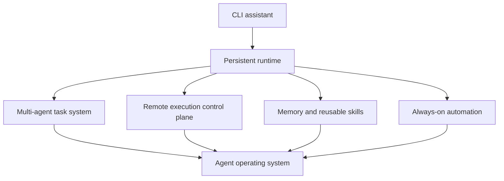
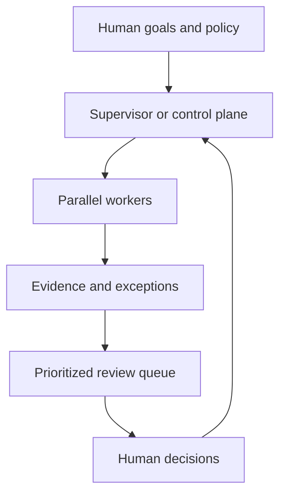

# Agent Harness Feature Trends: Codex CLI, OpenClaw, and Hermes Agent

**Research date:** 23 August 2026  
**Scope:** Current stable releases plus beta and unreleased development visible in the canonical repositories  
**Repositories audited:** `openai/codex`, `openclaw/openclaw`, and `NousResearch/hermes-agent`

## Executive summary

Codex CLI, OpenClaw, and Hermes Agent are converging on the same broad destination: a persistent agent runtime that can retain work, coordinate other agents, execute on remote infrastructure, operate without continuous supervision, and expose its state through an operator control plane.

The historical model was a short-lived coding assistant:

> prompt → inspect files → run commands → return answer → exit

The emerging model is a long-lived agent system:

> create durable task → execute locally or remotely → delegate subtasks → pause or accept steering → survive restart → deliver results → retain useful knowledge → schedule follow-up work

This does not mean the three projects are becoming identical. Their centers of gravity remain different:

- **Codex CLI** is becoming a disciplined, security-conscious coding execution and task-orchestration environment.
- **OpenClaw** is becoming a distributed personal-agent operating system spanning browsers, devices, messaging channels, external coding agents, and cloud workers.
- **Hermes Agent** is becoming a self-improving, provider-independent agent runtime centered on persistent memory, mutable procedural skills, broad execution backends, and always-on gateway operation.

The most important cross-project trends are:

1. Durable sessions and tasks are replacing disposable conversations.
2. Multi-agent delegation is becoming first-class infrastructure.
3. Execution is moving from one laptop to distributed workers and sandboxes.
4. Automation is becoming event-driven rather than timer-only.
5. Skills and memory are becoming writable program state.
6. Permissions are shifting from repeated confirmations to durable, scoped capabilities.
7. Plugins, MCP, and apps are becoming a shared extension layer.
8. Operator dashboards are becoming as important as the chat interface.
9. Reliability, recovery, and observability are receiving more engineering attention than model prompting.
10. Rapid feature expansion is creating significant complexity and security risk.
11. As concurrent agent capacity rises, human attention becomes the limiting resource.

## 1. Scope and methodology

This report is based on read-only inspection of the canonical repositories, release tags, release notes, source implementations, tests, configuration defaults, security documentation, and recent commit history.

The analysis distinguishes three maturity levels:

- **Stable:** reachable through a current stable release or explicitly documented as shipped in that release.
- **Beta or preview:** present in an official prerelease but not the public stable channel.
- **Main-only:** present in the development branch and therefore subject to change or removal.

This distinction is important. The most exciting feature in a repository is not necessarily available to an ordinary user.

### Audited release boundaries

| Project | Latest stable inspected | Preview/development state | Important qualification |
|---|---|---|---|
| Codex CLI | `rust-v0.149.0`, released 20 August 2026 | Main was 122 commits ahead at inspection | Stable is a direct ancestor of main, making comparison relatively straightforward |
| OpenClaw | `v2026.7.1-2`; npm stable `2026.7.1-2` | `v2026.8.1-beta.2` plus a very active main branch | Release tags use divergent release branches; a simple “commits since stable” count is misleading |
| Hermes Agent | `v2026.8.19`, package version `0.20.5` | Main was 305 commits ahead at inspection | The stable release itself rolled up roughly 323 pull requests from the previous patch release |

No full test suites were executed for this report. Existing tests and test structure were inspected as implementation evidence.

## 2. The overarching trend: from harness to agent operating system

The word “harness” originally described the layer that connected an LLM to a terminal, files, and a few tools. That layer is expanding vertically and horizontally.

Vertically, the projects are adding durable state, scheduling, policy, recovery, audit logs, cost controls, and human approval. Horizontally, they are adding messaging platforms, browsers, mobile clients, external services, additional models, remote machines, and other agents.



The strategic competition is therefore changing. It is no longer only about which model writes the best code. It is increasingly about which runtime can safely coordinate long-lived work across tools, people, machines, and models.

## 3. Trend one: durable sessions and task identity

### What is changing

Sessions are becoming durable operational objects rather than chat transcripts. A session increasingly has:

- a stable identity and human-readable name;
- an active permission profile;
- a working directory and execution location;
- queued or steering messages;
- parent and child relationships;
- task status and completion evidence;
- checkpoints, archives, and recovery state;
- cost, context, and model metadata.

### Evidence by project

**Codex CLI** added an interactive `codex agents` dashboard and `codex queue` in stable `0.149.0`. Operators can search, start, open, rename, stop, and send messages to existing local or remote sessions. Resumed and forked threads restore their permission profiles instead of silently adopting current defaults. See the [Codex 0.149.0 release](https://github.com/openai/codex/releases/tag/rust-v0.149.0).

**OpenClaw** has the richest session control plane. Stable `2026.7.1` introduced resizable multi-session panes, persistent groups, read/unread state, transcript forking, pinning, archiving, background-output indicators, task inspection, cancellation, and goals that survive queues, interruptions, and compaction. See the [OpenClaw 2026.7.1 release notes](https://docs.openclaw.ai/releases/2026.7.1).

**Hermes** persists sessions in SQLite with FTS5 search and lineage across compression. Bot Mode adds canonical, effectively permanent conversations for named agent profiles. Its stable release also strengthened update receipts and fleet verification so session-hosting runtimes can be reconciled after updates. See the [Hermes architecture documentation](https://hermes-agent.nousresearch.com/docs/developer-guide/architecture) and [Bot Mode](https://hermes-agent.nousresearch.com/docs/user-guide/bot-mode).

### Why it matters

Durability is a prerequisite for serious delegation and automation. If the runtime cannot reliably answer “which agent owns this task?” after a restart, it cannot safely become an always-on system.

## 4. Trend two: multi-agent work is becoming a task system

### What is changing

Early multi-agent systems simply spawned children and collected their final text. The newer implementations add:

- parallel batches;
- explicit child ownership;
- steering and cancellation;
- stable task identifiers;
- worktree or workspace isolation;
- nested delegation limits;
- completion delivery and retries;
- dependency graphs and review stages;
- different models for different agents;
- visibility in dashboards.

### Codex CLI

Codex is turning multi-agent work into an ordinary terminal workflow. The stable agents dashboard makes children and background tasks visible, while the queue allows asynchronous instructions to reach idle sessions. Main development continues to strengthen Guardian review identity, task context, completion routing, and collaboration instructions.

Codex’s differentiator is not the largest number of orchestration modes. It is the effort to make agent activity obey the same execution, permission, sandbox, and approval rules as foreground coding work.

### OpenClaw

OpenClaw supports its own subagents, ACP-connected agents, and a bundled Codex harness. Its Codex integration does not merely launch a process: it mirrors native Codex child threads into OpenClaw task records, preserves ownership, reconciles races, and protects authoritative completion state.

The stable release also supports temporary, session-scoped attachment of external coding tools. `openclaw attach` can launch Claude Code without exposing process-wide Gateway credentials, and native Codex delegation returns results as tracked tasks. See [Codex and connected coding agents](https://docs.openclaw.ai/releases/2026.7.1#codex-and-connected-coding-agents).

### Hermes

Hermes combines several overlapping orchestration systems:

- `delegate_task` for reasoning children;
- programmatic tool calling for mechanical workflows;
- Git worktree isolation;
- durable Kanban dispatch with dependencies and review;
- A2A task exchange;
- Bot Mode group deliberation and routines.

Only summaries from isolated delegates need to enter the parent context, reducing token use. The stable release also added execution-discipline and anti-stall behavior derived from observed agent failures. See [Hermes delegation](https://hermes-agent.nousresearch.com/docs/user-guide/features/delegation) and the [v2026.8.19 release](https://github.com/NousResearch/hermes-agent/releases/tag/v2026.8.19).

### Direction of travel

The common destination resembles a durable task graph more than a conversation tree. Agents will increasingly have owners, budgets, dependencies, execution locations, capabilities, and review requirements.

## 5. Trend three: execution is moving beyond the local machine

### Hermes: broad backend portability

Hermes currently exposes seven terminal backends:

| Backend | Typical purpose |
|---|---|
| Local | Fast trusted development |
| Docker | Reproducible isolation |
| SSH | Remote server execution |
| Singularity/Apptainer | HPC and rootless cluster workloads |
| Modal | Serverless cloud execution |
| Daytona | Persistent cloud workspaces |
| Vercel Sandbox | Snapshot-backed cloud microVMs |

This makes Hermes unusually portable across personal machines, inexpensive VPS deployments, cloud sandboxes, and GPU or HPC environments. See [Tools and terminal backends](https://hermes-agent.nousresearch.com/docs/user-guide/features/tools).

### OpenClaw: distributed session placement

OpenClaw’s most important main-only work is a more rigorous distributed placement architecture. A Gateway retains canonical session and transcript ownership while an admitted paired device or disposable cloud worker executes turns.

The source design uses:

- placement generations and owner epochs;
- exact turn claims;
- pinned worker bundles and protocol dialects;
- fail-closed admission;
- durable workspace reconciliation;
- explicit conflict staging instead of silently choosing one copy.

This is qualitatively different from running a shell over SSH. It is an attempt to preserve task identity and state consistency while moving execution between machines. See [OpenClaw cloud workers](https://github.com/openclaw/openclaw/blob/main/docs/gateway/cloud-workers.md). This remains unreleased main-branch work.

### Codex: local/remote continuity

Codex is moving more cautiously toward local and remote session continuity, Desktop integration, environment-aware policies, and executor forwarding. Its focus remains preserving the same security and permission semantics when execution moves outside the immediate TUI process.

### Implication

The harness is becoming a control plane. The computer executing a command becomes one replaceable capability host among several.

## 6. Trend four: automation is becoming event-driven

Traditional cron runs at a time. New agent automation systems also respond to state transitions.

### OpenClaw

Stable OpenClaw jobs can:

- wait for a build, deployment, or script to finish;
- resume the originating workflow with exit status and recent output;
- monitor an outside condition and invoke a model only when it changes;
- safely reapply declarations without duplicating jobs or losing history.

See [Scheduled work that wakes only when needed](https://docs.openclaw.ai/releases/2026.7.1#scheduled-work-that-wakes-only-when-needed).

### Hermes

Hermes combines duration, cron, and ISO schedules with script-only jobs, agent jobs, per-job model and reasoning selection, delivery routing, durable claims, heartbeats, misfire grace, execution ledgers, and model-drift protection. Goals and loops provide additional judge-driven or repeated execution modes.

### Codex

Codex does not yet present the same broad personal-automation product, but queues, hooks, persistent sessions, asynchronous user messages, and task dashboards supply the primitives required for external schedulers and orchestrators.

### Direction of travel

Automation is shifting toward:

> remain dormant → observe cheap signal → wake only when necessary → execute within standing authority → deliver result or escalate exception

This pattern reduces model cost and makes unattended operation more practical.

## 7. Trend five: memory and skills are becoming writable program state

### Hermes leads in automatic learning

Hermes treats memory and skills as complementary:

- memory stores compact durable facts that should remain in context;
- skills store longer procedures loaded when relevant;
- background review examines completed work and can update both;
- FTS5 search retrieves prior sessions;
- optional memory providers and user-modeling systems extend the built-in store;
- a mutation ledger and content-addressed backups support rollback.

This is a genuine learning loop, not merely conversation history. See [Persistent Memory](https://hermes-agent.nousresearch.com/docs/user-guide/features/memory) and [Skills](https://hermes-agent.nousresearch.com/docs/user-guide/features/skills).

The key risk is the default policy. Background review is enabled, while `memory.write_approval` and `skills.write_approval` default to `false`. The agent can therefore retain an incorrect assumption or flawed procedure unless the operator enables approval. Hermes documents this behavior explicitly in [Controlling memory writes](https://hermes-agent.nousresearch.com/docs/user-guide/features/memory#controlling-memory-writes-write_approval).

### OpenClaw emphasizes governed learning

OpenClaw’s beta Skill Workshop uses a proposal lifecycle:

1. Draft proposed skill content separately from the live skill.
2. Bind updates to the current target hash.
3. Rescan the proposal before application.
4. Mark changed targets stale rather than overwriting them.
5. Record rollback metadata before mutation.
6. Apply automatically or keep the proposal pending, depending on policy.

Its autonomous mode also defaults to automatic application, but the storage, scanning, ownership, and rollback boundaries are more explicit. See [Skill Workshop](https://docs.openclaw.ai/tools/skill-workshop) and [Self-learning](https://docs.openclaw.ai/tools/self-learning). These capabilities are associated with the beta train rather than the latest stable release.

### Codex remains comparatively conservative

Codex is improving skill selection, plugin-provided skills, history, notes, and context budgeting. It has not made autonomous mutation of long-term user procedures the center of the stable product. This conservatism reduces personalization but also limits the risk of quietly persisting incorrect behavior.

## 8. Trend six: extension systems are converging

All three projects increasingly distinguish between different extension types:

| Extension type | Best use |
|---|---|
| Skill | Repeatable instructions or workflow knowledge |
| Tool | A callable capability with a bounded schema |
| Plugin | Code, credentials, lifecycle hooks, providers, or packaged capabilities |
| MCP server | External interoperable tools and resources |
| App/widget | Interactive user-facing view connected to a tool or session |
| Harness/provider | An alternative agent runtime or model execution path |

Codex is integrating plugins, MCP policy, apps, tool hooks, and marketplace identity. OpenClaw exposes an extensive plugin SDK and can load alternative harnesses, including its native Codex integration. Its beta MCP apps can appear as leased dashboard widgets with revision-bound action grants. Hermes exposes skills, plugins, MCP servers, many provider backends, memory plugins, gateway platforms, and A2A adapters.

This convergence suggests that future harnesses will compete partly on ecosystem compatibility rather than proprietary tool formats.

## 9. Trend seven: permissions are becoming durable capabilities

Repeated “approve this command?” prompts do not scale to unattended operation. The projects are therefore moving toward scoped authority.

### Codex

Codex is investing heavily in Guardian review, environment-aware command policy, permission-profile persistence, managed configuration, sandbox hardening, MCP origin restrictions, credential isolation, and protection against symlink or path-based escapes.

### OpenClaw

OpenClaw beta adds destination-bound secret egress: a shared secret is authorized for exact HTTPS hosts, and substitution fails before plaintext egress when the destination is not bound. It also strengthens plugin provenance, external supervision, operator scopes, audit explanations, and capability admission.

OpenClaw nevertheless documents an explicit personal-assistant trust model: one trusted operator boundary per Gateway. Authenticated operators and trusted plugins are part of the trusted control plane. It is not a hostile multi-tenant isolation boundary. See [OpenClaw security](https://docs.openclaw.ai/gateway/security).

### Hermes

Hermes documents eight defensive layers: user authorization, dangerous-command approval, file-write safety, container isolation, MCP credential filtering, context-file scanning, cross-session separation, and working-directory validation. See [Hermes security](https://hermes-agent.nousresearch.com/docs/user-guide/security).

Its learning defaults deserve separate attention: dangerous shell commands receive smart approval by default, but memory and skill mutations are allowed unless their specific write-approval gates are enabled.

### Direction of travel

The approval unit is shifting from an individual command to a bounded grant:

- this agent;
- for this task or session;
- on this machine or worker;
- inside this workspace;
- using this tool set;
- sending this secret only to this destination;
- until this grant is revoked or expires.

## 10. Trend eight: the operator interface is becoming a control room

Once several agents and automations run concurrently, chat alone is inadequate. The projects are therefore adding operational interfaces.

Common additions include:

- task and agent rosters;
- session search, grouping, pinning, and archiving;
- context, token, cache, model, and cost inspection;
- live tool and reasoning progress;
- integrated terminals and browser panels;
- approval queues and audit history;
- automation health and run history;
- execution-location controls;
- mobile and messaging clients.

OpenClaw is furthest along this path, with a browser Control UI, official mobile apps, guarded terminals, browser control, task views, workboards, usage pages, and channel integrations. Hermes Desktop is quickly developing Bot rosters, group rooms, in-app browser control, agent-guided UI tours, voice, and multiple Gateway connections. Codex remains more terminal-focused, but `codex agents`, queueing, doctor diagnostics, Desktop integration, and richer TUI views move it toward an operator console.

## 11. The emerging bottleneck: human orchestration

Parallel execution changes the scarce resource. When an operator can start ten, twenty, or one hundred sessions, model inference and terminal capacity are no longer necessarily the main constraint. The constraint becomes the operator's ability to understand what is happening, identify the decisions that matter, review evidence, resolve conflicts, and safely authorize consequential actions.

Useful names for this problem include **human supervision bottleneck**, **human attention bottleneck**, and **human-in-the-loop bottleneck**. The most precise term for this report is **human orchestration bottleneck**, because the work involves more than approving actions. It includes prioritization, delegation, coordination, conflict resolution, quality control, and deciding where human judgment has the highest value.

Another useful concept is **agent span of control**: the number of concurrent agents or tasks that one person can supervise safely and effectively. The strategic objective of the emerging control planes is not simply to maximize agent count. It is to increase this span of control without allowing error, cost, risk, and unresolved decisions to grow at the same rate.

### Why concurrency creates a management problem

Agent execution scales more easily than human judgment. Starting another session may cost one command and additional tokens, but reviewing that session can require understanding a different repository state, goal, plan, set of assumptions, tool history, and risk profile.

A useful conceptual model is:

> supervision load ≈ active tasks × intervention rate × review cost per intervention

Harnesses can therefore attack the problem in three ways:

1. reduce the number of tasks requiring intervention;
2. reduce the amount of evidence a human must process for each intervention;
3. direct scarce human attention toward the highest-impact decisions.

The projects are increasingly designed around all three.

### How the three harnesses respond

| Human bottleneck | Codex CLI | OpenClaw | Hermes Agent |
|---|---|---|---|
| Too many sessions to watch | Agents dashboard, task queue, resumable tasks | Multi-pane session control, grouping, pin/archive/fork, durable background tasks | Kanban-style task views, Bot Mode rooms, persistent sessions |
| Repeated instructions | Repository context, durable task state, plugins | Persistent goals, session state, writable skills | Persistent memory, user profile, background review, learned skills |
| Coordinating parallel workers | First-class subagents and distinct Guardian review threads | Child-task mirroring, distributed workers, placement and ownership controls | Delegation trees, agent-to-agent messaging, optional worktrees |
| Knowing when to intervene | Permission escalation, sandbox boundaries, review findings | Event and condition triggers, task notifications, supervisor state | Approval policies, execution budgets, stall guards, cron status |
| Reviewing excessive output | Diffs, tests, structured results, focused review | Task summaries, dashboard status, audit and run history | Session summaries, memory extraction, skill proposals and ledgers |
| Recovering failed work | Durable queues and resumable permission state | Snapshots, supervisor restarts, ownership claims, reconciliation | Rollback ledger, duplicate-result protection, backend recovery |
| Controlling autonomous risk | Sandboxing, scoped policy, Guardian | Scoped Gateway permissions and destination-bound secret handling | Smart approvals plus optional memory and skill write approval |

### Codex: compress software review

Codex takes the most conservative and software-development-specific approach. It tries to make parallel work reviewable through concrete artifacts:

- code diffs;
- test and command results;
- changed-file summaries;
- explicit permission requests at security boundaries;
- durable queued tasks;
- separate implementation and review roles;
- Guardian threads distinguishable from ordinary subagents.

The human is therefore encouraged to review outcomes and exceptions instead of watching every command. This is a form of **supervision compression**: a long execution trace is reduced to a smaller set of artifacts that support a decision.

Codex's main remaining limitation is that evidence compression is not the same as judgment compression. Five agents may produce five individually reasonable implementations, yet a human may still need to understand architecture, product intent, hidden coupling, and maintenance consequences before accepting any of them. Codex currently reduces execution labor more effectively than it reduces high-level review labor.

### OpenClaw: operate agents as a fleet

OpenClaw addresses the bottleneck as an operations problem. Durable tasks, session organization, event-driven automation, remote execution, cancellation, attachment, snapshots, restart recovery, and increasingly sophisticated worker placement turn the Gateway into an agent fleet control plane.

The intended management model is **management by exception**:

- routine successful work continues or closes without operator involvement;
- a changed condition can automatically start another task;
- failed or stalled work becomes visible;
- ownership and worker failure can be reconciled by the runtime;
- conflicts and dangerous capability requests are routed to a human;
- an operator can interrupt, redirect, archive, fork, or inspect a task from another device.

OpenClaw is the clearest attempt among the three projects to build an agent operations center. Its distributed placement work is particularly relevant: owner epochs, turn claims, placement generations, and workspace reconciliation are mechanisms for preventing several workers from silently corrupting one logical task. Those mechanisms reduce the coordination burden that would otherwise fall directly on the human.

Its major risk is **notification displacement**. If every task reports every transition, the system moves overload from terminal windows into a dashboard. A useful control plane must rank events by consequence, uncertainty, urgency, reversibility, and operator responsibility—not merely display more state.

### Hermes: eliminate repeated supervision through learning

Hermes attacks the bottleneck most aggressively through persistent learning and autonomous delegation. It can extract durable facts into memory, maintain a user profile, review completed sessions in the background, turn procedures into reusable skills, delegate work to child agents, expose tasks in a Kanban interface, and communicate between agents and Bot Mode rooms.

The implicit design principle is that repeated correction should become reusable state. If the operator has explained the same preference or procedure several times, the system should remember or encode it rather than requiring another instruction. This reduces the **briefing cost** of every new session.

Hermes also includes practical mechanisms for bounding unattended work: execution budgets, stall detection, duplicate-result protection, scheduled-job limits, and a skill mutation ledger with rollback. These features allow a human to supervise at a policy level rather than at every step.

The tradeoff is a new auditing problem. An automatically written memory or skill can preserve a misunderstanding just as easily as a useful lesson. In the inspected stable configuration, memory and skill writes do not require approval unless the operator enables those gates. Hermes can therefore decrease immediate supervision while increasing the need for periodic governance. For sensitive or long-lived deployments, enabling write approval and isolated execution is the safer way to obtain leverage without allowing invisible policy drift.

### The shared architecture: exception-driven supervision

Across all three projects, the emerging management loop looks like this:



Five mechanisms make this loop scalable:

1. **Persistence:** work survives disconnects and restarts, so the human does not need to remain present.
2. **Hierarchy:** supervisors or parent agents coordinate workers, reducing direct human-to-agent relationships.
3. **Attention routing:** queues, dashboards, event triggers, and alerts determine what the operator sees.
4. **Evidence compression:** diffs, tests, summaries, run receipts, and review findings replace full transcript reading.
5. **Bounded autonomy:** permissions, budgets, destinations, workers, and writable state are constrained by policy.

### What remains unsolved

The deepest bottleneck is not session count but consequential decision count. Ten independent, well-tested tasks may be easier to supervise than two agents making ambiguous architectural decisions.

Important unsolved problems include:

- ranking tasks by business impact rather than activity level;
- distinguishing genuine uncertainty from verbose status reporting;
- proving that a task is complete, not merely that an agent stopped;
- detecting semantic conflicts between outputs from parallel sessions;
- combining many locally correct changes into one coherent system;
- estimating the cost of failing to review a particular decision;
- learning preferences without reinforcing mistakes;
- deciding when an agent should ask, continue, retry, or stop;
- presenting calibrated confidence and provenance that a human can trust.

The likely next competitive layer is therefore an **attention scheduler**: a system that scores work by impact, risk, uncertainty, urgency, reversibility, and evidence quality, then creates a prioritized human decision queue. The most valuable metric may become neither token throughput nor number of simultaneous agents, but **useful autonomous work per minute of human attention**.

The harnesses are not eliminating the human bottleneck. They are moving it from issuing commands and observing execution toward defining goals, setting policy, reviewing exceptions, and making high-value judgments. Codex is strongest at evidence-based software review, OpenClaw at fleet operations and attention routing, and Hermes at learned procedures and autonomous delegation.

## 12. Trend nine: model routing, cost, and context efficiency

The projects increasingly assume that one model should not perform every job.

Emerging techniques include:

- cheaper models for background review or child agents;
- per-job model and reasoning selection;
- provider fallback based on replay safety;
- model-capability catalogs rather than hard-coded assumptions;
- local-model discovery;
- context compaction and protected tails;
- spilling large results to files;
- replacing duplicate tool results with references;
- limiting tool and skill catalogs to a token budget;
- showing estimated cost and cache use to the operator.

Hermes is strongest on provider and backend freedom. OpenClaw is strongest on presenting multi-provider usage and runtime state across channels and clients. Codex is strongest on tightly coupling model capabilities to execution and security policy.

## 13. Trend ten: reliability is becoming a product feature

Recent commit histories are dominated not only by new capabilities but by recovery work:

- preventing duplicate message delivery;
- preserving output across gateway restarts;
- recovering queued instructions;
- reconnecting realtime transports;
- avoiding stale credentials or permission profiles;
- bounding caches and replay buffers;
- detecting crash loops;
- reconciling task state after process loss;
- preserving SQLite integrity;
- improving update receipts and fleet verification;
- adding live end-to-end proof systems.

This is a healthy sign. Agent quality depends as much on delivery semantics and state recovery as on reasoning. A brilliant answer that is duplicated, lost, routed to the wrong user, or attributed to the wrong task is an operational failure.

## 14. Project-by-project strategic profile

### Codex CLI

**Primary direction:** secure coding execution plus durable task coordination.

**Strongest capabilities:**

- coding-focused terminal experience;
- granular execution and sandbox policies;
- Guardian-assisted risk review;
- resumable tasks and queued messages;
- first-class subagent dashboard;
- plugins, MCP, hooks, and app-server integration;
- strong platform-specific hardening.

**Main limitation:** comparatively narrow personal automation, messaging, memory, and multi-device reach.

**Best fit:** software engineering where correctness, codebase navigation, permissions, and trustworthy execution matter more than omnichannel presence.

### OpenClaw

**Primary direction:** distributed personal-agent operating system.

**Strongest capabilities:**

- widest integrated operator surface;
- durable task and session control;
- broad messaging and device support;
- browser, terminal, automation, and mobile integration;
- native orchestration of Codex and other agent runtimes;
- advanced beta work on secret egress and external supervision;
- ambitious main-only distributed worker placement.

**Main limitation:** enormous surface area and attack surface. The repository contains more than 33,000 tracked files and a very large extension ecosystem. Main development moves too quickly for conservative production deployment.

**Best fit:** a trusted single operator who wants an always-on agent across browser, phone, chat services, local machines, and external coding agents.

### Hermes Agent

**Primary direction:** self-improving, provider-independent, always-on agent runtime.

**Strongest capabilities:**

- built-in learning loop;
- memory plus mutable procedural skills;
- broad model-provider support;
- seven execution backends;
- more than 20 messaging platforms;
- delegates, Kanban, A2A, and Bot Mode;
- cron, goals, loops, and heartbeat operation;
- strong portability from laptop to VPS, serverless, and HPC.

**Main limitation:** aggressive autonomous defaults, high development velocity, overlapping orchestration concepts, documentation drift, and large monolithic source files such as `gateway/run.py`.

**Best fit:** advanced users who value model freedom, customization, persistent personal knowledge, and experimentation—and who are willing to configure guardrails deliberately.

## 15. Comparative matrix

| Dimension | Codex CLI | OpenClaw | Hermes Agent |
|---|---|---|---|
| Center of gravity | Coding execution | Personal-agent control plane | Self-improving agent runtime |
| Stable multi-agent UX | Excellent | Excellent | Strong |
| Persistent memory | Limited/conservative | Growing; self-learning in beta | Core stable feature |
| Remote execution | Growing | Advanced main-only placement | Seven stable backends |
| Messaging reach | Low | Very high | Very high |
| Browser/mobile integration | Moderate | Very high | Growing quickly |
| Automation | Hooks and queues | Advanced event-driven automation | Advanced cron/goals/loops |
| Model portability | Primarily OpenAI-oriented | Broad | Broadest |
| Security posture | Most conservative coding controls | Strong controls within a single-operator model | Defense in depth, but permissive learning defaults |
| Architectural complexity | Significant but focused | Extremely large platform | Smaller overall, with large monolithic hotspots |
| Recommended production channel | Stable | Stable only | Stable with explicit hardening |

## 16. Risks created by the trend

### 16.1 Feature creep

Every new channel, worker backend, plugin, model provider, device, and lifecycle mode multiplies interaction paths. The cost is not simply more code; it is more combinations that must preserve authorization, delivery, state, and recovery invariants.

### 16.2 Self-reinforcing mistakes

An agent that writes memory or skills can convert a temporary misunderstanding into persistent behavior. Scanning catches some malicious content but does not prove that a learned fact or procedure is correct.

### 16.3 Larger trusted computing base

Plugins, browser extensions, gateway adapters, remote workers, MCP servers, and mobile nodes introduce additional credentials and process boundaries. A system can be well-designed while still becoming harder to reason about as its trusted computing base expands.

### 16.4 Runaway cost and work

Parallel children, long iteration budgets, unattended cron jobs, background review, and remote cloud workers can produce substantial model and infrastructure usage. Durable task systems require durable budget systems.

### 16.5 Release velocity

Both OpenClaw and Hermes merge changes at a pace that makes main-branch deployment inappropriate for most users. Stable tags remain essential, and even stable upgrades should be tested against copies of real state.

### 16.6 False confidence from dashboards

A polished task card does not guarantee that the underlying work is durable, correctly attributed, or restart-safe. The important implementation details are ownership, claims, ledgers, idempotency, and evidence—not only visual status.

## 17. Expected next developments

The following are informed projections based on the current repositories rather than announced guarantees.

### Near term

1. **Durable task graphs:** task dependencies, retries, review gates, and artifacts will become common across harnesses.
2. **Automatic execution placement:** runtimes will choose local, container, paired-device, or cloud execution based on capability, policy, cost, and data locality.
3. **Risk-based model routing:** cheap models will monitor, classify, summarize, or review, while expensive models handle difficult planning and synthesis.
4. **Standing authority:** operators will approve programs or capability envelopes rather than individual commands.
5. **Cross-harness interoperability:** one control plane will supervise Codex, Claude, Hermes, local models, and specialist agents.

### Medium term

6. **Agent identity and provenance:** task outputs will carry stronger records of which model, agent, tool, worker, permission set, and source produced them.
7. **Reversible learning:** memory and skill changes will increasingly require diffs, confidence, evidence, rollback, expiry, and review policies.
8. **Unified operator workspaces:** terminal, browser, chat, artifacts, automation, approvals, and cost information will converge into one control surface.
9. **Policy-driven secret brokerage:** agents will receive temporary capability tokens rather than raw credentials.
10. **Evaluation as runtime infrastructure:** live end-to-end proofs and automated reviewers will become part of deployment and task completion, not only CI.

## 18. Practical recommendations

### Choose Codex when

- the primary workload is software development;
- repository correctness and secure command execution matter most;
- you want first-class terminal orchestration without running a personal messaging gateway;
- conservative memory behavior is a feature rather than a limitation.

### Choose OpenClaw when

- you want one trusted personal agent across chat, browser, phone, and multiple machines;
- you need rich task visibility and event-driven automation;
- you want to orchestrate Codex or other coding agents from a broader control plane;
- you are willing to run a substantial Gateway platform.

Use the stable channel for real work. Treat beta as an evaluation path for destination-bound secrets, external supervision, CLI-agent terminals, MCP dashboard apps, and related work. Treat main as development-only.

### Choose Hermes when

- model and provider freedom are central requirements;
- you want the agent to learn durable facts and procedures;
- you need Docker, SSH, cloud sandbox, or HPC execution backends;
- you want a highly customizable always-on agent on a VPS or serverless environment.

For a cautious Hermes setup, enable write review and isolate terminal execution:

```yaml
memory:
  write_approval: true

skills:
  write_approval: true

terminal:
  backend: docker

approvals:
  mode: smart
```

Also set explicit delegation, cron-parallelism, and runtime budgets appropriate to the available model and infrastructure budget.

## 19. Final conclusion

The defining trend is not “more tools.” It is the transformation of the agent harness into a persistent control plane.

The projects are learning that useful autonomy requires more than model intelligence. It requires identity, state, scheduling, placement, policy, provenance, recovery, observability, and a human interface for intervention.

Codex currently leads in disciplined coding execution. OpenClaw leads in distributed personal-agent orchestration. Hermes leads in automatic learning and deployment flexibility.

The likely winner will not be the project with the longest feature list or the largest number of concurrent sessions. It will be the project that makes long-lived autonomy dependable, inspectable, affordable, and reversible while allowing one human to supervise substantially more useful work. As agent concurrency increases, the bottleneck shifts from execution capacity to human attention.

## Primary sources

### Codex CLI

- [Canonical repository](https://github.com/openai/codex)
- [Codex CLI 0.149.0 release](https://github.com/openai/codex/releases/tag/rust-v0.149.0)

### OpenClaw

- [Canonical repository](https://github.com/openclaw/openclaw)
- [OpenClaw 2026.7.1 release documentation](https://docs.openclaw.ai/releases/2026.7.1)
- [OpenClaw 2026.7.1-2 stable tag](https://github.com/openclaw/openclaw/releases/tag/v2026.7.1-2)
- [OpenClaw 2026.8.1-beta.2 prerelease](https://github.com/openclaw/openclaw/releases/tag/v2026.8.1-beta.2)
- [Security and trust model](https://docs.openclaw.ai/gateway/security)
- [Skill Workshop](https://docs.openclaw.ai/tools/skill-workshop)
- [Self-learning](https://docs.openclaw.ai/tools/self-learning)
- [Automation](https://docs.openclaw.ai/automation/cron-jobs)
- [Cloud worker design on main](https://github.com/openclaw/openclaw/blob/main/docs/gateway/cloud-workers.md)

### Hermes Agent

- [Canonical repository](https://github.com/NousResearch/hermes-agent)
- [Hermes Agent v2026.8.19 / 0.20.5 release](https://github.com/NousResearch/hermes-agent/releases/tag/v2026.8.19)
- [Hermes documentation](https://hermes-agent.nousresearch.com/docs/)
- [Persistent Memory](https://hermes-agent.nousresearch.com/docs/user-guide/features/memory)
- [Skills System](https://hermes-agent.nousresearch.com/docs/user-guide/features/skills)
- [Delegation](https://hermes-agent.nousresearch.com/docs/user-guide/features/delegation)
- [Tools and execution backends](https://hermes-agent.nousresearch.com/docs/user-guide/features/tools)
- [Bot Mode](https://hermes-agent.nousresearch.com/docs/user-guide/bot-mode)
- [Security](https://hermes-agent.nousresearch.com/docs/user-guide/security)
- [Architecture](https://hermes-agent.nousresearch.com/docs/developer-guide/architecture)
