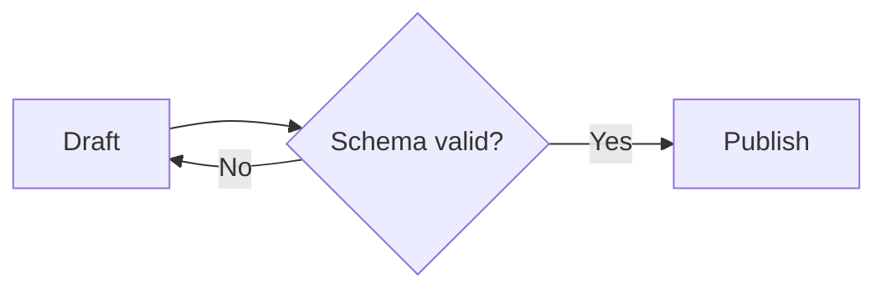
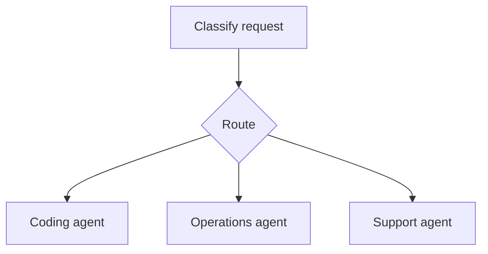
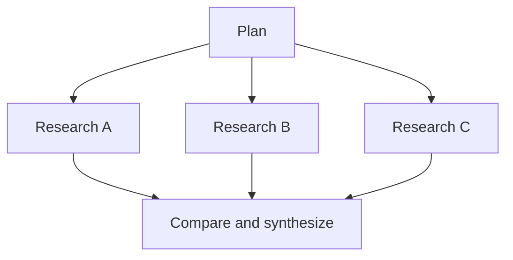
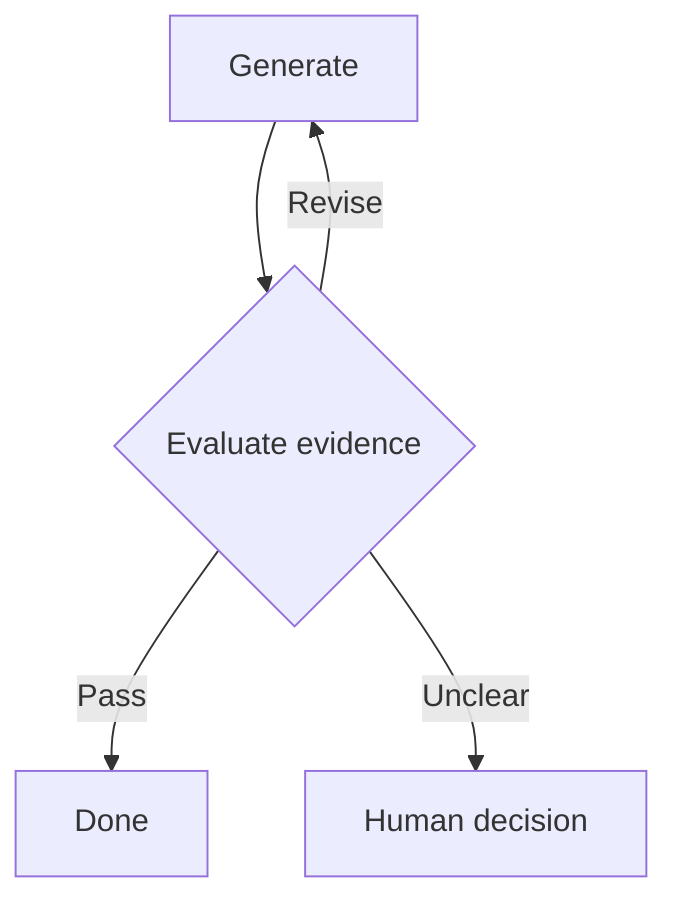
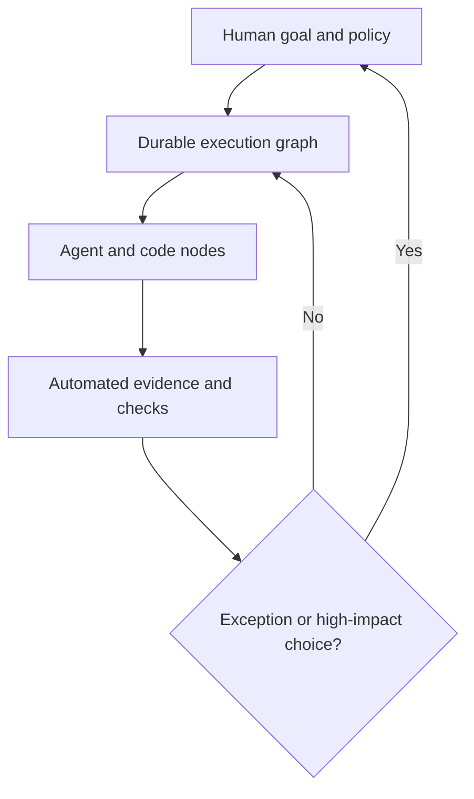
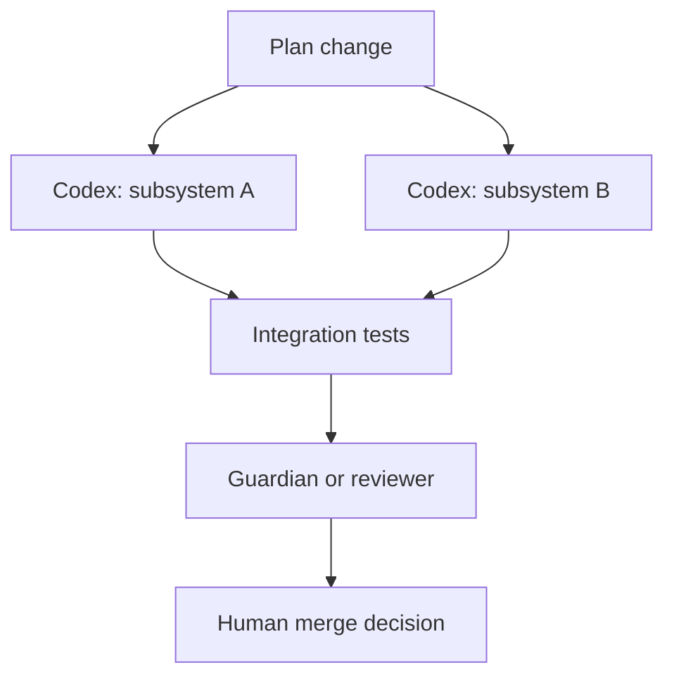
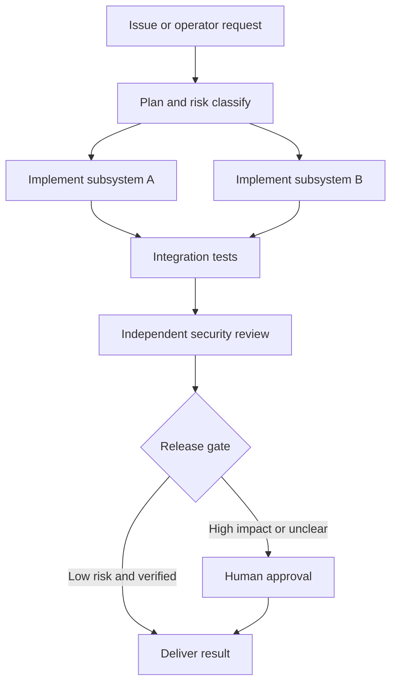

# Graph Engineering for Agentic Systems

## What it means, why it is becoming popular, and how it relates to Codex CLI, OpenClaw, and Hermes Agent

**Research date:** 23 August 2026  
**Scope:** Agent execution and orchestration graphs—not graph neural networks or ordinary knowledge-graph engineering  
**Harnesses examined:** Codex CLI, OpenClaw, and Hermes Agent

## Executive summary

**Graph engineering** is the practice of designing an agentic system as an explicit network of work rather than relying on one agent to improvise the entire process inside a single loop.

In that network:

- **nodes** perform work: deterministic code, an LLM call, a tool call, a complete agent session, a validator, or a human decision;
- **edges** determine what may happen next: fixed transitions, conditional branches, dependencies, retries, escalation paths, or event triggers;
- **state** carries the durable facts, artifacts, decisions, budgets, and provenance needed by downstream nodes;
- **reducers and joins** combine parallel results;
- **policies** decide which paths are allowed and where human approval is mandatory;
- **termination rules** decide when the system has succeeded, failed, exhausted its budget, or requires intervention.

The phrase became fashionable in July 2026, but the engineering practice is not new. Workflow engines, state machines, DAG schedulers, actor systems, CI pipelines, and multi-agent frameworks have used these structures for years. LangChain's July 2026 retrospective explicitly describes the phrase as a recent buzzword for an established approach and notes that the important modern change is what can now occupy a node: a node can be a capable, long-running agent rather than only deterministic code or a single model call. See [LangChain's “3 Years of Graph Engineering with LangGraph”](https://www.langchain.com/blog/3-years-of-graph-engineering-with-langgraph).

The most useful distinction is:

> Harness engineering makes an individual agent loop capable and safe. Graph engineering decides how multiple loops, deterministic operations, reviewers, and humans are connected.

This makes graph engineering directly relevant to Codex, OpenClaw, and Hermes:

- **Codex CLI** is currently best understood as a strong agent node and dynamic subagent-tree runtime. It has excellent coding execution, sandboxing, review evidence, Guardian, persistent threads, and multi-agent tools. However, the CLI itself does not yet provide a general user-authored persistent dependency graph. Explicit graph orchestration usually belongs in an outer script or the OpenAI Agents SDK, with Codex exposed through MCP.
- **OpenClaw** is becoming an event-driven agent control plane. It has parent/child session lineage, transcript branching, durable tasks, scheduled and conditional activation, remote workers, lifecycle recovery, and operator interfaces. These are graph-shaped primitives, but OpenClaw does not currently expose a general-purpose task-DAG engine with typed dependency edges, joins, and graph-wide completion semantics.
- **Hermes Agent** is closest to native graph engineering. Its stable Kanban system stores parent/child task links, prevents cycles, gates children on parent completion, supports fan-out and fan-in, passes parent results downstream, and can automatically decompose a triage item into a routed task graph. It is the strongest graph scheduler of the three, although its graph contracts and state remain less formal than a dedicated workflow engine such as LangGraph, AutoGen GraphFlow, Google ADK, or Temporal.

Graph engineering is also a direct response to the **human orchestration bottleneck**. The goal is not merely to run more agents. It is to move routine coordination, dependency tracking, verification, retry, and evidence collection into the graph so that humans handle only high-value decisions and genuine exceptions.

The likely winning architecture is hybrid:

> a deterministic, durable outer graph containing flexible agent loops as selected nodes.

This preserves autonomy where the path is genuinely unknown while enforcing structure where the process, risk, or evidence requirements are already understood.

## 1. Why people are talking about graph engineering now

Agent-development vocabulary has progressed through several overlapping layers:

| Layer | Primary design question | What becomes programmable |
|---|---|---|
| Prompt engineering | What should the model be told? | One model response |
| Context engineering | What should the model know at this moment? | The inference-time information environment |
| Harness engineering | What tools, state, policies, and feedback surround the model? | One capable agent runtime |
| Loop engineering | How should one agent act, observe, verify, retry, and stop? | One iterative agent process |
| Graph engineering | How should many loops, steps, reviewers, and humans interact? | A complete agentic work system |

These layers compose; they do not replace one another. A graph node may still require excellent prompting, carefully selected context, a secure harness, and a well-designed internal loop.

The phrase's recent popularity reflects three practical changes.

First, individual agents have become capable enough to complete substantial work. A graph node can now represent “investigate this subsystem and return a tested patch,” not merely “classify this sentence.”

Second, agent concurrency has become ordinary. Codex, OpenClaw, Hermes, and other systems can run several agents or sessions simultaneously. Once work branches, builders need explicit dependencies, joins, resource ownership, budgets, and failure semantics.

Third, teams have discovered that unconstrained multi-agent conversation is difficult to operate. A group chat may appear collaborative while having unclear ownership, duplicated work, no reliable completion condition, and poor recovery. A graph externalizes those relationships.

This does not mean every agent system should become a complex graph. Anthropic distinguishes predefined **workflows** from agents that dynamically direct their own process, and recommends beginning with the simplest architecture that works. Its established patterns—prompt chains, routing, parallelization, orchestrator-workers, and evaluator-optimizer—are all graph shapes even though the 2024 article does not use the new label. See [Anthropic's “Building effective agents”](https://www.anthropic.com/engineering/building-effective-agents).

## 2. What “graph” means in this report

The term is overloaded. Four meanings frequently appear in the same discussion.

### 2.1 Execution graph

An execution graph describes how work proceeds.

- Nodes are tasks, agents, tools, validators, or humans.
- Edges are allowed transitions or dependencies.
- State moves along edges or lives in a shared durable store.

This is the primary meaning of **graph engineering for agents**.

### 2.2 Agent-organization graph

An organization graph describes responsibility and authority.

- Which agent can delegate to which specialist?
- Which agent owns the final result?
- Which reviewer can veto a deployment?
- Which human receives an escalation?

This is often embedded inside the execution graph. A supervisor-worker tree is a simple organization graph.

### 2.3 Feedback and control graph

A control graph connects generators, tests, evaluators, policies, metrics, and corrective loops.

For example, a coding agent may produce a patch; tests measure behavior; a security reviewer checks risk; a cost controller checks budget; an evaluator requests revision; and a human approves release. Each feedback path constrains the others.

### 2.4 Knowledge graph

A knowledge graph represents entities, facts, and relationships: people, systems, documents, events, ownership, provenance, and time. It answers **what is known and how facts relate**.

An execution graph answers **what happens next**.

An agentic system may use both, but they are not interchangeable. Someone advertising a “knowledge graph engineer” role may be discussing ontologies, RDF, property graphs, entity resolution, and graph databases rather than agent orchestration.

Unless explicitly stated otherwise, this report uses **graph engineering** to mean execution, organization, and control graphs around agents.

## 3. The anatomy of an agent execution graph

### 3.1 Nodes: units of responsibility

A good node is more than a prompt. It has an operational contract:

- purpose and acceptance criteria;
- typed or at least well-defined inputs;
- explicit outputs and artifacts;
- allowed tools and data access;
- execution location and sandbox;
- model and reasoning budget;
- timeout and retry policy;
- idempotency expectations;
- observable progress and completion evidence.

Nodes can lie anywhere on a deterministic-to-agentic spectrum:

| Node type | Example | Predictability |
|---|---|---|
| Deterministic function | Parse JSON, run tests, calculate checksum | High |
| Model call | Classify request, summarize results | Medium-high when constrained |
| Tool action | Query database, open ticket, deploy artifact | Depends on external system |
| Agent loop | Investigate and fix an unfamiliar bug | Flexible but less predictable |
| Human gate | Approve architecture or irreversible action | High authority, limited bandwidth |

The central graph-engineering decision is not “how many agents should exist?” It is “which work needs probabilistic reasoning, and which work should remain ordinary code?”

### 3.2 Edges: control, data, and authority

An edge should define more than an arrow on a diagram. Important properties include:

- transition condition;
- data or artifact passed downstream;
- authority transferred, retained, or restricted;
- retry and timeout behavior;
- whether execution is sequential or parallel;
- whether the edge is synchronous or event-driven;
- what happens when the destination fails;
- whether the transition is reversible.

An agent handoff is therefore an authority-bearing edge. A dependency edge may carry only completion state and artifacts. An escalation edge transfers a decision to a human without transferring all execution context.

### 3.3 State: the graph's durable truth

Without explicit state, the “graph” is often only several chat transcripts connected by hope.

Useful graph state includes:

- goal and acceptance criteria;
- task status and ownership;
- parent results and generated artifacts;
- decisions and their provenance;
- execution attempts and errors;
- permission and budget consumption;
- human approvals;
- current version of memory, skills, code, and configuration.

LangGraph formalizes this as shared state updated by nodes and routed through edges. Its persistence layer distinguishes thread checkpoints from longer-term stores and supports interruption, resumption, fault recovery, and human-in-the-loop operation. See the [LangGraph Graph API](https://docs.langchain.com/oss/python/langgraph/graph-api) and [persistence documentation](https://docs.langchain.com/oss/python/langgraph/persistence).

### 3.4 Joins and reducers

Parallelism is easy to start and difficult to finish correctly. A fan-in node needs rules for combining results:

- wait for all workers, a quorum, the first success, or a deadline;
- deduplicate overlapping findings;
- detect contradictions;
- reconcile competing file changes;
- preserve provenance;
- decide whether missing branches are fatal;
- determine whether another round is required.

This is why a native “spawn many and wait” barrier is only the beginning. The graph must also define the reducer.

### 3.5 Checkpoints, interrupts, and recovery

Long-running graphs must survive process failure and human delay. A production runtime needs:

- checkpointed state;
- resumable human approval;
- replay-safe or idempotent nodes;
- durable timers;
- ownership leases and claims;
- bounded retries;
- cancellation and compensation;
- audit history.

Temporal illustrates the durable-execution interpretation: workflow progress is recorded in event history so work can resume after crashes or outages. Its human-in-the-loop patterns use signals and durable timers rather than keeping a process blocked. See [Temporal's durable execution overview](https://docs.temporal.io/temporal) and [human-in-the-loop agent pattern](https://docs.temporal.io/ai/cookbook/human-in-the-loop-python).

## 4. Graphs are usually not DAGs

The phrase “task graph” often implies a directed acyclic graph, or DAG. DAGs are excellent for build pipelines, batch processing, and work whose dependency order is known in advance.

Agent systems often require cycles:

- retry a failed tool;
- revise an answer after evaluation;
- ask a human and resume;
- gather more evidence when confidence is insufficient;
- repair a patch after tests fail;
- return to planning when assumptions change.

LangChain emphasizes that production agent graphs are commonly cyclic and that a loop is simply a small directed cyclic graph. Microsoft AutoGen's experimental GraphFlow likewise supports sequential paths, parallel fan-out, conditional branches, and loops with exit conditions. See [AutoGen GraphFlow](https://microsoft.github.io/autogen/stable/user-guide/agentchat-user-guide/graph-flow.html).

The practical distinction is:

- use a **DAG** for dependency scheduling when completed nodes should not reopen;
- use a **state machine or cyclic graph** for iterative work and human interruption;
- use **nested subgraphs** when a durable outer workflow contains flexible agent loops.

## 5. Common graph patterns

### 5.1 Chain with gates



Useful when each stage has a clear contract. Programmatic gates should handle conditions that can be checked deterministically.

### 5.2 Router to specialists



Useful when categories require different tools, prompts, policies, or models.

### 5.3 Parallel fan-out and synthesis



Useful for independent research, repository exploration, multi-model comparison, or separate implementation areas. The synthesis node is essential.

### 5.4 Generator and independent evaluator



Useful when evaluation criteria are clear enough to improve the output. The evaluator should use independent evidence, not merely agree with the generator.

### 5.5 Dynamic orchestrator-workers

A supervisor decides at runtime how many workers are needed, delegates bounded tasks, and synthesizes their results. The topology is partly known—the system will fan out and rejoin—but the number and identity of workers are dynamic.

This is the pattern most visible in current multi-agent harnesses.

### 5.6 Event-driven graph

An external event activates a workflow: a failed build, a new support ticket, a price change, an incoming message, or a changed condition. Nodes may then schedule later checks, wait for a callback, or create follow-up tasks.

This pattern connects graph engineering to always-on harnesses such as OpenClaw and Hermes.

## 6. Why graph engineering can reduce the human bottleneck

Running many sessions creates a **human orchestration bottleneck**. Graph engineering helps by transferring routine coordination from human memory into executable structure.

| Human coordination work | Graph mechanism |
|---|---|
| Remember what must happen next | Dependency edges and transition rules |
| Decide which work can run simultaneously | Fan-out topology and concurrency limits |
| Check whether prerequisites are complete | Automatic readiness gating |
| Collect results from many sessions | Join and reducer nodes |
| Request routine corrections | Evaluator-optimizer loops |
| Recover interrupted work | Checkpoints and durable state |
| Escalate only important cases | Conditional human-interrupt edges |
| Understand why a decision occurred | Provenance and execution traces |
| Prevent excessive autonomy | Capability, budget, and approval gates |

The target is **exception-driven supervision**:



However, a graph can also amplify the problem. A hundred nodes can produce a hundred status events, and a visual graph can create false confidence. The graph only reduces supervision if it compresses evidence, ranks exceptions, and anchors success in external reality such as tests, transactions, measurements, or genuine human judgment.

## 7. Relevance to Codex CLI

### 7.1 What Codex already provides

Codex has a graph-shaped multi-agent runtime even though it is not exposed as a general graph authoring system.

Its current primitives include:

- parent and descendant agent threads identified by task paths;
- parallel subagent spawning;
- waiting for worker completion;
- follow-up and steering messages;
- interrupt and shutdown controls;
- an interactive `codex agents` dashboard;
- durable sessions and queued messages;
- specialized role configuration;
- Guardian review threads distinct from ordinary worker agents;
- sandbox and permission boundaries;
- diffs, commands, and tests as review evidence.

The resulting topology is primarily a **dynamic rooted tree**. A parent agent creates children, children may create descendants, and results return toward the parent. The model decides the decomposition at runtime.

OpenAI's subagent guidance describes parallel specialist spawning and collection in one response, while its best practices recommend bounded subagent work for exploration, tests, and triage. See [Codex subagents](https://developers.openai.com/codex/agent-configuration/subagents) and [Codex best practices](https://developers.openai.com/codex/learn/best-practices).

### 7.2 Where Codex is graph-ready

Codex is especially strong as a graph node because a coding node needs:

- repository navigation;
- file editing and command execution;
- isolation and approvals;
- verifiable artifacts;
- test feedback;
- resumable state;
- rich progress and result reporting.

Guardian can act as an independent policy or review node. Tests and linters are deterministic validation nodes. Separate worktrees or sandboxes can isolate parallel implementation branches. This makes Codex well suited to a pattern such as:



### 7.3 What Codex does not yet provide natively

The CLI does not currently expose a general persistent graph definition with:

- user-authored dependency edges;
- automatic readiness scheduling;
- typed fan-in reducers;
- graph-wide retry and completion policy;
- durable cross-session graph state;
- a general graph visualization or editor.

The parent agent usually performs these functions through reasoning and tool calls. This is flexible, but orchestration state remains partly implicit in the agent's context.

### 7.4 The official external-graph route

OpenAI documents exposing Codex CLI as an MCP server and placing it inside an Agents SDK workflow. The outer SDK supplies managers, handoffs, guardrails, and traces, while Codex performs the coding work. The official guide explicitly describes this as creating deterministic, reviewable workflows that scale to a software-delivery pipeline. See [Use Codex with the Agents SDK](https://developers.openai.com/codex/mcp-server) and the [OpenAI Agents SDK orchestration guide](https://openai.github.io/openai-agents-python/multi_agent/).

This yields a clean division:

> Codex is the execution harness inside a node; the Agents SDK or another workflow runtime owns the graph.

### 7.5 Assessment

**Graph-engineering maturity:** medium as an implicit dynamic tree; high as a worker runtime; low-to-medium as a native persistent workflow graph.

Codex is the best of the three for graph nodes whose output is code and whose success can be tested. It is not currently the strongest graph scheduler.

## 8. Relevance to OpenClaw

### 8.1 What OpenClaw already provides

OpenClaw's architecture is graph-shaped in several different dimensions:

- sessions have parent/child subagent lineage;
- ACP metadata allows clients to render subagent graphs;
- transcripts can branch and switch between DAG tips;
- durable tasks and background work have lifecycle state;
- cron and condition changes activate future work;
- standing intents connect events to actions;
- child tasks and external coding-agent runs return to the requesting destination;
- cloud-worker work introduces placement, ownership, claims, and reconciliation;
- plugins connect channels, tools, runtimes, memory, browsers, and external systems.

The [OpenClaw ACP documentation](https://docs.openclaw.ai/cli/acp) explicitly says session metadata includes parent and child lineage so clients can render subagent graphs. This is an **observability graph** and organization graph rather than a complete task dependency graph.

### 8.2 OpenClaw's strongest graph role

OpenClaw is best positioned as the **outer event and operations plane**:

- receive work from chat, mobile, browser, cron, webhook, or condition changes;
- choose a runtime or external coding harness;
- start and monitor durable sessions;
- place work on local or remote infrastructure;
- deliver results back to the correct channel and thread;
- expose task status, cancellation, archives, and operator controls;
- enforce gateway, secret, and destination policy.

In graph terms, OpenClaw is developing the scheduler, event ingress, delivery edges, resource-placement layer, and operator console.

### 8.3 The missing general task graph

OpenClaw does not currently expose one general core abstraction equivalent to:

```text
task B depends on A
tasks C and D may run in parallel
task E starts after both C and D succeed
task F is the human approval gate
the workflow succeeds only after E and F
```

Its subagents form lineage trees, and its transcript history may form a DAG, but neither automatically provides dependency scheduling and graph-wide completion semantics. A transcript branch is not the same as a work dependency.

Open issues and proposals reinforce this distinction. Community proposals have asked for mission DAGs, dependency-aware work units, resource claims, and a native fan-out/fan-in barrier. Those proposals demonstrate demand, not shipped core capability. They should not be confused with the current task and session features.

### 8.4 Why the recent phrase is associated with OpenClaw

The July 2026 discussion was amplified by a short post from OpenClaw creator Peter Steinberger asking whether the conversation had shifted from loops to graphs. LangChain's retrospective links that post while stressing that graph-shaped agent systems predated the phrase.

This is culturally relevant to OpenClaw, but it is not evidence that OpenClaw suddenly shipped a graph engine. The repository's actual direction—durable tasks, subagent lineage, event conditions, transcript branching, distributed placement, and control-plane visibility—does make graph orchestration a logical next layer.

### 8.5 Assessment

**Graph-engineering maturity:** high as an event/control-plane substrate; medium for visualized session topology; low-to-medium for native task dependencies and reducers.

OpenClaw is the strongest candidate to become the operator-facing graph control plane, particularly when graphs span channels, devices, browsers, remote workers, and several different harnesses.

## 9. Relevance to Hermes Agent

### 9.1 Hermes already has a persistent task graph

Hermes is the most direct implementation of graph engineering among the three projects.

Its Kanban system provides:

- durable tasks in SQLite;
- parent-to-child task links;
- cycle detection;
- automatic readiness gating;
- parallel execution of tasks without unmet parents;
- fan-in by assigning several completed parents to a downstream task;
- parent-result summaries and metadata injected into downstream context;
- named specialist profiles;
- per-task model, tools, reasoning, priority, budget, and workspace configuration;
- task claims, heartbeats, retries, review, blocking, and audit events;
- worktree or scratch isolation;
- a persistent board humans and agents can both inspect.

The official [Hermes Kanban documentation](https://hermes-agent.nousresearch.com/docs/user-guide/features/kanban) describes the board as a durable multi-agent work queue and explicitly supports decomposing a triage item into a graph of child tasks. The [Kanban tutorial](https://hermes-agent.nousresearch.com/docs/user-guide/features/kanban-tutorial) demonstrates dependency promotion: downstream tasks remain waiting until all parents complete and then receive the parents' structured handoffs.

### 9.2 Automatic graph generation

Hermes can ask an auxiliary model to decompose a rough triage item into a JSON task graph:

- choose two to six concrete tasks;
- route them to profiles using profile descriptions;
- assign parent indices representing real data dependencies;
- run independent tasks in parallel;
- keep dependent tasks waiting;
- retain the original task as the parent of graph leaves;
- wake the orchestrator after the graph completes so it can judge the result or create additional work.

This is graph engineering performed partly by the model and partly by deterministic infrastructure. The model proposes topology and responsibility; the database enforces links, cycle safety, readiness, ownership, and durable state.

### 9.3 Two graph timescales

Hermes exposes two different orchestration levels:

1. **Ephemeral delegation:** `delegate_task` fans short reasoning work out to child agents and returns results to the parent context.
2. **Durable Kanban graph:** tasks survive restarts, cross profile and process boundaries, wait for dependencies, accept human intervention, and preserve auditable handoffs.

This is a useful distinction. Short-lived reasoning does not always deserve a durable workflow object. Work that crosses people, sessions, machines, or time usually does.

### 9.4 Remaining gaps

Hermes' Kanban graph is substantial, but it is not yet equivalent to a formal general workflow runtime.

Potential limitations include:

- node input and output contracts rely heavily on text bodies, summaries, and metadata rather than strict schemas;
- conditional edges are less expressive than a full state-machine language;
- reducers and conflict resolution are implemented through downstream agents rather than a general typed reducer system;
- compensation for irreversible side effects is not a first-class graph primitive;
- LLM-generated decomposition can create weak boundaries or incorrect dependencies;
- writable memory and skills can change node behavior over time unless governed;
- rapid repository evolution increases the chance of behavior and documentation drift.

The graph is therefore operationally real but still agent-centric rather than workflow-language-centric.

### 9.5 Assessment

**Graph-engineering maturity:** high for durable dependency graphs and profile-routed work; medium for typed state, conditional control, and formal workflow semantics.

Hermes is currently the strongest of the three if the user's main requirement is to drop work into a persistent multi-agent task graph and allow it to progress automatically.

## 10. Comparative matrix

| Capability | Codex CLI | OpenClaw | Hermes Agent |
|---|---|---|---|
| Primary topology | Dynamic subagent tree | Session lineage, transcript branches, events, remote task topology | Persistent task DAG plus agent delegation |
| Explicit parent/child lineage | Yes | Yes | Yes |
| User-defined task dependencies | Not as a general CLI graph | Not as a general core task graph | Yes |
| Automatic readiness after parents finish | Parent agent coordinates | Not generally | Yes |
| Parallel fan-out | Yes | Yes | Yes |
| Native fan-in semantics | Parent waits and synthesizes | Mostly parent/session logic | Multiple parents gate a child; downstream synthesis task |
| Cycle prevention | Tree structure limits ordinary cycles | Depends on subsystem | Yes for Kanban task links |
| Durable graph state | Durable threads, but orchestration partly implicit | Durable sessions/tasks/events; dependency graph incomplete | SQLite task graph and run history |
| Conditional/event activation | Model and external orchestration | Strong cron, intents, events, channel triggers | Cron, dispatcher state, blocks, reviews, task status |
| Human approval/review | Strong sandbox approvals and Guardian | Strong operator surfaces and gateway policy | Review/block states and approval configuration |
| Execution placement | Local and remote session continuity | Strong distributed/control-plane direction | Many terminal backends and per-task workspaces |
| Best role in a larger graph | High-quality coding worker and reviewer | Event ingress, routing, fleet control, delivery | Durable dependency scheduler and multi-profile orchestrator |
| Main graph gap | No native general persistent task DAG | No unified dependency/reducer graph | Limited typed contracts and conditional workflow language |

## 11. A practical hybrid architecture

A mature system does not need to choose between graphs and autonomous agents. It can place autonomy inside bounded nodes.

Consider a software-delivery workflow:



The nodes can be implemented in several ways.

### Codex-centered implementation

- An external workflow script or Agents SDK owns the graph.
- Codex MCP sessions perform planning, implementation, testing, and review nodes.
- Structured outputs and files carry node results.
- Guardian and sandbox policy constrain risky tool calls.
- Traces expose handoffs and execution history.

### OpenClaw-centered implementation

- OpenClaw receives the issue from a channel, schedule, webhook, or changed condition.
- A skill or plugin implements the workflow state machine.
- Codex or another harness performs specialized nodes.
- OpenClaw manages remote placement, status, operator interruption, and final delivery.
- A dedicated durable workflow service may still be needed for strict dependency and replay guarantees.

### Hermes-centered implementation

- A triage task is decomposed into a Kanban task graph.
- Independent implementation tasks receive separate profiles and worktrees.
- Test and security tasks list implementation tasks as parents.
- The release-review task lists the verification tasks as parents.
- A human can review the board, request changes, or approve completion.
- Parent summaries and metadata flow into downstream workers.

### Composite implementation

It is also possible to use the projects at their strongest layers:

- OpenClaw for event ingress, device/channel reach, and operator control;
- Hermes or a dedicated workflow engine for durable dependency scheduling;
- Codex for coding and evidence-producing execution nodes.

This composite requires deliberate integration; it is an architectural possibility, not a claim that all three currently interoperate as one turnkey product.

## 12. What a graph engineer actually engineers

“Graph engineer” is not yet a standardized job title in agentic AI. The work is real, but it overlaps existing disciplines: workflow engineering, distributed systems, reliability engineering, platform engineering, security, data contracts, evaluation, and human-computer interaction.

A graph engineer would make decisions such as:

1. **Decomposition:** What deserves a separate node? What should remain inside one agent loop?
2. **Contracts:** What inputs, outputs, artifacts, and schemas cross each edge?
3. **Authority:** Which node may write files, contact external systems, spend money, modify memory, or deploy?
4. **Topology:** Which work is sequential, parallel, conditional, iterative, or human-gated?
5. **State:** What is durable, versioned, replayable, private, or shared?
6. **Failure semantics:** What retries, times out, compensates, escalates, or permanently fails?
7. **Evidence:** What proves that each node and the whole graph succeeded?
8. **Resource policy:** Which model, machine, sandbox, budget, and concurrency limit apply?
9. **Observability:** Can operators see ownership, progress, decisions, cost, and provenance?
10. **Evolution:** Can the graph change without corrupting already-running work?

The title may or may not persist. The responsibility will.

## 13. Design principles for production graphs

### 13.1 Keep the outer graph simpler than the work

If the graph diagram requires a specialist to understand it, it may merely relocate complexity. Use explicit structure only where it adds control, reuse, safety, or observability.

### 13.2 Put agents only where judgment is needed

Parsing, validation, routing by exact rules, permission checks, state transitions, and deterministic calculations should generally remain code. Use agents for ambiguous decomposition, synthesis, investigation, or creation.

### 13.3 Define artifacts, not just messages

Downstream nodes should receive durable artifacts and structured evidence: patches, test results, design decisions, source lists, receipts, or typed records. Chat summaries alone are fragile interfaces.

### 13.4 Make every side-effecting node idempotent or compensatable

A retry should not send the same payment, email, deployment, or database mutation twice. If idempotency is impossible, record a durable operation key and provide an explicit compensation path.

### 13.5 Isolate parallel writers

Parallel coding nodes should not silently mutate the same checkout. Use worktrees, separate sandboxes, resource claims, or file ownership rules, followed by an explicit merge or reconciliation node.

### 13.6 Give joins a conflict policy

“Wait for all” does not explain what happens when outputs disagree. Define whether the reducer selects, votes, merges, asks another agent, reruns a branch, or escalates.

### 13.7 Require reality anchors

Review agents can agree with one another and still be wrong. Anchor graphs in external evidence:

- tests that actually ran;
- files and diffs that exist;
- transactions confirmed by the destination system;
- measurements from production;
- source documents with provenance;
- human judgment for genuinely subjective or high-impact decisions.

### 13.8 Bound graph expansion

Dynamic graph generation needs limits on:

- maximum nodes and depth;
- concurrency;
- model and infrastructure cost;
- retries and loop iterations;
- elapsed time;
- tool and permission scope.

### 13.9 Treat human attention as a scheduled resource

Human gates should carry priority, deadline, risk, context, recommended action, and the cost of delay. A queue of raw approval prompts is not a complete human-in-the-loop design.

## 14. Failure modes and limitations

### 14.1 Graph theater

A diagram may show reviewers and gates without defining executable contracts, durable state, or independent evidence. This is project management artwork, not graph engineering.

### 14.2 Premature decomposition

The graph can freeze assumptions before the problem is understood. Open-ended research or debugging may be better handled by one strong agent loop until the shape of the work becomes clearer.

### 14.3 Coordination tax

Each node boundary creates serialization, context transfer, latency, cost, and failure surface. A ten-node graph can perform worse than one capable agent if the task does not contain real separable structure.

### 14.4 Stragglers and blocked joins

One failed or slow branch can hold an entire fan-in. Production graphs need deadlines, partial-result policies, cancellation, and graceful degradation.

### 14.5 Context loss at edges

Summaries may omit subtle constraints. Passing entire transcripts defeats compression. The graph needs carefully designed state and artifact contracts.

### 14.6 Correlated evaluators

Several agents using similar models and the same evidence may repeat the same mistake. More reviewers do not guarantee independence.

### 14.7 Cycles without progress

Revision loops can consume unlimited tokens while alternating between superficially different outputs. Loops require measurable progress, iteration limits, and escalation rules.

### 14.8 Mutable nodes

If prompts, skills, memory, models, or tools change while a graph is running, replay may produce different results. Durable graphs should record the effective node configuration and version.

### 14.9 The graph engineer becomes the bottleneck

Over-centralized workflow ownership can slow adaptation. Good systems allow bounded dynamic topology and reusable subgraphs without permitting every agent to rewrite the whole control plane.

## 15. When to use a graph—and when not to

### Strong graph candidates

Use an explicit graph when several of these conditions hold:

- the workflow repeats;
- dependencies are knowable;
- stages have different tools, permissions, models, or owners;
- parallelism provides meaningful speed or quality gains;
- outputs can be verified;
- work must survive restarts or human delay;
- auditability matters;
- side effects are costly or irreversible;
- human review should occur only at defined gates;
- several harnesses or machines must cooperate.

### Weak graph candidates

Prefer one agent loop when:

- the task is exploratory and one-off;
- the decomposition is not yet understood;
- all steps use the same context and tools;
- node boundaries would discard useful tacit context;
- the work is cheap, reversible, and easy to verify;
- orchestration overhead exceeds expected benefit.

### Practical rule

> Start with one loop. Extract a node when a boundary needs independent tools, policy, parallelism, reuse, evidence, ownership, or recovery.

## 16. Recommended direction for the three harnesses

### Codex

Codex would benefit from a lightweight persistent task-graph layer above its existing thread tree:

- declare dependencies and acceptance criteria;
- attach artifacts and tests to node completion;
- provide automatic joins and synthesis tasks;
- display graph status in `codex agents`;
- allow Guardian and human approval nodes;
- preserve the current flexible subagent model inside each node.

It should avoid becoming a general enterprise workflow engine. Strong interoperability with Agents SDK, MCP, and external durable runtimes may provide the better boundary.

### OpenClaw

OpenClaw's logical next step is a first-class mission or workflow object connecting:

- event triggers;
- durable task nodes;
- subagent and external-harness nodes;
- resource placement and claims;
- dependency edges and joins;
- human approval and notification edges;
- delivery destinations;
- graph-wide cost, audit, and recovery state.

Its operator UI makes it a natural place to visualize and intervene in such graphs. The risk is adding another large subsystem to an already broad trusted computing base.

### Hermes

Hermes already has the execution foundation. Its next graph-engineering gains would come from making contracts more formal:

- typed node input/output schemas;
- explicit conditional edges;
- reusable, versioned graph definitions;
- graph preview and cost estimation before launch;
- typed reducers and conflict policies;
- compensation and idempotency declarations;
- pinned skill, model, memory, and tool versions;
- graph-level evaluation and provenance exports.

Because Hermes can automatically generate task graphs, preview and approval are especially important. The system should show expected node count, fan-out, permissions, model routes, workspaces, and estimated cost before executing a large graph.

## 17. Expected trend

The next phase of harness development will probably combine four systems that are currently separate:

1. **Agent runtime:** tools, context, memory, and a reasoning loop.
2. **Graph runtime:** dependencies, conditional control, joins, state, retries, and recovery.
3. **Policy runtime:** capabilities, approvals, budgets, identity, and secret scope.
4. **Operator runtime:** visualization, attention routing, evidence, intervention, and audit.

Dedicated frameworks already demonstrate pieces of this direction:

- LangGraph models nodes, edges, shared state, dynamic sends, checkpoints, and interrupts.
- AutoGen GraphFlow provides directed multi-agent execution with sequential, parallel, conditional, and looping paths.
- Google ADK 2.0 is moving from fixed sequential/parallel/loop templates toward graph-based and dynamic workflows. See [Google ADK workflow agents](https://adk.dev/agents/workflow-agents/).
- OpenAI Agents SDK provides agents-as-tools, handoffs, guardrails, tracing, and human-in-the-loop patterns.
- Temporal adds durable execution, event history, signals, timers, and recovery beneath agent frameworks.

The harness projects are approaching the same territory from different directions. Codex begins with the worker. OpenClaw begins with the control plane. Hermes begins with the autonomous personal agent and has now added a durable task graph.

## 18. Final conclusion

Graph engineering is partly a buzzword, but it names a genuine architectural transition.

The single-agent loop is not disappearing. It is becoming a component. As agents grow more capable, the system-level problem shifts toward deciding how those loops interact, what state they share, which paths are deterministic, how failures recover, what evidence is required, and when a human must intervene.

For the three harnesses examined:

- **Codex is the strongest execution node**, especially for software work that can produce diffs, tests, and reviewable evidence.
- **OpenClaw is the strongest emerging event and operator control plane**, with broad channels, devices, automation, task visibility, and distributed execution.
- **Hermes has the strongest native persistent task graph**, with dependency-aware Kanban scheduling, automatic decomposition, fan-out, fan-in, and cross-profile handoffs.

The most important implication is that graph engineering and harness engineering are complementary:

> The harness governs how one agent works. The graph governs how the whole system works.

Graph engineering will be valuable when it increases useful autonomous work per minute of human attention. It will be harmful when it merely creates more agents, more arrows, more notifications, and more state for a human to understand.

## Primary sources

### Graph and workflow foundations

- [LangChain: 3 Years of Graph Engineering with LangGraph](https://www.langchain.com/blog/3-years-of-graph-engineering-with-langgraph)
- [LangGraph Graph API](https://docs.langchain.com/oss/python/langgraph/graph-api)
- [LangGraph persistence](https://docs.langchain.com/oss/python/langgraph/persistence)
- [Anthropic: Building effective agents](https://www.anthropic.com/engineering/building-effective-agents)
- [Microsoft AutoGen GraphFlow](https://microsoft.github.io/autogen/stable/user-guide/agentchat-user-guide/graph-flow.html)
- [Google ADK workflow agents](https://adk.dev/agents/workflow-agents/)
- [OpenAI Agents SDK: Agent orchestration](https://openai.github.io/openai-agents-python/multi_agent/)
- [OpenAI Agents SDK: Tracing](https://openai.github.io/openai-agents-python/tracing/)
- [Temporal durable execution](https://docs.temporal.io/temporal)
- [Temporal human-in-the-loop agent pattern](https://docs.temporal.io/ai/cookbook/human-in-the-loop-python)

### Codex CLI

- [Codex canonical repository](https://github.com/openai/codex)
- [Codex subagents](https://developers.openai.com/codex/agent-configuration/subagents)
- [Codex best practices](https://developers.openai.com/codex/learn/best-practices)
- [Use Codex with the Agents SDK](https://developers.openai.com/codex/mcp-server)

### OpenClaw

- [OpenClaw canonical repository](https://github.com/openclaw/openclaw)
- [OpenClaw agent runtime architecture](https://docs.openclaw.ai/agent-runtime-architecture)
- [OpenClaw ACP and session lineage](https://docs.openclaw.ai/cli/acp)
- [OpenClaw automation](https://docs.openclaw.ai/automation/cron-jobs)
- [OpenClaw 2026.7.1 release](https://docs.openclaw.ai/releases/2026.7.1)

### Hermes Agent

- [Hermes Agent canonical repository](https://github.com/NousResearch/hermes-agent)
- [Hermes Kanban](https://hermes-agent.nousresearch.com/docs/user-guide/features/kanban)
- [Hermes Kanban tutorial](https://hermes-agent.nousresearch.com/docs/user-guide/features/kanban-tutorial)
- [Hermes delegation](https://hermes-agent.nousresearch.com/docs/user-guide/features/delegation)
- [Hermes Agent v2026.8.19 release](https://github.com/NousResearch/hermes-agent/releases/tag/v2026.8.19)
