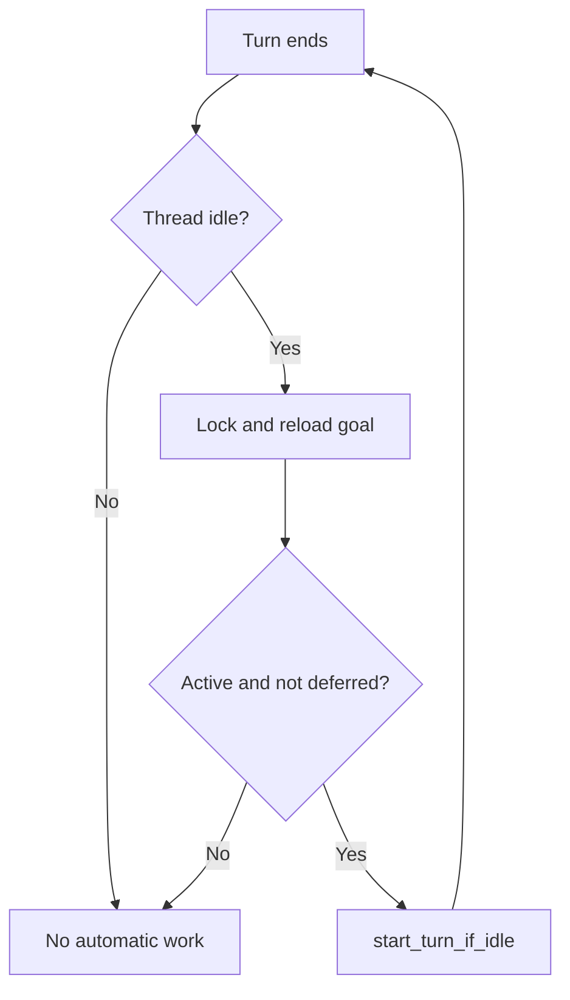
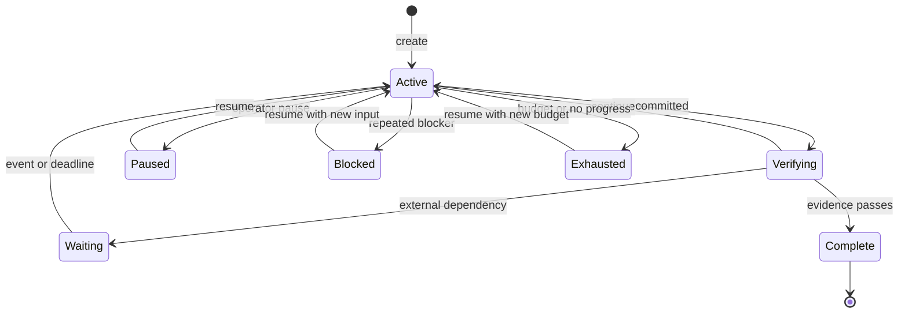
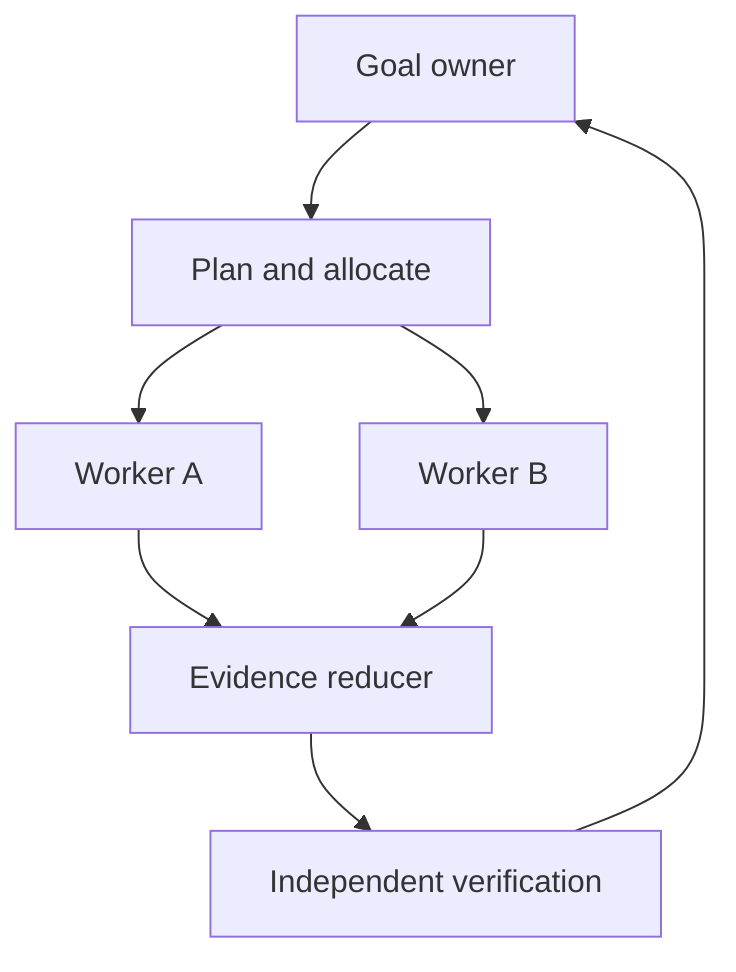

# Goal Mode and Loop Engineering in Agent Harnesses

## How Codex CLI, OpenClaw, and Hermes Agent implement durable goals—and what to build in a new harness

**Research date:** 24 August 2026

**Repository snapshots:** Codex CLI `fb0781b9eee6d2da741b984bed9dde95834d909d`; OpenClaw `19d44d3f38bf2bbab525cfc1326d23ad98d3cd63`; Hermes Agent `9ab056d4e8b892fccb797cc5cd5dffd090ac827e`

**Scope:** Cross-turn goal pursuit, continuation scheduling, verification, stopping, persistence, recovery, and multi-agent composition. This is about execution loops, not ordinary programming loops.

## Executive summary

All three harnesses now expose a literal goal concept, but they implement three materially different control architectures:

| Harness | What `/goal` owns | How another turn starts | How completion is decided | Primary safety backstop |
|---|---|---|---|---|
| Codex CLI | A durable thread objective, status, and token/time accounting | The goal extension listens for an idle thread and starts a new turn with a goal steering item | The working agent calls `update_goal(complete|blocked)` after a strict evidence audit | Token budget, terminal turn errors, usage-limit state, operator pause/clear |
| OpenClaw | Durable session objective and operator/agent-visible state | `/goal` alone does not schedule autonomous turns; `/loop`, automations, heartbeat, tasks, or Task Flow provide activation | Agent or operator explicitly marks complete/blocked | Token budget, operator-owned lifecycle controls, separate scheduler policies, tool-loop detection |
| Hermes Agent | A persistent single-session objective plus completion contract, gates, wait barrier, and turn counter | After each turn, an auxiliary judge returns `done`, `continue`, or `wait`; `continue` is queued back into the same session | Deterministic gates run first; then a separate judge model evaluates the response and contract | Default 20-turn budget, gate retry/timeout limits, pause, wait barriers, user-message preemption |

The best design for a new harness is not to copy one implementation wholesale. Use a hybrid:

1. Adopt OpenClaw's separation between **goal state** and **activation policy**.
2. Adopt Codex's durable state machine, serialized mutations, lifecycle hooks, accounting, and automatic idle-start seam.
3. Adopt Hermes' completion contracts, deterministic quality gates, separate judge, wait semantics, and human-message preemption.
4. Reject the unsafe parts: do not let the maker be the only verifier; do not treat judge failure as unbounded `continue`; do not encode a durable goal only under a mutable session identifier; and do not make `pause`, `blocked`, `exhausted`, or `error` aliases for success.

The core architectural rule is:

> A goal is durable control-plane state. A continuation is a leased, idempotent scheduling decision. A completion is an evidence-backed state transition. These must be three separate operations.

## 1. What “loop engineering” means here

The phrase is easily confused with two older loops. An ordinary `while` loop is programming control flow. The inner agent loop—the model choosing tools, observing results, and deciding whether to call another tool—is harness plumbing. The newer loop-engineering object is an **external loop specification** wrapped around whole agent turns.

The June 2026 position paper [*Stop Hand-Holding Your Coding Agent*](https://arxiv.org/html/2607.00038v1) defines that specification as a bounded artifact with a trigger, goal, execution phase, verification, stopping rule, and durable memory. It also argues that the check is more important than the repeated prompt: without new evidence pushing back on the next action, the system is only an agent agreeing with itself.

This report therefore distinguishes four layers:

| Layer | One iteration is | Typical stop condition |
|---|---|---|
| Tool loop | One model/tool cycle inside a turn | Model returns a final answer, tool policy blocks, or the turn errors |
| Goal loop | One complete agent turn toward a durable objective | Objective verified, blocked, paused, exhausted, or failed |
| Scheduler loop | One wake-up caused by idle, time, event, or completion | Schedule removed, condition false, or policy disables the job |
| Work graph | One node or task attempt among dependencies | Node terminal; downstream readiness is recalculated |

`/goal` should primarily own the second layer. It may use the scheduler and graph layers, but combining all four into one opaque loop makes stopping, recovery, and operator control much harder.

## 2. Research method and source policy

The implementation analysis used the canonical repositories at the pinned commits above, official product documentation, official release notes, and project issue trackers for observed failure modes. The repositories are moving quickly; commit links in the source index are pinned so the described code can be recovered even if `main` changes.

The comparison asks the same questions of every harness:

- Is there a literal `/goal`, or only an analogous feature?
- Where is the goal stored, and what identity is it keyed by?
- What event schedules the next turn?
- Is continuation a normal user message, a special steering item, or a task event?
- Who decides `complete`, and what evidence can that decider inspect?
- What stops busy-waiting, repeated failures, token burn, or stale work?
- How do user messages, edits, permissions, compaction, restart, and fork/resume interact?
- How does a single-session loop compose with subagents and a durable work graph?

## 3. Comparative conclusions first

### 3.1 The three systems answer different questions

Codex asks: **How can an active thread keep starting turns until the working model says the objective is complete?** Its implementation is closest to a goal runtime embedded inside the ordinary thread lifecycle.

OpenClaw asks: **How can a durable objective remain attached to an operator-visible session while several independent activation mechanisms decide when work runs?** Its `/goal` is intentionally not a background job or task queue.

Hermes asks: **How can one conversation be re-prompted until an independent checker says the contract is satisfied, while deterministic gates and background waits prevent waste?** It is the most explicit maker-checker implementation.

### 3.2 Capability matrix

| Capability | Codex CLI | OpenClaw | Hermes Agent |
|---|---|---|---|
| Literal `/goal` | Yes | Yes | Yes |
| Durable objective | SQLite thread-goal record | Session goal state in shared persistence | `SessionDB.state_meta` goal record |
| Automatic continuation from `/goal` alone | Yes, on thread idle | No | Yes, after judge verdict |
| Separate judge model | No | No, not in `/goal` itself | Yes, auxiliary `goal_judge` |
| Deterministic completion gates | Encouraged through tools/tests, not a first-class goal gate | External scheduler/flow/plugin may implement them | Yes, first-class shell gates before judge |
| Structured completion contract | Objective plus strong continuation/audit prompt | Objective and optional budget; other workflow state is separate | Outcome, verification, constraints, boundaries, stop condition, subgoals |
| Explicit wait/park state | Indirect through tools and thread lifecycle | Scheduler/task mechanisms are separate | Yes, process/session/time wait barriers |
| Primary budget | Tokens and elapsed time accounting; optional token budget | Optional token budget window | Continuation turns; gate retries and timeouts |
| User-message precedence | Steering/queued input through the thread runtime | Queue and session policy | Explicitly ahead of queued continuation |
| Goal mutation serialization | Per-thread runtime lock plus database checks | Revisioned durable session/task state in surrounding runtime | Gateway control-plane restrictions; state persistence |
| Tool-loop repetition guard | Goal errors become terminal blocked; ordinary loop protections live elsewhere | Rolling tool-call detector plus post-compaction guard | Goal gates fingerprint unchanged work; turn budget bounds outer loop |
| Multi-agent composition | Subagent tree inside a goal turn; goal remains thread-scoped | Subagents, tasks, Task Flow, ACP, and schedulers are separate primitives | `/goal` is single-session; Kanban cards may opt into goal mode |

### 3.3 Strongest idea from each harness

- **Codex:** continuation is a lifecycle extension, not a shell script. It observes thread idle, rechecks durable state under a lock, and submits the next turn only if the thread can atomically accept idle work.
- **OpenClaw:** goal, scheduler, task ledger, and workflow are separate objects. This prevents a durable objective from silently becoming an always-on job with unclear delivery and recovery semantics.
- **Hermes:** completion is a contract evaluated by deterministic gates first and an independent judge second. Waiting on real external work is represented as a parked state rather than repeated “is it done?” turns.

## 4. Codex CLI implementation

### 4.1 Surface and control plane

Codex has a literal `/goal`. At the inspected commit it is a stable, default-enabled feature, not just a prompt convention. [`SlashCommand::Goal`](https://github.com/openai/codex/blob/fb0781b9eee6d2da741b984bed9dde95834d909d/codex-rs/tui/src/slash_command.rs) routes the TUI command; [`goal_display.rs`](https://github.com/openai/codex/blob/fb0781b9eee6d2da741b984bed9dde95834d909d/codex-rs/tui/src/goal_display.rs) documents `objective`, `edit`, `pause`, `resume`, and `clear`; and the official [Follow a goal](https://developers.openai.com/codex/use-cases/follow-goals/) guide describes multi-hour autonomous work.

The slash command is only one client. The durable control plane is the app-server protocol:

```text
thread/goal/set
thread/goal/get
thread/goal/clear
thread/goal/updated   # notification
thread/goal/cleared   # notification
```

The handlers live in [`thread_goal_processor.rs`](https://github.com/openai/codex/blob/fb0781b9eee6d2da741b984bed9dde95834d909d/codex-rs/app-server/src/request_processors/thread_goal_processor.rs). They require a materialized thread, reconcile persisted rollout state, mutate the goal through `GoalService`, publish ordered notifications, and only then apply live runtime effects.

This is an important implementation boundary: a noninteractive client should call the RPC. Sending the text `"/goal ..."` to `codex exec` is not guaranteed to take the TUI slash-command path. The missing first-class programmatic surface is tracked in [Codex issue #26949](https://github.com/openai/codex/issues/26949).

### 4.2 Data model and status authority

The durable record contains a generated `goal_id`, thread id, objective, status, optional token budget, tokens used, elapsed seconds, and creation/update timestamps. The status set is:

```text
Active | Paused | Blocked | UsageLimited | BudgetLimited | Complete
```

The model receives `get_goal`, `create_goal`, and `update_goal` tools from the [`codex-rs/ext/goal`](https://github.com/openai/codex/tree/fb0781b9eee6d2da741b984bed9dde95834d909d/codex-rs/ext/goal) extension. The tool contract deliberately restricts authority:

- the model may create a goal only after an explicit user/system request;
- `update_goal` may set only `complete` or `blocked`;
- pause, resume, usage-limit, and budget-limit transitions belong to the operator or runtime;
- `blocked` is intended only after the same blocker has repeated across at least three goal turns.

See [`spec.rs`](https://github.com/openai/codex/blob/fb0781b9eee6d2da741b984bed9dde95834d909d/codex-rs/ext/goal/src/spec.rs) and [`tool.rs`](https://github.com/openai/codex/blob/fb0781b9eee6d2da741b984bed9dde95834d909d/codex-rs/ext/goal/src/tool.rs). This split prevents the working model from silently pausing, replacing, or erasing the user's durable objective.

### 4.3 Persistence and race control

Goal state lives in a dedicated SQLite store rather than only in rollout JSONL. The schema is created by [`0001_thread_goals.sql`](https://github.com/openai/codex/blob/fb0781b9eee6d2da741b984bed9dde95834d909d/codex-rs/state/goals_migrations/0001_thread_goals.sql); a second table in [`0002_thread_goal_continuation_deferrals.sql`](https://github.com/openai/codex/blob/fb0781b9eee6d2da741b984bed9dde95834d909d/codex-rs/state/goals_migrations/0002_thread_goal_continuation_deferrals.sql) prevents a copied/forked goal from auto-starting before its intended explicit first turn.

[`GoalStore`](https://github.com/openai/codex/blob/fb0781b9eee6d2da741b984bed9dde95834d909d/codex-rs/state/src/runtime/goals.rs) provides atomic CRUD and accounting. Mutations may include an expected `goal_id`, so a late operation from a previous goal cannot overwrite a replacement. The live runtime also holds a one-permit semaphore across read/mutate/start windows. Before an external edit, pause, clear, or replacement, it flushes current accounting under that serialization boundary.

This combination—database precondition plus per-runtime lock—is what a new harness should copy. A lock alone does not survive multiple processes; a database compare alone does not stop two live callbacks from both deciding to start work before their writes become visible.

### 4.4 The cross-turn continuation loop

The ordinary Codex tool loop remains unchanged: one turn can already perform many model/tool cycles, compact context, receive steering, execute stop hooks, and terminate normally. Goal mode adds an outer lifecycle extension.

[`GoalRuntimeHandle::continue_if_idle`](https://github.com/openai/codex/blob/fb0781b9eee6d2da741b984bed9dde95834d909d/codex-rs/ext/goal/src/runtime.rs) performs the decisive sequence:

```text
thread becomes idle
→ acquire goal-state permit
→ reject if continuation is deferred
→ load live thread and durable goal
→ require status == Active
→ build a typed continuation steering item
→ call thread.start_turn_if_idle(...)
```

`start_turn_if_idle` is stronger than “send another prompt.” It atomically loses to any user or system input that already started the thread, so an automatic continuation does not create a second overlapping turn. [`extension.rs`](https://github.com/openai/codex/blob/fb0781b9eee6d2da741b984bed9dde95834d909d/codex-rs/ext/goal/src/extension.rs) wires this into thread start/resume/idle/stop, turn start/stop/abort/error, token usage, and tool completion hooks.



The continuation text in [`templates/goals/continuation.md`](https://github.com/openai/codex/blob/fb0781b9eee6d2da741b984bed9dde95834d909d/codex-rs/ext/goal/templates/goals/continuation.md) is unusually substantive. It re-injects the complete objective as untrusted user data, current budget, evidence rules, a requirement-by-requirement completion audit, plan guidance, and the strict blocker rule. This is why the objective survives transcript compaction without depending on a summary to preserve every control instruction.

There is no independent judge. The maker calls `update_goal(complete)` after its own prompted audit. Codex strengthens the audit but does not automatically require a passing test command, external reviewer, or artifact gate before committing `Complete`.

### 4.5 Accounting and terminal errors

[`accounting.rs`](https://github.com/openai/codex/blob/fb0781b9eee6d2da741b984bed9dde95834d909d/codex-rs/ext/goal/src/accounting.rs) counts uncached input plus output tokens, tracks wall time, and serializes progress snapshots so overlapping tool-finish hooks do not charge the same delta twice. If a token threshold is crossed during a tool call, the runtime injects a budget-limit steering item so the current turn can wrap up instead of beginning more substantive work.

Error semantics are designed to prevent a runaway restart loop:

- usage-limit errors transition an active goal to `UsageLimited`;
- other terminal or retries-exhausted turn errors transition it to `Blocked`;
- inactive statuses suppress idle continuation;
- operator interrupt first pauses the goal, then cancels the turn, so the new idle state cannot immediately relaunch it.

Plan mode is excluded from active goal charging/continuation for that turn. Resume restores active accounting from the database; stopped states remain stopped until the user acts.

The largest budget gap is that there is no mandatory default. A configurable `max_goal_token_budget` can cap/default the budget, but the goal runtime has no built-in maximum turns, maximum tool calls, monetary ceiling, or mandatory wall-time ceiling.

### 4.6 Compaction, resume, and fork

Conversation history persists as rollout JSONL, while goal state remains authoritative in SQLite. Pre-sampling and mid-turn compaction summarize/prune the transcript, but the next goal continuation reconstructs its contract from the durable goal record. A non-retryable compaction failure ends the turn and blocks the goal rather than starting the same failing continuation forever.

Ordinary forks do not generally inherit goals. A specialized app-server path in [`thread_fork_goal.rs`](https://github.com/openai/codex/blob/fb0781b9eee6d2da741b984bed9dde95834d909d/codex-rs/app-server/src/request_processors/thread_fork_goal.rs) copies the snapshot to the new thread and writes a continuation deferral. The first explicit input clears the deferral; only later idle state may continue it. This is a useful pattern whenever a goal moves between workers or hosts.

### 4.7 Plans, subagents, and what remains outside `/goal`

The `update_plan` checklist is presentation/advisory state, not a durable scheduler. Plan updates do not define dependencies or drive readiness. Goal mode may ask the model to maintain a plan, but runtime continuation depends only on goal state and thread lifecycle.

Codex can spawn, steer, interrupt, and wait for subagent threads. Each child is an ordinary `CodexThread` with separate identity and rollout. The parent synthesizes results. A thread goal does not automatically decompose into child goals, assign worktrees, join evidence, or block completion on required child tasks.

Codex's strongest reusable ideas are therefore:

- durable goal state independent of compacted transcript;
- a normal-turn boundary between iterations;
- race-safe idle continuation;
- authority-separated status transitions;
- serialized accounting/mutation;
- current-state evidence instructions re-injected every turn;
- terminal errors converted to stopped goal states.

Its most important gaps are:

- no independent verifier or first-class deterministic goal gates;
- no host-side semantic progress/stuck detector;
- no stored blocker fingerprint or programmatic three-strike counter;
- no multidimensional mandatory budget;
- no durable plan/task DAG or goal-aware child aggregation;
- no external daemon continuing work if the hosting Codex runtime disappears.

## 5. OpenClaw implementation

### 5.1 `/goal` is durable state, not an autonomous job

OpenClaw also has a literal `/goal`, but its contract is intentionally different. The official [Goal documentation](https://docs.openclaw.ai/tools/goal) says a goal is one durable objective attached to a session; it is not a background task, reminder, cron job, standing order, or task queue. It survives process restarts and follows the session key across supported chat surfaces.

The command grammar is richer than Codex's:

```text
/goal [status]
/goal start|set|create <objective>
/goal edit <objective>
/goal pause [note]
/goal resume [note]
/goal complete|done [note]
/goal block|blocked [note]
/goal clear
```

Unknown action text is treated as a new objective, so `/goal get CI green` is an alias for `start`. Only one goal may exist on a session, including after completion, until it is cleared.

[`commands-goal.ts`](https://github.com/openclaw/openclaw/blob/19d44d3f38bf2bbab525cfc1326d23ad98d3cd63/src/auto-reply/reply/commands-goal.ts) parses and executes the command. `start` and `resume` rewrite the current command into an ordinary continuation prompt, so those control actions immediately produce one agent turn. Subsequent autonomous turns are not scheduled by the goal record itself.

This is the most important semantic point in the entire comparison:

> OpenClaw `/goal` keeps the objective alive across turns; it does not, by itself, keep creating turns.

### 5.2 Session data model and budget accounting

The goal is a core field on the `SessionEntry`. [`SessionGoal`](https://github.com/openclaw/openclaw/blob/19d44d3f38bf2bbab525cfc1326d23ad98d3cd63/src/config/sessions/types.ts) stores:

- schema version and random goal id;
- objective and status;
- created/updated and status-specific timestamps;
- token baseline, freshness flag, tokens used, and optional token budget;
- a `continuationTurns` counter slot;
- last status note.

Statuses mirror the mature control vocabulary:

```text
active | paused | blocked | usage_limited | budget_limited | complete
```

[`goals.ts`](https://github.com/openclaw/openclaw/blob/19d44d3f38bf2bbab525cfc1326d23ad98d3cd63/src/config/sessions/goals.ts) owns storage policy. `createSessionGoal` refuses an existing record, captures a fresh total-token baseline when available, and records a `session_goal_changed` event. Read/account operations derive usage from the current fresh session total; when usage crosses the configured window, `active` becomes `budget_limited`.

The baseline logic handles a subtle persistence problem: if a session only has a stale token snapshot when the goal begins, display reads do not charge old work to the goal. A later persisted read adopts the next fresh total as the new baseline. Resuming from `budget_limited` or `usage_limited` opens a new budget window while preserving the objective.

The human `/goal start` surface currently does not accept a token-budget flag. A budget is available through the model-facing `create_goal` tool. That asymmetry is documented and is a good reason to make programmatic goal creation the canonical API in a new harness.

### 5.3 Model-facing authority and context injection

[`goal-tools.ts`](https://github.com/openclaw/openclaw/blob/19d44d3f38bf2bbab525cfc1326d23ad98d3cd63/src/agents/tools/goal-tools.ts) exposes:

| Tool | Authority |
|---|---|
| `get_goal` | Read objective, status, and usage |
| `create_goal` | Create only on an explicit user/system request; may set a positive token budget |
| `update_goal` | Set only `complete` or `blocked`, with an optional note |

The model cannot silently pause, resume, clear, or replace the goal. The `update_goal` description repeats the three-consecutive-blocker rule and reminds the model that the tool mutates control state but does not send the visible final response.

Every ordinary inbound turn receives a compact context line while the goal is active. [`formatActiveGoalContext`](https://github.com/openclaw/openclaw/blob/19d44d3f38bf2bbab525cfc1326d23ad98d3cd63/src/auto-reply/reply/inbound-meta.ts) truncates the objective to 200 characters and injects:

```text
Active goal: <objective> — advance; keep active until fully achieved;
block only after the same blocker on 3 consecutive turns; after update_goal,
provide the requested visible final.
```

The queued-turn admission path refreshes this injected block from current session state. That means a goal edit, pause, budget limit, or clear that occurs while input is queued is reflected when the queued turn actually starts; stale copied context is removed. Inactive statuses are not injected.

Unlike Codex, OpenClaw does not re-inject a full completion-audit template or independently decide after every turn whether another should start. The durable goal is a shared target and status contract, not an outer turn scheduler.

### 5.4 Activation lives in other OpenClaw subsystems

OpenClaw has several ways to produce future work, each with its own semantics. The [Automation overview](https://docs.openclaw.ai/automation) explicitly separates them:

- `/loop [interval] <prompt>` creates a recurring agent-turn automation bound to the conversation;
- omitted interval enables self-paced scheduling within bounds through `next_check`;
- automations provide durable exact, interval, condition, webhook, or stream triggers;
- heartbeat batches flexible periodic checks into the main session;
- background tasks record detached execution but are not schedulers;
- Task Flow manages durable multi-step plugin-controlled work;
- standing orders inject persistent policy/instructions but still need a trigger.

The [Automations documentation](https://docs.openclaw.ai/automation/cron-jobs) states that `/loop` may use a fixed cadence or self-pace between one minute and one hour. Failed, timed-out, or skipped paced runs discard a proposed next check so retry/backoff policy remains authoritative.

The [Task Flow documentation](https://docs.openclaw.ai/automation/taskflow) is particularly relevant to building a graph around goals. Managed flows keep revisioned state in SQLite, reject stale expected revisions, propagate sticky cancellation, and distinguish `queued`, `running`, `waiting`, `blocked`, `succeeded`, `failed`, `cancelled`, and `lost`. Detached subagent and ACP runs can receive mirrored one-task flows.

This layered architecture is more verbose than “goal auto-repeats,” but it avoids confusing four different responsibilities:

| Need | OpenClaw object |
|---|---|
| Keep one outcome visible in a conversation | Goal |
| Decide when another turn runs | Loop/automation/heartbeat/event |
| Track detached execution | Task |
| Orchestrate multiple durable steps | Task Flow |

### 5.5 Native Codex integration deliberately avoids double scheduling

OpenClaw's optional Codex harness exposes `/codex goal` to read or modify the attached Codex thread's native goal. Its [Codex harness documentation](https://docs.openclaw.ai/plugins/codex-harness) explicitly says Codex automatic goal continuation remains disabled in that integration because OpenClaw does not yet own native autonomous follow-on turns there.

This is a crucial integration lesson. If an outer control plane and an inner harness both observe “idle + active goal,” they can race to create duplicate continuations. Cross-harness goal support needs one elected scheduler owner, with the other runtime exposing status and one-turn execution only.

### 5.6 Loop safety

OpenClaw has the strongest explicit inner tool-loop detector of the three. The official [Tool-loop detection](https://docs.openclaw.ai/tools/loop-detection) design has two layers:

1. optional rolling-history detectors for repeated patterns, unknown-tool retries, and high-frequency no-result calls;
2. a post-compaction guard that is on unless explicitly disabled and watches a short window for the same `(toolName, argsHash, resultHash)` triple after context-overflow recovery.

For `exec`, result hashing keeps stable status, exit code, timeout, and output while ignoring volatile pid/session/duration metadata. History is scoped to a run so an old heartbeat cannot poison a fresh run. A first critical loop blocks the tool batch and gives the model one recovery response; another critical loop in the same run ends it.

This detector protects the inner tool loop, not the semantic outer goal loop. A goal can still receive several different-looking but unproductive turns unless the selected activation mechanism adds no-progress policy.

### 5.7 Strengths and gaps

OpenClaw's strongest design choices are:

- clean separation of durable intent, activation, execution ledger, and workflow;
- operator-visible statuses and controls across chat surfaces;
- model authority limited to create/complete/block;
- current-state goal context refreshed at queued-turn admission;
- careful fresh-token baseline and resumable budget windows;
- revisioned Task Flow and sticky cancellation for multi-step work;
- explicit tool-loop and post-compaction runaway protection;
- multiple durable trigger mechanisms for time, event, and detached completion.

Its `/goal`-specific gaps are:

- no automatic continuation after each ordinary goal turn;
- no goal-owned judge, deterministic gate list, wait contract, or completion evidence bundle;
- the active prompt carries a truncated objective, not a full structured completion contract;
- `continuationTurns` exists in the schema but is not, in the inspected path, the driver of a bounded autonomous loop;
- scheduler, task, and flow records are powerful but require deliberate composition with the goal;
- the same model may mark its own work complete unless a workflow adds independent review.

OpenClaw is therefore the best reference for a **control-plane decomposition**, not the most complete turnkey `/goal` loop.

## 6. Hermes Agent implementation

### 6.1 A post-turn maker-checker loop

Hermes has a literal `/goal` whose architecture is closest to the research definition of an external loop. [`GoalManager`](https://github.com/NousResearch/hermes-agent/blob/9ab056d4e8b892fccb797cc5cd5dffd090ac827e/hermes_cli/goals.py) wraps complete ordinary turns rather than modifying the inner model/tool loop:

```text
normal turn finishes
→ deterministic gates, if configured
→ auxiliary goal judge
→ DONE, WAIT, or CONTINUE
→ persist state
→ enqueue an ordinary user-role continuation when needed
```

The CLI and gateway implement the same idea through different delivery paths. The CLI's `_maybe_continue_goal_after_turn` places a continuation into its pending-input queue; [`gateway/run.py`](https://github.com/NousResearch/hermes-agent/blob/9ab056d4e8b892fccb797cc5cd5dffd090ac827e/gateway/run.py) waits for the visible response to be delivered and then appends through the adapter FIFO. A real pending user message preempts synthetic continuation. Slash controls may be dispatched while busy, but replacing a running goal is rejected until the active work is stopped.

Continuation is an ordinary user-role message. That keeps the main turn engine, tool visibility, and prompt caching conventional. It also means the harness must attach provenance and a goal revision outside the message if it wants strong stale-continuation protection; current Hermes rechecks `active` status but does not have a goal revision/CAS protocol.

### 6.2 Command, state, and completion contract

The [Goals guide](https://hermes-agent.nousresearch.com/docs/user-guide/features/goals) and [`COMMAND_REGISTRY`](https://github.com/NousResearch/hermes-agent/blob/9ab056d4e8b892fccb797cc5cd5dffd090ac827e/hermes_cli/commands.py) expose:

```text
/goal <objective> | draft <objective> | show | status
/goal pause | resume | clear
/goal gate add|remove|list|clear ...
/goal wait <pid> | unwait
/subgoal ...
```

`GoalState` stores objective, `active|paused|done|cleared`, turns used/max turns, last verdict/reason, pause reason, judge failure counters, flat subgoals, wait fields, contract, and gates. The default allowance is 20 continuation turns. Resume normally resets the allowance, enabling explicit additional 20-turn windows.

Persistence is a JSON-like value in `SessionDB.state_meta` keyed as `goal:<session_id>`. That is better than transcript-only state but weaker than a dedicated goal record: there is no stable goal id, revision, attempt table, or append-only decision/evidence log. The manager lazily acquires the session database with bounded waits; on a bootstrap timeout, the live in-memory goal can proceed even though the durable write was dropped. Command success and persistence are therefore not one transaction.

Hermes's strongest user-facing idea is `GoalContract`, with fields:

```text
outcome | verification | constraints | boundaries | stop_when
```

Inline labels can populate the contract, and `/goal draft` asks an auxiliary model to normalize an informal objective into those five parts. Both the worker continuation and judge see the contract. `/subgoal` adds persisted subordinate criteria, although these remain a flat checklist rather than a dependency graph.

### 6.3 Judge behavior and its evidence boundary

After gates pass, `judge_goal` calls the auxiliary client with `task="goal_judge"` at temperature zero. It receives the objective, contract, subgoals, current time, known background processes, and roughly the last 4,000 characters of the latest assistant response. It returns JSON `DONE`, `WAIT`, or `CONTINUE`; fenced/embedded JSON and a legacy boolean shape are tolerated.

The separate judge is a real maker-checker boundary, but not an independent source-of-truth boundary. It primarily sees the maker's narrative, not a structured ledger of tool results, file hashes, deployed state, or child evidence. A persuasive false claim can therefore pass unless a deterministic gate covers it. [Hermes issue #18421](https://github.com/NousResearch/hermes-agent/issues/18421) reports a false completion based on a claimed file that did not exist, and [issue #26986](https://github.com/NousResearch/hermes-agent/issues/26986) reports termination despite a response indicating incomplete work. These are user reports, not claims that every current path still reproduces the behavior.

Judge errors fail open initially: malformed or transport-failed judgments become `CONTINUE`. Consecutive parse and transport failures are counted, with defaults of three and five before pause. This preserves progress across a transient outage, but spends more turns while the component responsible for stopping is unavailable. A safer policy is bounded retry followed by `verification_unavailable`/`paused`, never unqualified continuation.

The terminal vocabulary has another important flaw: `DONE` covers both success and an objective that is unachievable, outside boundaries, blocked, or needs the user. The natural-language reason retains nuance, but downstream automation sees one terminal state. A new harness should distinguish `succeeded`, `blocked`, `failed`, and `needs_input` in the schema.

### 6.4 Deterministic gates and no-change replay

Hermes runs configured shell gates before invoking the judge. A `GoalGate` records command, timeout, retry allowance, attempts, exit code, an output tail, and a failed-workspace fingerprint. Defaults are approximately a five-minute timeout and three attempts.

On a red gate, the next continuation receives the failure output. If the workspace fingerprint is unchanged, Hermes can replay the existing failure instead of rerunning an expensive command. Exhausting retries auto-pauses the goal. This ordering—hard checks before semantic judgment—is exactly right.

The implementation is not a complete evidence system. Gate commands use `shell=True`; the route itself does not add a per-execution approval boundary. The fingerprint is based mainly on `git rev-parse HEAD` and `git status --porcelain`, so it can miss content changes that preserve the same status shape or artifacts outside Git. A new harness should store the command, effective permissions, input/output hashes, exit state, freshness, and covered acceptance criteria as an evidence row.

### 6.5 Waiting without burning turns

The judge may return `WAIT` only with a concrete barrier: a background process, delegated session, or deadline. A bare wait is demoted to `CONTINUE`. While the barrier is live, the goal is parked; no new model turn, judge call, or continuation-budget unit is consumed. Manual `/goal wait` and `/goal unwait` expose operator control.

Process and child-session waits have natural completion events. Pure time waits are weaker: the goal module does not clearly own a durable timer that guarantees wake at `waiting_until`, so another watcher/tick may be needed. The correct generalization is a persistent wait subscription claimed by one scheduler, with process, child, task, timer, approval, and webhook wake sources.

### 6.6 Core-loop leases, compression, and repetition guards

Hermes's ordinary turn engine acquires a durable per-session lease before loading, running, and flushing a session. The lease is refreshed during work and fails closed on loss. This cross-process serialization is stronger than a process-local mutex and should be combined with goal-revision compare-and-swap in a new harness.

The inner turn loop has bounded provider, incomplete-output, dropped-tool-call, and outer-error recovery. [`repetition_guard.py`](https://github.com/NousResearch/hermes-agent/blob/9ab056d4e8b892fccb797cc5cd5dffd090ac827e/agent/repetition_guard.py) detects repetition-dominated text; verification and Kanban stop hooks can issue bounded nudges. These are useful local guards but do not measure semantic progress across goal turns.

Goal state is keyed by session id, so session rotation is a dangerous seam. Hermes now prefers in-place context compression, and [`context_compressor.py`](https://github.com/NousResearch/hermes-agent/blob/9ab056d4e8b892fccb797cc5cd5dffd090ac827e/agent/context_compressor.py) includes migration support for older replacement-session flows. Past reports [#18467](https://github.com/NousResearch/hermes-agent/issues/18467) and [#33618](https://github.com/NousResearch/hermes-agent/issues/33618) demonstrate why durable control state should bind to a stable logical session or goal id, not to a transcript id that compaction can replace.

### 6.7 `/loop`, Kanban, and delegated agents are distinct

Hermes also has `/loop` (alias `/proactive`), but it is timer/self-paced repetition, not semantic goal continuation. The [Loops guide](https://hermes-agent.nousresearch.com/docs/user-guide/features/loops) describes fixed cadence, bounded ticks, exponential backoff, `/until`, and explicit `LOOP_COMPLETE`. Its state is stored separately under `loop:<session_id>`. An active non-waiting goal owns the session's idle boundary; a parked goal may allow loop activity.

For durable multi-task work, Hermes uses [Kanban](https://hermes-agent.nousresearch.com/docs/user-guide/features/kanban). Its SQLite graph has tasks, dependency edges, events, attempts/runs, attachments, typed block kinds, atomic claims, heartbeats, expected-run fencing, retry/crash recovery, review, and dispatcher concurrency. Dependency invariants are rechecked at readiness, claim, review, and completion. A worker that claims nonexistent child cards is rejected instead of being allowed to complete—a strong example of converting an LLM assertion into a database invariant.

Kanban cards can opt into a bounded goal loop. The worker runs turns, the controller examines typed card/run state, and a judge decides whether to continue. If the worker stops without a required terminal tool, bounded nudges precede a protocol-violation block. This is more robust than prose-only `/goal`, though its local turn counter is not a durable loop checkpoint and reported integration seams show how easy it is to bypass the intended path.

`delegate_task` is the lighter parallel primitive. Children have isolated context, filtered tools, depth/concurrency limits, and an optional validated output schema. Asynchronous results use a durable delivery ledger and are injected only when the parent session is idle. Children do not inherit the parent's `/goal` or gain permission to mutate Kanban. The clean separation between ephemeral delegation and durable graph tasks is worth copying.

### 6.8 Strengths and gaps

Hermes contributes the richest loop-engineering ingredients:

- structured completion contracts and subgoals;
- deterministic gates before semantic judgment;
- a separate maker/checker model;
- first-class wait barriers that do not consume turns;
- a default bounded continuation budget;
- real-user preemption and cross-process session leases;
- a durable task graph with typed blocks, attempts, reviews, and run fencing;
- separate ephemeral child delegation with durable async delivery.

Its gaps are equally instructive:

- the judge sees narrative evidence rather than a structured authoritative bundle;
- `DONE` conflates success, blocked, unachievable, and needs-input;
- judge failure initially means continue;
- goal persistence has no stable id, revision, event history, or atomic visible-success guarantee;
- time waits do not clearly share the strongest durable scheduler;
- gate approval and fingerprints are incomplete;
- semantic no-progress detection is fragmented across several subsystems;
- ordinary goal state and the Kanban goal loop are related by integration code rather than one unified controller.

## 7. Failure modes exposed by real implementations

Repository source shows intended invariants; issue trackers show where those invariants can break at runtime boundaries. The following reports are evidence of failure classes, not proof that the pinned commits still reproduce every incident.

| Failure class | Observed evidence | Root design mistake | Required harness invariant |
|---|---|---|---|
| Automatic work does not stop after a final-looking response | [Codex #22516](https://github.com/openai/codex/issues/22516) reports wrap-up input not stopping goal behavior as expected | Turn termination and goal termination were mentally conflated | Only an explicit, validated goal transition stops the outer loop; UI must show both turn and goal state |
| Continuation contract disappears across later turns | [Codex #19910](https://github.com/openai/codex/issues/19910) reports continuation/audit requirements being lost | Safety rules were treated as transcript content | Reconstruct the full invariant envelope from durable state on every attempt |
| An integration has two possible scheduler owners | [OpenClaw #120116](https://github.com/openclaw/openclaw/issues/120116) reports an attached durable Codex goal repeatedly consuming paid turns while relay/ownership behavior failed | Inner and outer runtimes lacked one explicit continuation owner and unified delivery contract | Elect exactly one scheduler; treat execution success, goal outcome, and result delivery as separate states |
| Compaction reopens a low-level tool loop | [OpenClaw #48238](https://github.com/openclaw/openclaw/issues/48238) motivated a post-compaction loop guard | Compaction reset or obscured repetition history | Preserve a semantic fingerprint tail outside compacted context and arm stricter detection immediately after recovery |
| Provider error becomes silence while recurring work continues | [OpenClaw #48361](https://github.com/openclaw/openclaw/issues/48361) reports provider errors not surfacing correctly | Runtime failure, notification delivery, and scheduler retry were coupled loosely | Persist terminal attempt outcome, retry decision, and delivery outcome separately; alert on circuit opening |
| Judge outage causes repeated continuation | [Hermes #27585](https://github.com/NousResearch/hermes-agent/issues/27585) reports goal-judge transport failure leading to repeated terminal/error behavior | Stop-controller failure was treated as permission to keep spending | Retry the judge within a small independent budget, then pause as `verification_unavailable` |
| Goal vanishes after compression/session rotation | [Hermes #18467](https://github.com/NousResearch/hermes-agent/issues/18467) and [#33618](https://github.com/NousResearch/hermes-agent/issues/33618) report loss after compression | Goal ownership was keyed only by mutable session identity | Give goals stable ids and logical-session bindings; migrate atomically or retain the logical id |
| Judge accepts a narrative false claim | [Hermes #18421](https://github.com/NousResearch/hermes-agent/issues/18421) reports completion for a nonexistent file | Checker received the maker's prose instead of ground truth | Require criterion-linked evidence; deterministic facts outrank semantic judgment |
| Queued control applies to a superseded goal | [Hermes #87446](https://github.com/NousResearch/hermes-agent/issues/87446) reports a queued gate command firing after the goal disappeared | Queued work had no generation/revision precondition | Attach goal id, revision, source event, and idempotency key; reject stale delivery |
| Graph worker bypasses the intended goal loop | [Hermes #63396](https://github.com/NousResearch/hermes-agent/issues/63396) reports Kanban `--goal` workers not entering the expected loop path | Feature flags were carried through only one execution route | Pin effective run configuration in the attempt row and test every launcher/adapter path |
| Untyped terminal outcomes strand graph cards | [Hermes #71050](https://github.com/NousResearch/hermes-agent/issues/71050) reports goal-loop results leaving Kanban cards stranded | Goal verdicts and task terminal protocol had incompatible vocabularies | Define one typed outcome algebra and explicit adapters; final prose never substitutes for a terminal mutation |

### Cross-cutting lessons

1. **One scheduler owner.** Idle callbacks, cron, a gateway, and an embedded native goal must not independently decide to continue the same logical objective.
2. **Stable identities and revisions.** Session id, run id, goal id, and graph task id are different. Every delayed action must state which revision it targets.
3. **Fail closed at the stopping boundary.** Maker failures may be retryable; verifier failure must not silently authorize unlimited continuation or success.
4. **Typed terminal states.** `complete`, `blocked`, `needs_input`, `failed`, `stalled`, `exhausted`, and `delivery_failed` answer different operational questions.
5. **Evidence over narration.** A model's report is a claim. Tests, artifacts, external receipts, and independently captured tool outputs are evidence.
6. **Process, work, and delivery are independent.** A process may exit zero without terminalizing a task; a task may succeed while its result fails to reach the parent; a delivered answer may still fail goal verification.
7. **Compaction is an adversarial boundary.** Store goals, budgets, permissions, recent fingerprints, waits, and completion contracts outside the compacted transcript.
8. **Human input is the highest-priority event.** Pause/clear and new constraints must invalidate queued autonomous work before it runs.

## 8. Recommended architecture for a new harness

### 8.1 Separate six objects

A production goal loop should not be one boolean on a chat session. Keep these objects distinct:

1. **Goal specification** — what outcome is wanted and how success is proven.
2. **Goal runtime state** — status, revision, budget usage, progress, blockers, and timestamps.
3. **Turn attempt** — one bounded execution against a pinned effective configuration.
4. **Evidence bundle** — deterministic results, artifacts, diffs, external confirmations, and provenance.
5. **Continuation decision** — `continue`, `wait`, `complete`, `blocked`, `stalled`, or `exhausted`, with reason and confidence.
6. **Activation** — the trigger that is allowed to enqueue the next attempt: idle, schedule, event, task completion, or manual resume.

This separation lets you change a schedule without rewriting the objective, re-run verification without redoing work, recover an interrupted turn without duplicating it, and inspect why a terminal state was chosen.

### 8.2 Recommended state machine



Use `failed` for infrastructure failure of the goal runtime itself if your system needs operational retry. Do not collapse `failed`, `blocked`, `stalled`, `exhausted`, or `waiting` into `complete`.

### 8.3 Goal specification

Use an explicit contract instead of only free-form text:

```json
{
  "objective": "Migrate the auth service from cookies to JWT",
  "outcome": "All supported clients authenticate with JWT and the cookie path is removed",
  "acceptance_criteria": [
    "contract tests pass",
    "existing /login response shape is preserved",
    "rollback instructions are documented"
  ],
  "verification": [
    {"kind": "command", "run": "pytest tests/auth -q", "expect_exit": 0},
    {"kind": "artifact", "path": "docs/auth-migration.md", "must_exist": true}
  ],
  "constraints": ["do not modify billing", "do not rotate production secrets"],
  "boundaries": ["services/auth/**", "tests/auth/**", "docs/auth-migration.md"],
  "stop_when": ["database migration is required", "production access is required"],
  "activation": {"kind": "idle"},
  "budget": {"turns": 20, "tokens": 200000, "wall_seconds": 14400}
}
```

Keep the user's objective as data, not a higher-priority instruction. Codex's continuation template makes this boundary explicit. If your harness supports prompt roles beyond `user`, prefer a typed `goal_context` or steering event so logs and policy can distinguish human messages from automatic continuations.

### 8.4 Durable runtime schema

A practical relational design is:

```sql
CREATE TABLE goals (
  id TEXT PRIMARY KEY,
  owner_session_id TEXT NOT NULL,
  logical_session_id TEXT NOT NULL,
  revision INTEGER NOT NULL,
  objective TEXT NOT NULL,
  contract_json TEXT NOT NULL,
  status TEXT NOT NULL,
  status_reason TEXT,
  activation_json TEXT NOT NULL,
  budget_json TEXT NOT NULL,
  budget_epoch INTEGER NOT NULL DEFAULT 0,
  created_at INTEGER NOT NULL,
  updated_at INTEGER NOT NULL
);

CREATE TABLE goal_attempts (
  id TEXT PRIMARY KEY,
  goal_id TEXT NOT NULL,
  goal_revision INTEGER NOT NULL,
  sequence INTEGER NOT NULL,
  trigger_kind TEXT NOT NULL,
  trigger_event_id TEXT NOT NULL,
  runtime_config_hash TEXT NOT NULL,
  status TEXT NOT NULL,
  started_at INTEGER,
  finished_at INTEGER,
  UNIQUE(goal_id, trigger_event_id),
  FOREIGN KEY(goal_id) REFERENCES goals(id)
);

CREATE TABLE goal_evidence (
  id TEXT PRIMARY KEY,
  goal_id TEXT NOT NULL,
  attempt_id TEXT NOT NULL,
  criterion_key TEXT NOT NULL,
  verifier_kind TEXT NOT NULL,
  verdict TEXT NOT NULL,
  evidence_ref TEXT NOT NULL,
  content_hash TEXT,
  created_at INTEGER NOT NULL
);

CREATE TABLE goal_events (
  seq INTEGER PRIMARY KEY AUTOINCREMENT,
  goal_id TEXT NOT NULL,
  goal_revision INTEGER NOT NULL,
  event_type TEXT NOT NULL,
  actor_type TEXT NOT NULL,
  actor_id TEXT,
  payload_json TEXT NOT NULL,
  idempotency_key TEXT NOT NULL UNIQUE,
  created_at INTEGER NOT NULL
);

CREATE TABLE goal_leases (
  goal_id TEXT PRIMARY KEY,
  lease_owner TEXT NOT NULL,
  lease_epoch INTEGER NOT NULL,
  expires_at INTEGER NOT NULL
);
```

Two identity rules matter:

- Key the goal by its own stable id and a **logical** session id, not only by a transcript/session id that compaction may replace.
- Every mutation carries `expected_revision`; every activation carries a unique event id. This gives compare-and-swap semantics and exactly-once *decision recording*, even though actual tool side effects may still require idempotency keys.

### 8.5 Continuation algorithm

The scheduler should never “just append keep going.” It should run a guarded transaction around the decision to create the next attempt:

```text
on_turn_terminal(turn_event):
  goal = load_goal(turn_event.logical_session_id)
  if goal is absent or goal.status != ACTIVE:
      return

  with lease(goal.id):
      goal = reload_goal_for_update(goal.id)
      reject_if_stale_turn(turn_event, goal)
      account_usage(goal, turn_event)
      persist_artifacts_and_progress(turn_event)

      if any_budget_exhausted(goal):
          transition(goal, EXHAUSTED, evidence=usage_snapshot)
          return

      deterministic = run_due_verifiers(goal, turn_event.workspace_fingerprint)
      if deterministic.has_failure:
          decision = progress_policy(deterministic, recent_attempts)
      else:
          decision = independent_judge(goal.contract, evidence_bundle, recent_progress)

      decision = safety_policy(decision, goal, recent_attempts)
      persist_decision(decision, idempotency_key=turn_event.id)

      match decision:
        COMPLETE -> transition_if_revision(goal, COMPLETE)
        BLOCKED  -> transition_if_revision(goal, BLOCKED)
        STALLED  -> transition_if_revision(goal, STALLED)
        WAIT     -> persist_wait_and_subscribe(decision.wait_spec)
        CONTINUE -> create_attempt_once(goal, trigger_event=turn_event.id)
```

Starting the attempt is a second stage. A worker claims the pending attempt under a lease, rehydrates the current permission and runtime policy, pins the effective model/tools/skills/config hashes, and atomically asks the session runtime to start only if idle. This mirrors Codex's strongest concurrency property while making recovery explicit.

### 8.6 Verification ladder

Run the strongest available check first:

| Level | Verifier | Examples | Recommended autonomy |
|---|---|---|---|
| 1 | Deterministic assertion | exit code, exact output, checksum, schema | Safe to decide completion when coverage is sufficient |
| 2 | Rule or constraint | linter, type check, policy engine, invariant | Safe when the rule truly covers the criterion |
| 3 | Field truth | deployed health, CI completion, real transaction receipt | Wait for the external event; do not poll with model turns |
| 4 | Independent model judge | rubric over an evidence bundle | Assisted signal; require a conservative rubric and budget |
| 5 | Human checkpoint | subjective quality or high-impact approval | Explicit interrupt; never synthesize approval |

Hermes correctly orders shell gates before its judge. Extend that idea: map each acceptance criterion to one verifier and record whether the evidence proves, contradicts, or cannot decide it. The overall goal is complete only if every required criterion is proven and no constraint is violated.

### 8.7 Progress and stuck detection

Use multiple detectors because a healthy outer loop can contain repeated commands while external state changes, and a stuck inner tool loop can occur inside only one goal turn.

Track at least:

- normalized `(tool, arguments, result)` fingerprints inside each run;
- workspace or artifact fingerprint before and after the turn;
- acceptance-criteria verdict vector;
- repeated blocker signature;
- repeated judge reason or semantically equivalent final response;
- budget slope: tokens or time spent per newly proven criterion;
- external dependency state and next meaningful wake event.

Suggested policy:

1. Warn after repeated identical tool outcomes.
2. Let the model take one recovery response with tools still available.
3. Abort the turn on a repeated critical loop.
4. Mark the goal `stalled`, not `complete`, after N attempts with no change in artifacts, verifier vector, or external state.
5. Mark `blocked` only when a stable blocker requires user input or external change.
6. Park on a known process, task, event, or timer instead of burning continuation turns.

OpenClaw's post-compaction guard is especially worth copying: after a context-overflow compaction retry, temporarily strengthen identical `(tool, args, result)` detection so compaction cannot reset the loop counter and reopen unlimited spend.

### 8.8 User steering and goal edits

Human input must outrank automatic continuation. A robust queue has priority classes:

1. operator stop/pause/clear and approval decisions;
2. new user steering or constraint changes;
3. external completion events for a wait barrier;
4. goal continuations;
5. periodic status or maintenance work.

An objective edit increments the goal revision and invalidates any queued continuation built from an older revision. Do not allow a continuation to start after a newer pause, clear, replacement, permission change, or reset. Codex serializes state read/start with a per-goal lock; OpenClaw's revisioned task flows demonstrate the complementary database-side check; Hermes rejects unsafe mid-run replacement on gateway surfaces.

### 8.9 Budgets

Never rely on one budget dimension. Support:

- total continuation turns;
- model input/output tokens;
- wall-clock active time and total elapsed time;
- monetary/provider quota if available;
- tool calls and high-risk actions;
- gate attempts and per-gate timeout;
- consecutive failures and no-progress attempts;
- subagent count, depth, and combined child budget.

Budget exhaustion transitions to `exhausted` or `budget_limited`, preserves the goal, and requires an explicit resume/new budget epoch. It never means success. Report the consumed amounts and the last evidence-backed progress checkpoint.

### 8.10 Waiting rather than polling

A goal runtime needs a first-class `waiting` disposition:

```json
{
  "kind": "task|process|event|timer",
  "ref": "ci-run-9182",
  "resume_on": "terminal",
  "deadline": "2026-08-24T18:00:00Z",
  "on_timeout": "blocked",
  "reason": "Waiting for the required CI matrix"
}
```

Persist the subscription and wake with an idempotent event. A timer is a fallback, not the default. Hermes' wait verdict is the clearest implementation of this idea; OpenClaw's scheduler and push-driven task completion show how to implement it outside the chat loop.

### 8.11 Subagents and graph composition

Keep `/goal` single-owner even when work fans out. The owner loop may create a graph of bounded child tasks, but child completion should return structured artifacts and evidence to a reducer rather than several agents all mutating the parent goal.



Recommended invariants:

- one actor owns the goal status transition;
- every child has a bounded subtask, isolated write scope, and child budget;
- fan-in has an explicit policy for missing, conflicting, or stale results;
- a child cannot silently widen the parent objective or permissions;
- cancelling or pausing the goal propagates a sticky cancellation intent to descendants;
- child results include provenance, changed artifacts, checks run, and unresolved risks;
- graph nodes may use their own inner goal loops, but nested expansion is depth- and budget-limited.

This follows the architecture established in the earlier graph-engineering report: a deterministic, durable outer graph containing flexible agent loops as selected nodes.

### 8.12 Permissions and side effects

Every automatic turn must rehydrate the **current** permission policy. Never cache an approval context from goal creation and reuse it for hours. A goal can outlive models, tool registries, sandboxes, credentials, or operator settings.

For each attempt, record:

- model/provider and reasoning configuration;
- prompt, skill, and tool manifest hashes;
- sandbox and filesystem scope;
- network policy;
- approval routing;
- secret capabilities by reference, not plaintext;
- repository/worktree identity;
- side-effect idempotency namespace.

High-impact actions remain approval-gated even when explicitly named in the objective unless your policy language grants that exact action. A natural-language goal is not a blanket capability token.

### 8.13 Observability

Expose one compact goal surface with:

- objective and revision;
- status and reason;
- current checkpoint;
- proven/failed/unverified acceptance criteria;
- current attempt and worker;
- tokens, time, cost, turns, gate attempts, and child budget;
- next scheduled or event-driven wake;
- last meaningful artifact change;
- pause/resume/block/clear controls;
- a link to the event/evidence history.

Do not stream every low-level tool call as an operator notification. The system should compress routine progress and route human attention only to approvals, genuine blockers, regressions, exhausted budgets, or completion claims.

## 9. Recommended command and API surface

### 9.1 Human-facing commands

```text
/goal start <objective>
/goal status [--json]
/goal show
/goal edit <objective-or-contract-patch>
/goal criterion add|remove|list ...
/goal gate add|remove|list|run ...
/goal pause [reason]
/goal resume [--turns N] [--tokens N] [reason]
/goal wait <task|process|event|duration> [reason]
/goal unwait
/goal block [reason]
/goal complete [--evidence <ref>]
/goal clear
/goal history [--limit N]
```

Treat `/goal <text>` as a convenience alias for `start`, but keep the explicit form in APIs and logs. Non-interactive clients need a first-class flag or RPC; do not depend on sending a string beginning with `/goal` through the model prompt path.

### 9.2 Model-facing tools

The model should receive a narrower surface than the human:

```text
get_goal() -> GoalView
report_progress(checkpoint, evidence_refs, blockers?)
propose_goal_decision(status=complete|blocked|wait, reason, evidence_refs)
```

The model proposes; the control plane validates. Reserve pause, resume, clear, objective replacement, budget changes, and permission changes for the operator or trusted workflow controller. This is one of the strongest shared ideas in Codex and OpenClaw.

### 9.3 Programmatic RPC

```text
goal.create
goal.get
goal.patch(expected_revision)
goal.pause(expected_revision)
goal.resume(expected_revision, new_budget_epoch)
goal.clear(expected_revision)
goal.verify
goal.events.list
goal.attempts.list
goal.wake(idempotency_key)
```

RPC responses should include the updated revision and normalized status. Events should include stable goal id, attempt id, logical session id, actor, reason, usage, and evidence references.

## 10. Implementation roadmap

### Phase 0 — Define semantics before automation

- Freeze the state machine and terminal-state meanings.
- Define the completion contract and verification result schema.
- Decide logical session identity across compaction, resume, fork, and reset.
- Define which controls belong to the user, model, scheduler, and policy engine.

### Phase 1 — Durable goal record

- Implement create/get/edit/pause/resume/block/complete/clear.
- Add optimistic revision checks and event history.
- Show status in CLI/UI.
- Do not auto-continue yet.

### Phase 2 — Bounded manual continuation

- Add `goal.next` to enqueue one idempotent attempt.
- Record pinned runtime configuration and usage.
- Support cancel, interrupt, and recovery after process restart.

### Phase 3 — Verification and automatic idle continuation

- Add deterministic gates and evidence bundles.
- Add independent judge only for criteria that cannot be deterministic.
- Start another turn only under a lease and only when the session is idle.
- Add token, turn, wall-time, failure, and no-progress budgets.

### Phase 4 — Waits and event-driven activation

- Add persistent task/process/event/timer waits.
- Prefer completion callbacks over polling.
- Add backoff and deadlines.

### Phase 5 — Multi-agent and graph composition

- Add bounded child tasks with isolated write scopes.
- Add reducers and conflict policy.
- Propagate pause/cancel/budget intent.
- Keep goal status single-owner.

## 11. Test plan

### State-machine tests

- Every allowed transition succeeds and emits one event.
- Every forbidden transition fails without mutation.
- Complete is terminal until clear; resume opens a new budget epoch only from resumable states.
- Error, exhausted, stalled, blocked, and waiting never serialize as success.

### Concurrency tests

- Pause racing with idle continuation never starts a post-pause turn.
- Edit racing with continuation invalidates the old revision's prompt.
- Two wake events with the same idempotency key create one attempt.
- Two workers cannot own the same lease epoch.
- Clear during a running turn prevents its stale completion from recreating or completing the goal.

### Persistence tests

- Restart between decision and enqueue resumes without duplication.
- Restart after enqueue but before claim preserves one pending attempt.
- Compaction/session-id rotation preserves the logical goal binding.
- Fork semantics are explicit: inherit snapshot, reference parent, or start goal-free.
- Reset/new clears or archives according to documented policy.

### Verification tests

- A red deterministic gate prevents a model judge from declaring success.
- A green gate that does not cover all criteria cannot complete the goal.
- Judge malformed output follows a bounded retry/fallback policy.
- The maker cannot alter hidden hold-out checks or verifier configuration.
- Evidence points to real artifacts and recorded command results.

### Loop-safety tests

- Repeated identical tool/args/result triggers warning, one recovery response, then abort.
- Changing results do not trigger a false positive.
- Post-compaction identical behavior cannot reset the detector indefinitely.
- Unchanged workspace avoids rerunning an expensive red gate.
- No-progress attempts end in `stalled` or `exhausted` with a useful report.

### Human-control tests

- User input preempts queued continuation.
- Stop/pause/clear works while tools or subagents are active.
- Automatic turns use current permissions, not stale creation-time settings.
- Approval requests survive restart and do not count as completion.

## 12. Decision checklist for your harness

Before shipping `/goal`, answer these concretely:

- What stable id owns the goal if the transcript id changes?
- What exact event is allowed to enqueue a continuation?
- What transaction or lease prevents two continuations?
- What proves each acceptance criterion?
- Who may claim success, and can the maker approve itself?
- What happens if the judge is unavailable or malformed?
- How are external waits represented without busy turns?
- Which budget stops turn count, tokens, wall time, tool repetition, and child expansion?
- What evidence and runtime config are pinned per attempt?
- How does a user message outrank automatic work?
- How do pause, clear, reset, fork, resume, compaction, and permission changes interact?
- How are side effects made idempotent or compensatable?
- How does the operator see progress without becoming the scheduler?

If any answer is “the prompt tells the model to behave,” that part is not yet implemented as a harness guarantee.

## 13. Source index

### Conceptual reference

- June 2026 position paper: [*Stop Hand-Holding Your Coding Agent: Engineering the Loops that Replace Step-by-Step Prompting*](https://arxiv.org/html/2607.00038v1).

### Codex CLI

- Official guides: [Follow a goal](https://developers.openai.com/codex/use-cases/follow-goals/), [Long-running work](https://developers.openai.com/codex/long-running-work), and [Codex changelog](https://developers.openai.com/codex/changelog).
- Pinned source: [`codex-rs/ext/goal`](https://github.com/openai/codex/tree/fb0781b9eee6d2da741b984bed9dde95834d909d/codex-rs/ext/goal), [`runtime.rs`](https://github.com/openai/codex/blob/fb0781b9eee6d2da741b984bed9dde95834d909d/codex-rs/ext/goal/src/runtime.rs), [`extension.rs`](https://github.com/openai/codex/blob/fb0781b9eee6d2da741b984bed9dde95834d909d/codex-rs/ext/goal/src/extension.rs), [`continuation.md`](https://github.com/openai/codex/blob/fb0781b9eee6d2da741b984bed9dde95834d909d/codex-rs/ext/goal/templates/goals/continuation.md), [`GoalStore`](https://github.com/openai/codex/blob/fb0781b9eee6d2da741b984bed9dde95834d909d/codex-rs/state/src/runtime/goals.rs), and [`turn.rs`](https://github.com/openai/codex/blob/fb0781b9eee6d2da741b984bed9dde95834d909d/codex-rs/core/src/session/turn.rs).
- App/API and orchestration: [`app-server/README.md`](https://github.com/openai/codex/blob/fb0781b9eee6d2da741b984bed9dde95834d909d/codex-rs/app-server/README.md), [`thread_goal_processor.rs`](https://github.com/openai/codex/blob/fb0781b9eee6d2da741b984bed9dde95834d909d/codex-rs/app-server/src/request_processors/thread_goal_processor.rs), and [`spawn.rs`](https://github.com/openai/codex/blob/fb0781b9eee6d2da741b984bed9dde95834d909d/codex-rs/core/src/agent/control/spawn.rs).
- Historical changes: [goal persistence PR #18073](https://github.com/openai/codex/pull/18073), [idle continuation PR #25060](https://github.com/openai/codex/pull/25060), [Plan-mode gating PR #26147](https://github.com/openai/codex/pull/26147), and [terminal-error blocking PR #26690](https://github.com/openai/codex/pull/26690).

### OpenClaw

- Official guides: [Goals](https://docs.openclaw.ai/tools/goal), [Automations](https://docs.openclaw.ai/automation), [`/loop` and recurring jobs](https://docs.openclaw.ai/automation/cron-jobs), [Task Flow](https://docs.openclaw.ai/automation/taskflow), [Tool-loop detection](https://docs.openclaw.ai/tools/loop-detection), [Subagents](https://docs.openclaw.ai/tools/subagents), and [Codex harness](https://docs.openclaw.ai/plugins/codex-harness).
- Pinned goal source: [`commands-goal.ts`](https://github.com/openclaw/openclaw/blob/19d44d3f38bf2bbab525cfc1326d23ad98d3cd63/src/auto-reply/reply/commands-goal.ts), [`goals.ts`](https://github.com/openclaw/openclaw/blob/19d44d3f38bf2bbab525cfc1326d23ad98d3cd63/src/config/sessions/goals.ts), [`goal-tools.ts`](https://github.com/openclaw/openclaw/blob/19d44d3f38bf2bbab525cfc1326d23ad98d3cd63/src/agents/tools/goal-tools.ts), and [`inbound-meta.ts`](https://github.com/openclaw/openclaw/blob/19d44d3f38bf2bbab525cfc1326d23ad98d3cd63/src/auto-reply/reply/inbound-meta.ts).
- Pinned activation/safety source: [`commands-loop.ts`](https://github.com/openclaw/openclaw/blob/19d44d3f38bf2bbab525cfc1326d23ad98d3cd63/src/auto-reply/reply/commands-loop.ts), [`run-loop.ts`](https://github.com/openclaw/openclaw/blob/19d44d3f38bf2bbab525cfc1326d23ad98d3cd63/src/agents/embedded-agent-runner/run-loop.ts), [`tool-loop-detection.ts`](https://github.com/openclaw/openclaw/blob/19d44d3f38bf2bbab525cfc1326d23ad98d3cd63/src/agents/tool-loop-detection.ts), and [`task-flow-registry.ts`](https://github.com/openclaw/openclaw/blob/19d44d3f38bf2bbab525cfc1326d23ad98d3cd63/src/tasks/task-flow-registry.ts).
- Feature history: [core session goals PR #87469](https://github.com/openclaw/openclaw/pull/87469), [goal reinjection PR #100468](https://github.com/openclaw/openclaw/pull/100468), and [`/loop` PR #114328](https://github.com/openclaw/openclaw/pull/114328).

### Hermes Agent

- Official guides: [Goals](https://hermes-agent.nousresearch.com/docs/user-guide/features/goals), [Loops](https://hermes-agent.nousresearch.com/docs/user-guide/features/loops), [Kanban](https://hermes-agent.nousresearch.com/docs/user-guide/features/kanban), and [Delegation](https://hermes-agent.nousresearch.com/docs/user-guide/features/delegation).
- Pinned goal/turn source: [`goals.py`](https://github.com/NousResearch/hermes-agent/blob/9ab056d4e8b892fccb797cc5cd5dffd090ac827e/hermes_cli/goals.py), [`commands.py`](https://github.com/NousResearch/hermes-agent/blob/9ab056d4e8b892fccb797cc5cd5dffd090ac827e/hermes_cli/commands.py), [`gateway/run.py`](https://github.com/NousResearch/hermes-agent/blob/9ab056d4e8b892fccb797cc5cd5dffd090ac827e/gateway/run.py), and [`conversation_loop.py`](https://github.com/NousResearch/hermes-agent/blob/9ab056d4e8b892fccb797cc5cd5dffd090ac827e/agent/conversation_loop.py).
- Pinned graph/delegation source: [`kanban_db.py`](https://github.com/NousResearch/hermes-agent/blob/9ab056d4e8b892fccb797cc5cd5dffd090ac827e/hermes_cli/kanban_db.py), [`kanban_dispatcher.py`](https://github.com/NousResearch/hermes-agent/blob/9ab056d4e8b892fccb797cc5cd5dffd090ac827e/hermes_cli/kanban_dispatcher.py), [`delegate_tool.py`](https://github.com/NousResearch/hermes-agent/blob/9ab056d4e8b892fccb797cc5cd5dffd090ac827e/tools/delegate_tool.py), and [`async_delegation.py`](https://github.com/NousResearch/hermes-agent/blob/9ab056d4e8b892fccb797cc5cd5dffd090ac827e/tools/async_delegation.py).
- Pinned scheduling source: [`loops.py`](https://github.com/NousResearch/hermes-agent/blob/9ab056d4e8b892fccb797cc5cd5dffd090ac827e/hermes_cli/loops.py), [`heartbeat.py`](https://github.com/NousResearch/hermes-agent/blob/9ab056d4e8b892fccb797cc5cd5dffd090ac827e/hermes_cli/heartbeat.py), and [`cron/scheduler.py`](https://github.com/NousResearch/hermes-agent/blob/9ab056d4e8b892fccb797cc5cd5dffd090ac827e/cron/scheduler.py).

### Issue-derived failure evidence

- Codex: [#19910](https://github.com/openai/codex/issues/19910), [#20656](https://github.com/openai/codex/issues/20656), [#22516](https://github.com/openai/codex/issues/22516), and [#26949](https://github.com/openai/codex/issues/26949).
- OpenClaw: [#48238](https://github.com/openclaw/openclaw/issues/48238), [#48361](https://github.com/openclaw/openclaw/issues/48361), and [#120116](https://github.com/openclaw/openclaw/issues/120116).
- Hermes Agent: [#18421](https://github.com/NousResearch/hermes-agent/issues/18421), [#18467](https://github.com/NousResearch/hermes-agent/issues/18467), [#26986](https://github.com/NousResearch/hermes-agent/issues/26986), [#27585](https://github.com/NousResearch/hermes-agent/issues/27585), [#33618](https://github.com/NousResearch/hermes-agent/issues/33618), [#63396](https://github.com/NousResearch/hermes-agent/issues/63396), [#71050](https://github.com/NousResearch/hermes-agent/issues/71050), and [#87446](https://github.com/NousResearch/hermes-agent/issues/87446).

Repository paths and behavior are pinned to the snapshot commits shown at the top of this report. Issue reports are cited for failure classes and should be re-tested against the version you integrate.
