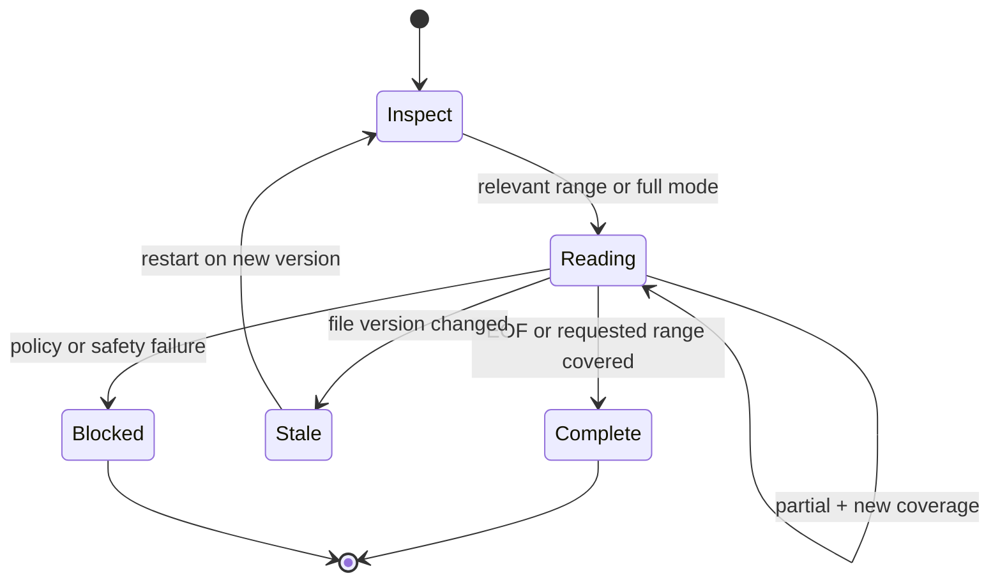
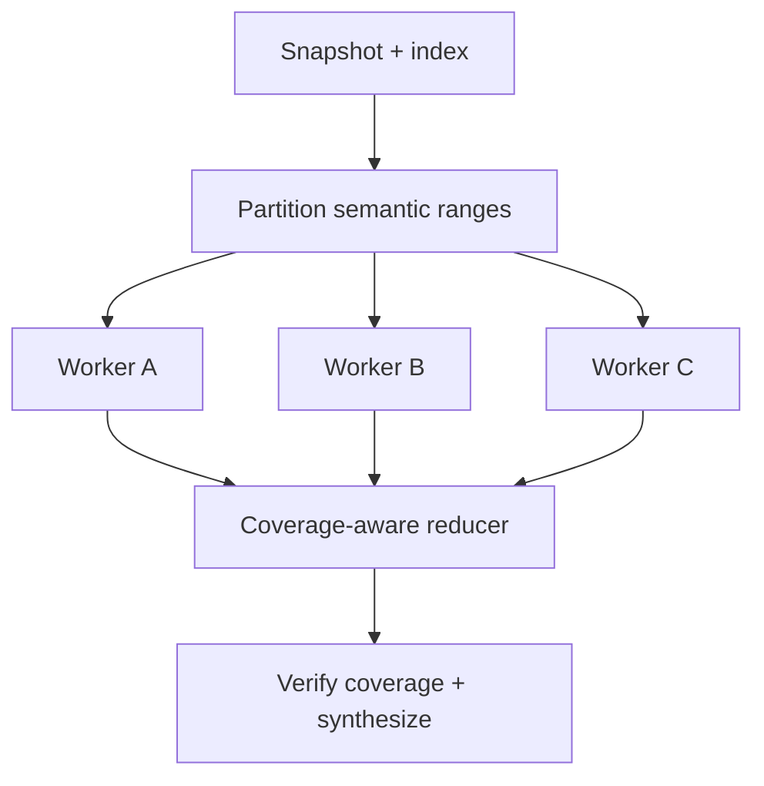

# Large-File Reading in Agent Harnesses

## How Codex CLI, OpenClaw, and Hermes Agent bound tool output, resume reads, and keep an agent from silently skipping content

**Prepared:** 2026-08-24  
**Audience:** engineers designing a coding-agent or general-purpose agent harness  
**Scope:** Codex CLI, OpenClaw, and Hermes Agent—the same three harnesses examined in the companion goal-loop report  
**Method:** source-level inspection of pinned repository snapshots, followed by a design review of the supplied 47,728-token example

---

## Executive summary

The message in the current harness is a **good safety guard but a weak continuation protocol**:

> File content (47728 tokens) exceeds maximum allowed tokens (25000). The file has 582 lines. Retry with offset 405 and limit 24, then continue from where that ends.

It prevents one oversized tool result from consuming the model context, reports useful measurements, and gives the agent something actionable. Those are worthwhile properties. It is not yet strong enough for correctness-sensitive reads, however, because it appears to return no file content, gives continuation only in prose, does not identify the range already returned, cannot resume inside a single oversized line, does not bind the continuation to a particular version of the file, and relies on the model to remember to keep reading.

The three reference harnesses make different trade-offs:

| Harness | Normal model-facing mechanism | Default bound | Continuation behavior | Long single line | Runtime guarantees full coverage? |
|---|---|---:|---|---|---|
| **Codex CLI** | Shell commands through `exec_command`, usually `rg`, `sed`, `head`, or similar | Usually 10,000 output tokens; execution buffer retains up to 1 MiB | No file cursor. Oversized command output is middle-truncated and the agent must issue a narrower shell command | No first-class file cursor; depends on chosen shell command | No |
| **OpenClaw** | First-class `read` tool | Base page: 2,000 lines or 50 KiB; wrapper adaptively targets 32–128 KiB | Returns content plus a typed line or character cursor; wrapper can combine up to four pages | Yes—character cursor resumes within the line | No for ordinary files; deliberately refuses pagination for must-read-whole skill instructions |
| **Hermes Agent** | First-class `read_file` tool | 2,000 lines and about 100,000 characters, configurable | Returns the largest complete-line prefix that fits plus `next_offset` | No—the source explicitly notes that a clamped first line cannot be recovered past the clamp | No; it adds duplicate-read and consecutive-read loop guards |

The best design is not to copy any one implementation unchanged. A stronger harness should combine:

1. OpenClaw's nonempty prefix result, typed continuation, and within-line cursor.
2. Hermes's actionable `next_offset`, server-side bounding, file-state tracking, and loop guards.
3. Codex's search-first workflow and conservative default output budget.
4. A durable coverage ledger owned by the runtime, not by the model, whenever the task really requires a complete read.
5. A separate policy for prompts, skills, and playbooks that must be read whole. These should be validated as atomic instructional artifacts, not casually paginated.

For the supplied file, the 25,000-token value is reasonable as a **hard ceiling**, but it is too large as the normal page target. A target around 6,000–10,000 tokens is safer for most coding-agent contexts, leaving space for instructions, reasoning, tool calls, and the final answer. At the file's average density of about 82 tokens per line, an 8,000-token target would be roughly 97 lines and about six pages. Actual page boundaries must be calculated from the local content, not from this average.

---

## 1. The problem has three separate layers

“Can the agent read a big file?” sounds like one question, but a harness must solve three different problems.

### 1.1 Transport safety

The tool process must not send an unbounded payload to the model adapter. Limits must be enforced while reading or before the payload crosses the tool boundary. A model's context limit is not a substitute for a tool-output limit.

Relevant controls include:

- maximum bytes or characters;
- maximum lines;
- maximum per-line length;
- token estimate or exact token count;
- safe handling of Unicode boundaries;
- regular-file, device, binary, and permission checks;
- predictable behavior when one line alone exceeds the page budget.

### 1.2 Context budgeting

Even a transport-safe result may be too large for the current conversation. The harness must reserve room for system instructions, history, reasoning, later tool results, and the final response. “The model has a 128K context” does not mean a read tool should return 128K tokens.

The relevant value is the **remaining usable context**, after reserves, not just the advertised model window.

### 1.3 Comprehension and coverage

Pagination only makes content retrievable. It does not prove that the agent retrieved, retained, or reasoned over every page. An instruction saying “then continue” is advisory: a model may answer early, change tactics, repeat a page, skip a page, or lose the instruction during compaction.

For ordinary investigation this may be acceptable—the agent often needs only a symbol, section, or matching range. For audits, migrations, summaries of an entire document, or must-follow instructions, the runtime needs an explicit coverage policy.

This distinction leads to four useful read modes:

| Mode | Intended use | Required guarantee |
|---|---|---|
| `inspect` | Locate relevant content with metadata, outline, search, or symbols | No claim of full-file coverage |
| `range` | Read an explicit line or character range | Exact requested/returned range and resumable continuation |
| `full` | Process every byte or character of the same file version | Runtime-owned coverage through EOF |
| `instructions` | Load a prompt, skill, policy, or playbook that must govern behavior | Atomic whole-artifact load, or a hard block requiring the artifact to be split deliberately |

Without these semantics, a harness may accidentally describe a targeted inspection as “reading the file,” or treat page 1 of a policy as if the policy were loaded.

---

## 2. Comparison at a glance

| Dimension | Codex CLI | OpenClaw | Hermes Agent | Recommended for a new harness |
|---|---|---|---|---|
| First-class text-file tool | No in the normal core model toolset; uses shell execution | Yes | Yes | Yes, while retaining shell/search tools |
| Normal result on overflow | Middle-truncated shell output | Useful head page plus continuation | Useful complete-line prefix plus continuation | Useful prefix plus structured continuation |
| Primary limit unit | Tokens at result shaping; bytes in retained process output | Lines and UTF-8 bytes; adaptive context-derived byte budget | Lines, characters, and per-line clamp | Bytes plus token estimate; line cap as a secondary guard |
| Default scale | 10K tokens in the inspected model/tool policy | 50 KiB base; 32–128 KiB adaptive wrapper | About 100K characters; 2K lines | Usually 6K–10K tokens target, lower than a hard ceiling |
| Prefix or head/tail | Shell output is middle-truncated, preserving head and tail | Prefix/head | Prefix/head | Prefix for sequential files; optional head/tail only for log inspection |
| Machine-readable continuation | No | Yes | Partly: JSON fields including `next_offset` | Yes, opaque cursor plus decoded next position |
| Resume within a line | Depends on manual shell command | Yes | No | Yes |
| File-version binding | No generic read cursor | No strong opaque version-bound cursor in the inspected contract | Tracks modification state, but `next_offset` itself is not a version-bound opaque cursor | Required |
| Duplicate-read guard | No generic file-read guard | Not a central read feature | Yes | Yes, as warning/dedup—not as a substitute for coverage |
| Adaptive page size | Model/tool policy, not file-specific pagination | Yes, based on context window | Configurable character cap | Yes, based on remaining context and reserves |
| Auto-fetch within one tool call | No | Up to four base pages | No | Optional, with a strict aggregate budget |
| Must-read instruction policy | General instruction discipline; no dedicated paginated file tool | Rejects offset/limit/cursor for skill instructions | Project policy says not to add pagination escape hatches to instructional tools | Treat as atomic or manifest-backed required children |
| Full-file completion receipt | No | No for ordinary files | No | Required for `full` mode |

The most important architectural difference is that Codex shapes generic command output, while OpenClaw and Hermes expose file semantics. Generic truncation protects the model, but only a file-aware protocol can say precisely what was read and what remains.

---

## 3. Codex CLI

### 3.1 Mechanism

In the inspected Codex CLI core, the model normally reads files by running shell commands through `exec_command`; there is no general first-class `read_file(path, offset, limit)` tool in the normal model-facing core toolset. This is consistent with the agent guidance to use `rg` and `rg --files` for fast discovery, followed by commands such as `sed` for bounded ranges.

There is an app-server `fs/readFile` RPC that reads bytes and returns base64, but it is a client-facing server API, not the ordinary model tool used for contextual file reading. It should not be treated as the model's large-file pagination design. See [the app-server file-system processor](https://github.com/openai/codex/blob/fb0781b9eee6d2da741b984bed9dde95834d909d/codex-rs/app-server/src/request_processors/fs_processor.rs) and [the shell tool specification](https://github.com/openai/codex/blob/fb0781b9eee6d2da741b984bed9dde95834d909d/codex-rs/core/src/tools/handlers/shell_spec.rs).

### 3.2 Limits and truncation

The shell tool exposes `max_output_tokens`; its description says the default is 10,000 tokens and larger requests may be capped by policy. The model metadata inspected for the current snapshot also commonly sets tool-output truncation at 10,000 tokens. See [the model policy data](https://github.com/openai/codex/blob/fb0781b9eee6d2da741b984bed9dde95834d909d/codex-rs/models-manager/models.json).

Codex retains at most 1 MiB in its unified-exec head/tail buffer. The token-side truncator estimates four bytes per token and performs **middle truncation**: it keeps a prefix and suffix, inserts a marker identifying that tokens were omitted, and reports original token and line counts. See [unified-exec limits](https://github.com/openai/codex/blob/fb0781b9eee6d2da741b984bed9dde95834d909d/codex-rs/core/src/unified_exec/mod.rs), [output truncation](https://github.com/openai/codex/blob/fb0781b9eee6d2da741b984bed9dde95834d909d/codex-rs/utils/output-truncation/src/lib.rs), and [string truncation](https://github.com/openai/codex/blob/fb0781b9eee6d2da741b984bed9dde95834d909d/codex-rs/utils/string/src/truncate.rs).

### 3.3 What happens to the agent

If the agent runs an unbounded command on a large file, it receives the beginning and end with a missing middle. It must notice the truncation marker and construct a new shell command, for example:

```bash
sed -n '401,800p' path/to/file
```

Nothing in the generic command result provides a file-specific cursor, proves that the next command starts immediately after the previous content, or records all covered ranges. Correctness depends on the model choosing suitable commands and tracking the ranges itself.

### 3.4 Strengths

- **Simple and composable.** The agent can choose `rg`, `awk`, `sed`, parsers, syntax-aware tools, or a project-specific command.
- **Search-first behavior.** Large source trees rarely require sequentially loading every file; `rg` is usually a better first operation.
- **Head and tail preservation.** For logs and command failures, the tail often contains the decisive error while the head contains setup context.
- **Conservative default.** A 10K-token output limit leaves more room for reasoning than a 25K-token normal page.

### 3.5 Weaknesses

- Middle truncation is a poor semantic fit for a sequential file: the returned view is discontinuous.
- The omitted file range is not encoded as an exact line/column interval.
- No generic character cursor handles a giant minified line.
- There is no durable coverage ledger or EOF receipt.
- The agent can forget to fetch the middle or mistakenly believe that head-plus-tail is representative.

### 3.6 Design lesson

Keep Codex's flexible shell and search workflow, but do not use generic middle truncation as the only large-file contract. A file-aware tool should return a contiguous prefix and exact continuation. Head/tail should be an explicit log-inspection mode, not the default for sequential file reading.

---

## 4. OpenClaw

### 4.1 Base read contract

OpenClaw has the most complete first-class read protocol of the three. The base `read` tool accepts:

- a path;
- a 1-based line `offset`;
- an optional line `limit`;
- a character `cursor` within the starting line.

The base bounds are 2,000 lines and 50 KiB. On truncation it returns the useful beginning of the requested content, not an empty error. The structured result distinguishes text, image, truncated, and optional-not-found outcomes. A truncated result carries total/output lines and bytes, which limit fired, whether the last line is partial, whether the first line exceeds the limit, and a continuation. See [the read implementation](https://github.com/openclaw/openclaw/blob/19d44d3f38bf2bbab525cfc1326d23ad98d3cd63/src/agents/sessions/tools/read.ts), [the typed output contract](https://github.com/openclaw/openclaw/blob/19d44d3f38bf2bbab525cfc1326d23ad98d3cd63/src/agents/sessions/tools/read-tool-contract.ts), and [the truncation primitives](https://github.com/openclaw/openclaw/blob/19d44d3f38bf2bbab525cfc1326d23ad98d3cd63/packages/agent-core/src/harness/utils/truncate.ts).

The continuation is a typed union:

```ts
{ kind: "line", offset: number, limit?: number }
```

or:

```ts
{ kind: "cursor", offset: number, cursor: number, limit?: number }
```

This is materially safer than a prose-only “try offset N” instruction because the controller can inspect or replay it without parsing natural language.

### 4.2 Oversized single lines

OpenClaw explicitly handles a line that is larger than the byte budget. It can return a prefix of that line and a character cursor into the same line. Its tests cover Unicode surrogate-pair safety and reconstructing the entire long line through successive reads. This is the strongest differentiator from Hermes's line-only `next_offset` and from manual shell pagination.

A robust cursor matters for generated JSON, minified JavaScript, lockfiles, encoded data, and stack traces with very long frames. A line count alone does not bound any of those.

### 4.3 Adaptive wrapper

OpenClaw's higher-level coding-tool wrapper applies a context-aware aggregate budget:

- default read page target: 32 KiB;
- maximum adaptive budget: 128 KiB;
- budget derived from about 10% of model context, using four characters per token and clamped to that range;
- up to four underlying pages may be fetched and aggregated in one model-visible tool call;
- an explicitly supplied line limit prevents the wrapper from automatically reading past that requested limit.

See [the adaptive read wrapper](https://github.com/openclaw/openclaw/blob/19d44d3f38bf2bbab525cfc1326d23ad98d3cd63/src/agents/agent-tools.read.ts).

This reduces model/tool round trips without allowing the aggregate result to grow without bound. The 32 KiB default is approximately 8K tokens under the same four-characters-per-token heuristic, close to the recommended normal target for a new harness.

### 4.4 Instructional files are treated differently

OpenClaw deliberately forbids `offset`, `limit`, and `cursor` windows when its wrapper identifies skill instructions that must be loaded as a whole. If the document cannot fit, the result tells the operator to reduce the document or increase available context. The design recognizes that “page 1 was returned” is unsafe when every instruction is supposed to constrain subsequent agent behavior.

This is a crucial lesson: pagination is a retrieval feature, not a valid substitute for atomic instruction loading.

### 4.5 Strengths

- Nonempty, contiguous content is returned on overflow.
- Continuation is machine-readable.
- Line and within-line continuations cover both normal prose/code and minified data.
- Metadata makes truncation visible and testable.
- Adaptive aggregation reduces round trips while preserving a total budget.
- Must-read-whole instructional content is protected from lazy partial reads.

### 4.6 Weaknesses

- The ordinary read protocol still does not make the agent continue to EOF.
- A line/cursor continuation is not, in the inspected contract, an opaque capability bound to a cryptographic or immutable file version.
- Byte-to-token conversion remains approximate and model-dependent.
- Returning more content per call improves throughput but may reduce reasoning quality if the wrapper chooses a large adaptive maximum merely because the model window is large.

### 4.7 Design lesson

OpenClaw provides the best base protocol to imitate: return the first safe page, expose structured truncation, and support a cursor within a long line. Add version binding and a runtime coverage mode rather than asking the model alone to drive every continuation.

---

## 5. Hermes Agent

### 5.1 Read contract

Hermes exposes `read_file(path, offset=1, limit=2000)` and line-numbers its compact output as `LINE_NUM|CONTENT`. The public schema caps `limit` at 2,000 lines. A second bound defaults to 100,000 characters and is configurable through `file_read_max_chars`. The source comments estimate this as roughly 25K–35K tokens. See [the Hermes file tool](https://github.com/NousResearch/hermes-agent/blob/3f5d37568eea351825b5e3ccbbdc1e8161f2c61d/tools/file_tools.py) and [the lower-level file operations](https://github.com/NousResearch/hermes-agent/blob/3f5d37568eea351825b5e3ccbbdc1e8161f2c61d/tools/file_operations.py).

When the character cap fires, Hermes trims to the last complete line that fits, returns the retained prefix, sets `truncated: true` and `truncated_by: "bytes"`, and emits `next_offset`. The source says this behavior replaced rejecting the whole read, because an empty error wastes a round trip.

That is directly relevant to the current harness: Hermes's newer choice is to provide useful content immediately and attach continuation metadata.

### 5.2 Layered clamps

Hermes also defaults to a 2,000-character maximum per output line. Its shell-backed file operation clamps bytes before the content crosses the command transport, and the Python layer applies a character clamp. This prevents one pathological line from bypassing the line-count guard. The central defaults are documented in [tool output limits](https://github.com/NousResearch/hermes-agent/blob/3f5d37568eea351825b5e3ccbbdc1e8161f2c61d/tools/tool_output_limits.py).

However, the source explicitly notes a correctness hole: if the first line itself exceeds the overall read-character budget, the line is clamped mid-line and the remainder is **not retrievable through `offset`**. Advancing to the next line skips data; repeating the same offset repeats the clamped prefix. OpenClaw's within-line cursor solves this case.

### 5.3 Loop and file-state controls

Hermes adds behavioral controls around reads:

- repeated reads of the same path/range can be replaced with a lightweight “unchanged” result based on modification state;
- repeated unchanged stubs are blocked;
- consecutive real reads receive a warning and are eventually blocked;
- file-state tracking helps detect stale assumptions across tool use and delegated work.

These controls reduce accidental read loops and context waste. They must be designed carefully for a true `full` read: sequential nonoverlapping pages are progress and should not be mistaken for a loop. The guard should operate on `(file version, returned interval)` and distinguish new coverage from repetition.

### 5.4 Large-file and safety behavior

Hermes emits a large-file hint when a file exceeds a size threshold and the caller did not request a narrow range. It also handles regular-file checks, binary/device cases, encoding rescue, secret redaction, and extraction of supported document formats. These features show that a production read tool is more than an `open()` followed by string slicing.

### 5.5 Instructional files

The repository's engineering guidance makes the same deeper distinction as OpenClaw: instructional tools should not expose lazy-reading pagination, because a model can read the first page and skip the rest. See [Hermes's repository guidance](https://github.com/NousResearch/hermes-agent/blob/3f5d37568eea351825b5e3ccbbdc1e8161f2c61d/AGENTS.md).

### 5.6 Strengths

- Useful content plus `next_offset`, instead of a zero-content overflow error.
- Server-side and layered size bounds.
- Compact line gutters reduce token overhead.
- Duplicate-read suppression and loop detection.
- File-state awareness and defensive file/encoding handling.

### 5.7 Weaknesses

- The character limit is only a proxy for model tokens.
- Continuation is line-only; the remainder of an oversized first line can be lost.
- `next_offset` is not an opaque, version-bound cursor.
- Loop guards do not prove full coverage.
- A 100K-character page may still be too large as a normal reasoning unit, even if it fits the transport and context.

### 5.8 Design lesson

Adopt Hermes's “return progress now” behavior and its loop/file-state instrumentation, but replace the line-only continuation with a position that can resume inside a line. Count progress by newly covered intervals so that guards suppress repetition without blocking legitimate sequential scans.

---

## 6. Review of the current harness message

### 6.1 What is already good

The current result contains four useful elements:

1. **Measured size:** 47,728 tokens.
2. **Explicit ceiling:** 25,000 tokens.
3. **File extent:** 582 lines.
4. **Actionable coordinates:** `offset 405` and `limit 24`.

Many weak implementations say only “output too long,” leaving the model to guess a safe range. The current message is better than that. It also uses a token-based measure closer to the actual scarce resource than a line count alone.

### 6.2 The critical ambiguity in `offset 405`

The report snippet does not say what range the failed call requested or what content, if any, was returned. Therefore `offset 405` has two possible meanings:

- If the original call already began at line 405, the retry may be a safe narrowing of that requested range.
- If the original call began at line 1 and returned no content, retrying at 405 would silently skip lines 1–404.

The tool must make this impossible to misinterpret. Every result should contain:

- the requested start and end;
- the actual returned start and end;
- whether the end is partial within a line;
- the exact next position;
- whether EOF was reached.

A continuation must always begin at the first unread position after the returned content. It must never be inferred only from total tokens or an estimated line density.

### 6.3 Zero-content overflow wastes a turn

The wording “retry with” implies that the tool rejected the read rather than returning a safe prefix. If so, the agent spent a model/tool round trip learning only that the request was too large.

OpenClaw and Hermes demonstrate the better behavior:

1. return as much contiguous content as safely fits;
2. return structured continuation metadata in the same result;
3. let the next call resume exactly.

An error-only result should be reserved for cases where no safe content can be returned: unauthorized path, binary/device input, stale cursor, corrupt encoding under a strict policy, or an oversized atomic instruction artifact.

### 6.4 `limit 24` may be too conservative

For this file:

\[
\frac{47{,}728\ \text{tokens}}{582\ \text{lines}} \approx 82\ \text{tokens per line}
\]

At that average density, 24 lines are roughly 1,968 tokens. The local region may contain much longer lines, so 24 could be correct for lines 405 onward; the global average cannot prove otherwise. Still, the tool should report why it chose 24—such as a byte/token scan of that exact range—rather than present an unexplained small number.

A content-aware page builder should scan until the target budget is nearly filled, stopping at a safe boundary. A fixed `limit` is an input preference, not the primary safety mechanism.

### 6.5 Twenty-five thousand tokens is a ceiling, not a target

A 25K result can dominate the context and reduce the agent's ability to reason about it. It may also be retained in conversation history while later pages arrive, so a two-page 47.7K read is not equivalent to a one-page 25K bound.

Recommended policy:

- keep 25K as an absolute per-result hard cap if the surrounding model and tool transport can support it;
- normally target 6K–10K tokens per read result;
- calculate the target from remaining context and explicit reserves;
- summarize and persist range-level evidence as pages are processed;
- do not expect all 47.7K raw tokens to remain simultaneously in the active prompt.

### 6.6 Natural-language continuation is not enough

The model-visible sentence is useful, but it should be generated from a structured result—not be the only representation. A controller should not need to extract `405` and `24` from prose.

### 6.7 Missing version and stale-read handling

If another tool edits the file between pages, a line offset may point to different content. The reader can then duplicate or skip text without noticing. Continuations should be bound to a file version derived from stable identity and content state, for example:

- device/inode plus size and high-resolution modification time for a local optimization;
- preferably a content hash or snapshot ID where correctness matters.

If the version changes, the result should be `stale`, not a best-effort continuation.

### 6.8 Missing within-line continuation

A 582-line file averaging 82 tokens per line may contain generated or minified regions. If one line exceeds 25K tokens, `offset` plus `limit` cannot retrieve it safely unless the tool also accepts a column, character cursor, or byte cursor.

### 6.9 No full-read guarantee

“Then continue” asks the model to do more work but does not make completion a runtime invariant. If the user's task is “review the whole file,” the controller should own a `full` operation and refuse to mark it complete until coverage reaches EOF for one unchanged file version.

### 6.10 Verdict

| Area | Rating | Reason |
|---|---|---|
| Preventing context overflow | Good | Explicit token ceiling blocks the unsafe result |
| Helping the next call | Fair | Gives coordinates, but only in prose and without returned-range context |
| Avoiding wasted turns | Weak if no content is returned | A safe prefix could have been returned immediately |
| Handling pathological lines | Weak | Line-only pagination cannot resume inside a line |
| Handling concurrent edits | Weak | No file-version binding is visible |
| Proving complete coverage | Weak | Continuation is advisory to the model |
| Overall | Promising guard, incomplete protocol | Suitable as an interim error; not yet a production-grade large-file reader |

---

## 7. Recommended read contract

### 7.1 Request

```json
{
  "path": "src/large-file.ts",
  "mode": "inspect",
  "cursor": null,
  "offset": { "line": 1, "column": 0 },
  "limit": { "lines": 2000 },
  "max_output_tokens": 8000,
  "expected_version": null
}
```

Recommended semantics:

- `mode`: `inspect`, `range`, `full`, or `instructions`.
- `cursor`: preferred for continuation; opaque and version-bound.
- `offset`: allowed for an initial human-readable range request.
- `limit.lines`: a caller preference, never the sole safety bound.
- `max_output_tokens`: a caller request that may be reduced by policy.
- `expected_version`: optional on the first call and mandatory through the cursor on continuation.

Do not accept both a cursor and a conflicting raw offset. The cursor is authoritative.

### 7.2 Partial result

```json
{
  "status": "partial",
  "file": {
    "path": "src/large-file.ts",
    "version": "sha256:…",
    "size_bytes": 186402,
    "total_lines": 582,
    "encoding": "utf-8"
  },
  "requested": {
    "start": { "line": 1, "column": 0 },
    "line_limit": 2000,
    "token_limit_requested": 8000
  },
  "returned": {
    "start": { "line": 1, "column": 0 },
    "end": { "line": 96, "column": 411 },
    "complete_lines": 95,
    "bytes": 31871,
    "estimated_tokens": 7924,
    "coverage": [{ "start_byte": 0, "end_byte_exclusive": 31871 }]
  },
  "content": "…",
  "continuation": {
    "cursor": "rf1_opaque_version_bound_cursor",
    "next": { "line": 96, "column": 411 },
    "expected_version": "sha256:…"
  },
  "eof": false,
  "truncation": {
    "reason": "target_token_budget",
    "target_tokens": 8000,
    "hard_tokens": 25000
  }
}
```

The numbers above illustrate the shape only; the implementation must calculate actual boundaries from content.

### 7.3 Complete result

```json
{
  "status": "complete",
  "file": { "path": "src/large-file.ts", "version": "sha256:…" },
  "returned": {
    "start": { "line": 511, "column": 0 },
    "end": { "line": 582, "column": 173 },
    "coverage": [{ "start_byte": 162004, "end_byte_exclusive": 186402 }]
  },
  "content": "…",
  "continuation": null,
  "eof": true
}
```

### 7.4 Other statuses

Use explicit statuses instead of overloading every problem as an exception:

| Status | Meaning | Expected next action |
|---|---|---|
| `complete` | Requested operation reached its terminal boundary | Process result |
| `partial` | Safe content returned; more remains | Continue with cursor if required |
| `stale` | File no longer matches cursor version | Restart, re-index, or ask the controller to resolve |
| `not_found` | Path does not exist | Correct path or stop |
| `binary` | Text protocol is inappropriate | Use a binary/document/image tool |
| `blocked` | Policy forbids partial serving, as with oversized instructions | Split artifact, raise context, or change policy explicitly |
| `unauthorized` | Path or permission policy rejected access | Do not retry without changed authority |

### 7.5 Cursor design

The cursor should encode or reference:

- canonical file identity;
- immutable version/snapshot identity;
- exact next byte offset;
- decoded line and character column for diagnostics;
- encoding and newline mode if needed;
- expiry or session identity if cursors are short-lived.

Use UTF-8 byte offsets internally for unambiguous coverage, but only stop at valid decoded character boundaries. Include a line/column display for humans. If the cursor crosses a trust boundary, sign or authenticate it so callers cannot forge arbitrary internal positions or paths.

---

## 8. Budget policy

### 8.1 Separate hard cap from target

```text
hard_tokens = min(
  configured_tool_hard_cap,
  provider_tool_output_cap,
  remaining_context - reasoning_reserve - response_reserve - metadata_reserve
)

target_tokens = min(
  hard_tokens,
  clamp(context_window × target_fraction, 4_000, 10_000)
)
```

A target fraction of 5%–10% is a reasonable starting point. It must be tuned with real model/context measurements. Use the **remaining** budget for the hard calculation, even if the normal target is derived from the nominal window.

### 8.2 Enforce more than tokens

Tokenizers vary and exact tokenization may be expensive. Use layered limits:

1. byte limit enforced while streaming;
2. character/Unicode-boundary safety;
3. line cap to bound bookkeeping and rendering;
4. token estimate while filling the page;
5. optional exact token check before final serialization;
6. metadata reserve so continuation fields do not push the total over the cap.

### 8.3 Page-building policy

For sequential files, fill a contiguous page from the requested position until one of these occurs:

- target token/byte budget is reached;
- requested line limit is reached;
- EOF is reached;
- a policy boundary is reached.

Prefer ending at a complete line. If the next line alone exceeds the remaining budget, return a character-safe prefix of that line and a cursor into the same line. Never discard the remainder.

### 8.4 The supplied file under this policy

Approximate planning based on the whole-file average:

| Target per page | Approximate lines per page | Approximate page count |
|---:|---:|---:|
| 6,000 tokens | 73 lines | 8 pages |
| 8,000 tokens | 97 lines | 6 pages |
| 10,000 tokens | 122 lines | 5 pages |
| 25,000 tokens | 305 lines | 2 pages |

These are capacity-planning estimates only. A correct implementation scans the actual next region and may stop within a long line. The 8K row is a good initial default; 25K remains available as a hard emergency ceiling rather than the routine page size.

---

## 9. Controller behavior and durable coverage

### 9.1 State machine



### 9.2 Coverage ledger

For `full` mode, persist state outside the conversational prompt:

```json
{
  "read_session_id": "read_01…",
  "file_version": "sha256:…",
  "total_bytes": 186402,
  "covered_intervals": [[0, 31871], [31871, 64002]],
  "next_cursor": "rf1_…",
  "eof_seen": false,
  "page_evidence": [
    {
      "range": [0, 31871],
      "summary_ref": "artifact://read_01/page_1_summary",
      "content_hash": "sha256:…"
    }
  ]
}
```

Rules:

- Merge adjacent and overlapping intervals.
- Only count bytes returned for the bound file version.
- A repeated interval is not progress and may trigger a duplicate-read warning.
- Completion requires coverage of `[0, total_bytes)` and an EOF observation for the same version.
- Context compaction may remove raw pages, but it must not remove the ledger.
- A range summary should cite its exact source interval and retain a hash or evidence reference.

### 9.3 Full processing loop

```python
session = begin_full_read(path)

while not session.eof_seen:
    page = read_file(path=path, mode="full", cursor=session.next_cursor)

    if page.status == "stale":
        return restart_or_block(session, page.file.version)
    if page.status in {"blocked", "binary", "unauthorized", "not_found"}:
        return fail_with_explicit_status(page)

    analysis = process_page(page.content, page.returned.coverage)
    persist_page_evidence(session, page, analysis)
    merge_coverage(session, page.returned.coverage)
    session.next_cursor = page.continuation.cursor if page.continuation else None
    session.eof_seen = page.eof

assert covers(session.covered_intervals, 0, session.total_bytes)
return complete_with_coverage_receipt(session)
```

The model may analyze each page, but the runtime decides whether the operation is complete. If the model attempts to finalize early, the outer controller can inject the next unread page or return a `blocked: incomplete_coverage` status.

### 9.4 Do not force full reads unnecessarily

Most coding tasks should begin with:

1. `stat` and file-type detection;
2. an outline, symbol index, headings, or `rg` search;
3. targeted range reads around matches;
4. a full scan only when the task's acceptance criteria require it.

This preserves Codex's strongest behavior: use the right query rather than shovel an entire repository into context.

---

## 10. Instructional artifacts need a stricter contract

A prompt, policy, skill, or playbook is not merely data to summarize. If all of it is supposed to govern the agent, returning the first page and a continuation is unsafe.

Recommended policies:

### Option A: Atomic size validation

At authoring, installation, or startup time:

- tokenize the complete instructional artifact for supported models;
- enforce an atomic-load budget;
- reject or warn before an agent run begins;
- serve it whole during the run.

### Option B: Manifest-backed instruction set

If the instruction set must be larger, split it deliberately:

```yaml
instruction_set: coding-policy-v3
required:
  - core.md
  - safety.md
  - tool-contracts.md
conditional:
  python: languages/python.md
  rust: languages/rust.md
```

The runtime loads all required children atomically and resolves conditional children before applicable work. It can issue a completeness receipt identifying every loaded version. This is different from letting the model casually page through `instructions.md` and hoping it reaches the end.

### Option C: Blocked status

If neither atomic loading nor deliberate splitting is possible, return:

```json
{
  "status": "blocked",
  "reason": "instructions_exceed_atomic_budget",
  "required_tokens": 47728,
  "available_tokens": 25000,
  "remediation": ["split_with_manifest", "increase_context", "reduce_instruction_set"]
}
```

Do not silently downgrade an instructional read to ordinary pagination.

---

## 11. Subagents and parallel large-file analysis

Subagents can improve throughput when the file is semantically divisible, but spawning them does not solve context limits by itself. The parent should pass **references and bounded ranges**, not inline the entire file into every child prompt.

Recommended work graph:

1. The controller snapshots the file and builds an outline or structural index.
2. It partitions by AST node, heading, function group, or other semantic boundary; byte ranges remain the coverage authority.
3. Each child receives the path, version, assigned ranges, analysis question, and output schema.
4. Each child returns findings with line/byte citations and a coverage receipt.
5. A reducer checks that assigned intervals cover the required file extent, resolves contradictory findings, and produces the final result.



Avoid line-only partitions that split a function, JSON object, table, or Markdown section unless workers receive enough overlap to reconstruct context. Record overlap separately so it is not mistaken for additional coverage.

Recommended child result:

```json
{
  "file_version": "sha256:…",
  "assigned": [[0, 31871]],
  "covered": [[0, 31871]],
  "findings": [
    {
      "claim": "…",
      "evidence": { "lines": [42, 61], "bytes": [8044, 11202] }
    }
  ],
  "uncertainties": [],
  "status": "complete"
}
```

Use bounded concurrency and cancellation. If one child reports a stale version, the controller should invalidate the affected analysis rather than merge mixed snapshots.

---

## 12. Reference implementation sketch

### 12.1 Page reader

```python
def read_page(request, context_budget):
    meta = authorize_stat_and_detect(request.path)
    version = bind_or_validate_version(meta, request.cursor, request.expected_version)

    if request.mode == "instructions" and meta.estimated_tokens > context_budget.atomic_limit:
        return blocked_instructions_result(meta, context_budget)

    hard = compute_hard_budget(context_budget, request.max_output_tokens)
    target = compute_target_budget(context_budget, hard)
    position = decode_cursor_or_offset(request, version)

    builder = PageBuilder(
        start=position,
        target_tokens=target,
        hard_tokens=hard,
        max_lines=request.limit.lines,
        metadata_reserve=context_budget.metadata_reserve,
    )

    with open_snapshot(meta, version) as stream:
        stream.seek(position.byte_offset)
        while not builder.done:
            chunk = stream.read_bounded()
            if not chunk:
                builder.mark_eof()
                break
            builder.append_at_unicode_boundary(chunk)

    end = builder.end_position()
    continuation = None if builder.eof else encode_cursor(meta, version, end)

    return make_result(
        status="complete" if builder.eof else "partial",
        file=meta,
        requested=request,
        returned=builder.coverage_and_counts(),
        content=builder.content,
        continuation=continuation,
        eof=builder.eof,
    )
```

### 12.2 Important implementation detail

The reader should stream or memory-map bounded regions. It should not first construct an arbitrarily large decoded string and only then discover that the result is too large. For document converters that inherently produce a large intermediate representation, place a separate cap on extraction and persist the intermediate artifact outside model context.

### 12.3 Human-readable rendering

Generate a concise notice from the structured object:

> Read lines 1–95 and characters 0–411 of line 96 (7,924 estimated tokens). More content remains. Continue with cursor `rf1_…`; the cursor is bound to file version `sha256:…`.

The prose helps the model, while the structured fields help the controller. Keep both.

---

## 13. Testing strategy

### 13.1 Exact regression for the supplied case

Create a fixture with exactly 582 lines and a token count of 47,728 under the target model tokenizer. Configure a 25,000-token hard cap and an 8,000-token target.

Assertions:

- the first call returns nonempty content beginning at the requested position;
- every `partial` result stays below the serialized hard cap, including metadata;
- each next cursor decodes to exactly the end-exclusive byte of the previous result;
- concatenating all returned byte ranges reconstructs the original file exactly;
- ranges have no gaps or unintended overlaps;
- the final result has `eof: true` and no continuation;
- the coverage ledger covers `[0, file_size)`;
- no returned continuation jumps directly to line 405 unless bytes before line 405 were already covered or the original request explicitly began there.

### 13.2 Pathological content

Test at least:

- one 300,000-character line;
- a line containing astral emoji at every possible page boundary;
- combining characters and multibyte UTF-8 sequences;
- CRLF, LF, and a final line without a newline;
- empty file and one-byte file;
- highly variable line lengths;
- invalid UTF-8 under permissive and strict policies;
- minified JSON and generated source maps;
- metadata whose size pushes the serialized result near the hard cap.

For the one-line fixture, repeated cursor reads must reconstruct the exact original content. A line-only `next_offset` implementation should fail this test, demonstrating the Hermes-style limitation.

### 13.3 Mutation and identity

- append between pages;
- insert before the current cursor;
- replace the file atomically while retaining the path;
- modify content while preserving size;
- delete and recreate the file.

Every continuation against a changed version must return `stale`; it must not silently continue.

### 13.4 Filesystem and security

- symlink escaping an allowed workspace root;
- FIFO or device path;
- unreadable file;
- sparse file;
- binary data misidentified by extension;
- secret-redaction behavior across page boundaries;
- cursor tampering and path substitution.

### 13.5 Controller behavior

- model ignores a continuation in `inspect` mode: allowed, but no full-read claim is emitted;
- model ignores a continuation in `full` mode: controller keeps the operation incomplete and schedules the next page;
- model requests the same cursor repeatedly: deduplicate/warn, then block the loop without losing session state;
- model requests an older overlapping range: return it if explicitly needed, but count only new bytes as progress;
- context compaction between pages: coverage ledger and evidence survive;
- stale page from one subagent: reducer refuses to merge it with the new snapshot;
- oversized skill/instruction: no first page is served as if instructions were loaded.

### 13.6 Quality evaluation

Beyond unit correctness, benchmark downstream task quality at 4K, 6K, 8K, 10K, and 25K page targets. Measure:

- answer accuracy;
- missed evidence;
- repeated reads;
- total tokens and tool round trips;
- latency;
- rate of premature completion;
- effect of chunk summaries versus retaining raw pages.

The optimal page size is an empirical reasoning-quality trade-off, not just the largest value that avoids an API error.

---

## 14. Implementation roadmap

### Phase 1: Fix the current response

1. Return the largest safe, contiguous prefix instead of an error-only result.
2. Add structured `requested`, `returned`, `continuation`, `eof`, and `truncation` fields.
3. Make `next` exactly end-exclusive of returned content.
4. Preserve the existing human-readable message as a rendering of those fields.
5. Treat 25K as the hard limit and add a smaller normal target.

This phase removes the biggest correctness and latency problems without requiring a full controller redesign.

### Phase 2: Make continuation lossless

1. Introduce an opaque cursor.
2. Resume within a line.
3. Bind the cursor to file identity and version.
4. Return `stale` on mutation.
5. Test exact reconstruction across Unicode and giant-line boundaries.

### Phase 3: Add mode semantics

1. Distinguish `inspect`, `range`, `full`, and `instructions`.
2. Add search/outline operations before full scans.
3. Prevent partial loading of must-read instructions.
4. Record whether a result supports a full-coverage claim.

### Phase 4: Add durable orchestration

1. Persist coverage intervals outside model context.
2. Store page summaries and evidence references.
3. Make the controller drive `full` mode to EOF.
4. Add duplicate-read and no-progress guards.
5. Support version-bound semantic partitions for subagents.

### Phase 5: Tune with production data

1. Measure task quality and cost across page targets.
2. Tune reserves by model and workload.
3. Observe repeated-read and stale-cursor rates.
4. Add file-type-specific indexing and chunk boundaries.
5. Keep hard caps independent of model compliance.

---

## 15. Recommended replacement for the current result

A minimal backward-compatible improvement could look like this:

```json
{
  "status": "partial",
  "path": "…",
  "file_version": "sha256:…",
  "total_lines": 582,
  "total_tokens_estimated": 47728,
  "requested": {
    "offset": { "line": 1, "column": 0 },
    "limit_lines": 2000
  },
  "returned": {
    "start": { "line": 1, "column": 0 },
    "end": { "line": 97, "column": 0 },
    "estimated_tokens": 7980
  },
  "content": "…",
  "continuation": {
    "cursor": "rf1_…",
    "next": { "line": 97, "column": 0 }
  },
  "eof": false,
  "limits": {
    "target_tokens": 8000,
    "hard_tokens": 25000
  }
}
```

Model-facing rendering:

> Returned lines 1–96 (about 7,980 tokens) from a 582-line, approximately 47,728-token file. More content remains. Continue with the supplied cursor; it resumes at line 97 and is bound to this file version.

The illustrative line boundary must be replaced by the implementation's actual scan result. If the next boundary falls inside a long line, return its column and use the cursor rather than discarding the remainder.

---

## 16. Final recommendation

Do not discard the current design; evolve it. Its token ceiling and actionable retry are a sound starting point. The priority changes are:

1. **Return content on overflow.** Make partial success the normal outcome.
2. **Make continuation structured and lossless.** Include a cursor capable of resuming inside a line.
3. **Bind continuation to a file version.** Never page across silent mutations.
4. **Use a smaller page target than the hard cap.** Start near 8K tokens and tune empirically.
5. **Move full-read completion into the runtime.** Track byte coverage through EOF outside the prompt.
6. **Keep instruction files atomic.** Split them deliberately with a manifest if they cannot fit whole.
7. **Search before scanning.** A large-file protocol should make exhaustive reading safe, not make it the default for every task.

If only one immediate change is possible, copy the common OpenClaw/Hermes behavior: return the safe first page plus exact continuation rather than rejecting the whole request. If two changes are possible, add OpenClaw-style within-line continuation. The durable coverage ledger is the step that turns pagination from a convenience into a correctness guarantee.

---

## Source index

### Codex CLI

- [Shell tool specification](https://github.com/openai/codex/blob/fb0781b9eee6d2da741b984bed9dde95834d909d/codex-rs/core/src/tools/handlers/shell_spec.rs)
- [Unified-exec limits](https://github.com/openai/codex/blob/fb0781b9eee6d2da741b984bed9dde95834d909d/codex-rs/core/src/unified_exec/mod.rs)
- [Output truncation](https://github.com/openai/codex/blob/fb0781b9eee6d2da741b984bed9dde95834d909d/codex-rs/utils/output-truncation/src/lib.rs)
- [String truncation](https://github.com/openai/codex/blob/fb0781b9eee6d2da741b984bed9dde95834d909d/codex-rs/utils/string/src/truncate.rs)
- [Model metadata and tool-output policies](https://github.com/openai/codex/blob/fb0781b9eee6d2da741b984bed9dde95834d909d/codex-rs/models-manager/models.json)
- [App-server file-system processor](https://github.com/openai/codex/blob/fb0781b9eee6d2da741b984bed9dde95834d909d/codex-rs/app-server/src/request_processors/fs_processor.rs)

### OpenClaw

- [Base read implementation](https://github.com/openclaw/openclaw/blob/19d44d3f38bf2bbab525cfc1326d23ad98d3cd63/src/agents/sessions/tools/read.ts)
- [Read output contract](https://github.com/openclaw/openclaw/blob/19d44d3f38bf2bbab525cfc1326d23ad98d3cd63/src/agents/sessions/tools/read-tool-contract.ts)
- [Truncation utilities](https://github.com/openclaw/openclaw/blob/19d44d3f38bf2bbab525cfc1326d23ad98d3cd63/packages/agent-core/src/harness/utils/truncate.ts)
- [Adaptive and instruction-aware read wrapper](https://github.com/openclaw/openclaw/blob/19d44d3f38bf2bbab525cfc1326d23ad98d3cd63/src/agents/agent-tools.read.ts)
- [Filesystem output-contract tests](https://github.com/openclaw/openclaw/blob/19d44d3f38bf2bbab525cfc1326d23ad98d3cd63/src/agents/filesystem-tools-output-contract.test.ts)

### Hermes Agent

- [File tool and read contract](https://github.com/NousResearch/hermes-agent/blob/3f5d37568eea351825b5e3ccbbdc1e8161f2c61d/tools/file_tools.py)
- [Shell-backed file operations](https://github.com/NousResearch/hermes-agent/blob/3f5d37568eea351825b5e3ccbbdc1e8161f2c61d/tools/file_operations.py)
- [Central tool-output limits](https://github.com/NousResearch/hermes-agent/blob/3f5d37568eea351825b5e3ccbbdc1e8161f2c61d/tools/tool_output_limits.py)
- [Repository engineering guidance](https://github.com/NousResearch/hermes-agent/blob/3f5d37568eea351825b5e3ccbbdc1e8161f2c61d/AGENTS.md)

---

## Snapshot note

This report analyzes these exact repository snapshots:

- Codex CLI: `fb0781b9eee6d2da741b984bed9dde95834d909d`
- OpenClaw: `19d44d3f38bf2bbab525cfc1326d23ad98d3cd63`
- Hermes Agent: `3f5d37568eea351825b5e3ccbbdc1e8161f2c61d`

Implementations change. Recheck the linked paths before copying details into a long-lived harness specification.
