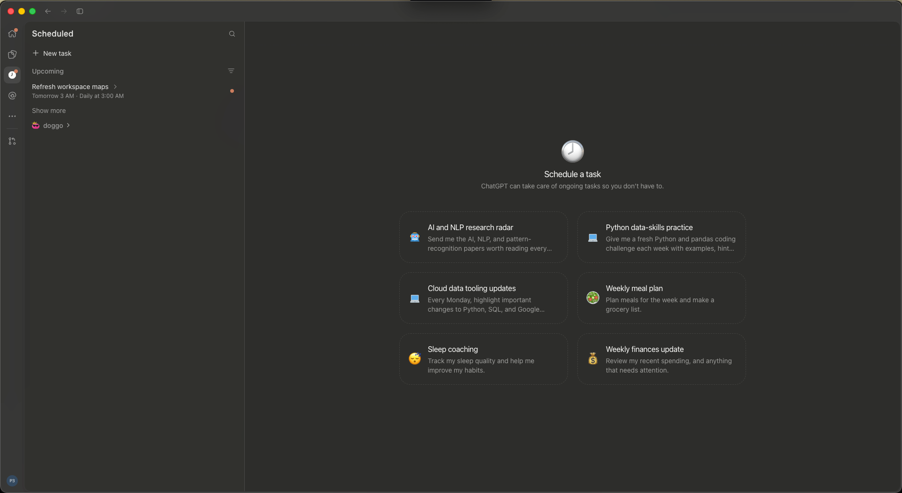
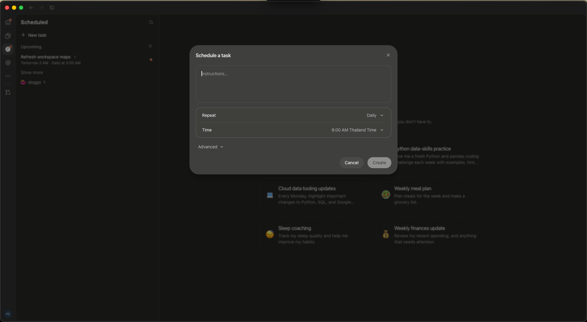
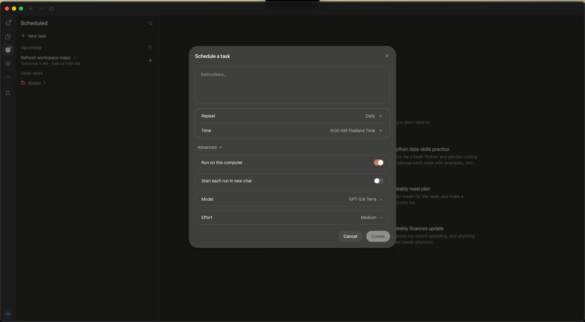

# Codex scheduled tasks research report

Date: October 8, 2026. Intended use: inform a future scheduled-task feature in Cat Code. This report describes the reference product; it does not authorize or implement changes to Cat Code.

Codex combines a simple scheduling interface with an ordinary agent-session executor. Users initially specify instructions and timing. Optional controls select where the work runs, whether runs share a chat, and which model and effort to use. Underneath, task definitions, recurrence calculation, agent execution, run review, and notifications are separate concerns.

The most important design distinction is between independent runs that create a fresh chat and follow-ups that resume a conversation. The most important reliability distinction is between an agent turn completing, the requested work succeeding, and the user reviewing its result. These should not be represented by one status.

**Evidence and scope**

| Evidence | What it establishes | Limits |
| --- | --- | --- |
| Three user-supplied screenshots | Actual landing, creation, and Advanced layouts captured on this installation | No dropdown contents, transitions, or post-create behavior |
| Installed desktop JavaScript | Scheduler, storage, notification, and UI implementation paths | Bundles contain conditional and potentially inactive variants |
| Automation TOML and SQLite records | Saved definitions, dispatch timestamps, run metadata, and review states | Legacy and account-owned representations can differ |
| Scheduled-run transcripts and app read tools | Inputs and results of real runs | Historical runs do not establish every current failure behavior |
| Official scheduled-task documentation | Public product contract and local/cloud distinction | Broader than the locally inspected execution path |

The inspected app identifies as version **26.1002.52244, build 13536**, bundle identifier `com.openai.codex`, installed at `/Applications/ChatGPT.app`. Computer Use denied access to Codex itself. Consequently, the screenshots are the authority for the visible UI; no live GUI walkthrough or new scheduled run was performed. Cloud-server scheduling internals were not inspected.

**1. Landing page and task discovery**

The captured layout has three regions: a narrow global navigation rail, a wider Scheduled sidebar, and the main content area. Scheduled uses a clock icon in the rail. The sidebar contains a search control, **+ New task**, an **Upcoming** section, a filter icon, existing tasks, and **Show more**.

An existing task is represented by its name and a smaller timing summary. The captured map task reads “Tomorrow 3 AM · Daily at 3:00 AM.” Orange dots appear beside the task and on navigation. Their interpretation as unread or attention indicators is consistent with the source, but the screenshot alone does not establish the exact condition that lit them.

With no task selected, the main area introduces scheduling using a large clock emoji, “Schedule a task,” and one explanatory sentence. Six suggestion cards form a two-column, three-row grid. Each card has a topic emoji, a short title, and a muted description truncated to approximately two lines. The topics include research, Python practice, tooling updates, meal planning, sleep, and finances. Their generation or personalization mechanism was not established.

The visual treatment is restrained: dark neutral surfaces, thin borders, rounded corners, small icons, and muted secondary text. Suggestions have dashed outlines. Existing tasks remain available while the central area explains possible uses.

Source inspection additionally confirms an animated sidebar clock asset with a rotating minute hand, an outline clock variant, and a filled selected variant for the compact rail. A feature flag can change the navigation label from Scheduled to Tasks. The screenshots show Scheduled.

**2. Basic creation flow**

Creation opens a centered modal, approximately 680 pixels wide in the supplied 1920-pixel image. The background is darkened and blurred, preserving the user's location while focusing attention on the form.

The modal presents, in order:

1. “Schedule a task” and a close icon.
2. A large multiline **Instructions…** field.
3. A grouped settings box containing **Repeat** and **Time**, separated by a thin divider.
4. A collapsed **Advanced** disclosure.
5. **Cancel** and **Create** actions aligned to the bottom right.

The captured selections are **Daily** and **9:00 AM Thailand Time**. The timezone appears in the value itself, making it visible during configuration. These are observed selections, not proven universal defaults.

There is no separate name field in this creation modal. Create appears disabled while instructions are empty. The image does not establish all validation rules or precisely when a name is generated. The bundle contains title-generation behavior, but its use by this particular modal was not traced end to end.

The basic interaction asks only what to do and when to do it. Users can reach creation without making project, model, reasoning, or execution-location decisions.

**3. Advanced creation controls**

Advanced expands within the same modal. Instructions and timing remain above it; the modal grows downward and the footer moves below the additional controls.

| Control | Captured selection | User-facing decision |
| --- | --- | --- |
| Run on this computer | On | Whether execution uses this device |
| Start each run in new chat | Off | Whether every run begins a separate conversation |
| Model | GPT-5.6 Terra | Which model performs the work |
| Effort | Medium | The reasoning-effort setting |

Each setting occupies its own rounded, bordered row. Toggles sit on the right, with orange indicating the enabled local-execution option. Model and Effort use right-aligned values and downward chevrons.

The screenshot does not show a project selector, notification selector, worktree selector, or recurrence-rule editor. Those capabilities exist on other inspected surfaces, but should not be added to a reconstruction of this modal without further evidence.

In particular, **Model and Effort are visible while “Start each run in new chat” is off**. Earlier source-based generalization that those controls disappear for every shared-chat task was too broad. A separate existing-chat detail editor hides some inherited settings; this creation flow exposes them, potentially to configure the task's initial conversation. That explanation remains an inference until the resulting chat is observed.

**4. Other configuration surfaces found in the bundle**

The bundle also contains a task-detail editor and a chat-side editor. These should be treated as additional surfaces, not substituted for the captured modal.

The detail editor contains conditional controls for execution location, conversation destination, project, model, reasoning, schedule, and notifications. Destination choices include a new chat each run, a new chat for the task, and another existing chat. Cloud and existing-chat selections change which fields are available.

The chat-side editor distinguishes a proposal from an existing saved task. A proposal has explicit **Create scheduled task** or **Apply changes** actions. In the inspected saved-task path, valid changed values trigger an update automatically, with **Retry save** after a failed save.

Task rows expose actions on hover or keyboard focus. The action menu includes **Run now**, **Pause/Resume**, and **Delete**. Run now uses a play-triangle asset; pause uses a circled pause asset. History components contain previous runs, timestamps, result summaries, Open chat, read/unread, and archive actions.

Schedule components support ordinary recurrence controls and an advanced RRULE editor with validation. The available modes vary by surface and task type. The supplied screenshots establish only the closed Repeat and Time controls, not their complete menus.

**5. Execution model**

| Dimension | Standalone automation, internally `cron` | Conversation follow-up, internally `heartbeat` |
| --- | --- | --- |
| Conversation | New chat for a run | Resume target chat |
| Primary context | Saved prompt, normal project instructions, files, automation memory | Existing conversation plus follow-up instructions |
| Target | Project, projectless workspace, or supported worktree execution | A specific chat |
| Model selection | Automation configuration/defaults with availability checks | Existing collaboration settings with availability checks |
| Default notification label in inspected editor | All runs | Important updates |
| Typical use | Independent daily reports or maintenance | Monitoring and continuing ongoing work |

The local scheduler is an in-process timer. The internal name `cron` does not imply a Unix crontab. Local jobs require the app and machine to be available. Public documentation separately describes cloud tasks, which do not provide direct access to a folder on the user's computer. [Official scheduled-task documentation](https://learn.chatgpt.com/docs/automations)

```mermaid
flowchart TD
    A[Saved task definition] --> B[Calculate and persist next occurrence]
    B --> C[Scheduler finds a due task]
    C --> D{Conversation mode}
    D -->|Standalone| E[Prepare workspace and create chat]
    D -->|Follow-up| F[Check eligibility and resume chat]
    E --> G[Start normal agent turn]
    F --> G
    G --> H[Tools and permission handling]
    H --> I[Observe completion and result]
    I --> J[Review state and notification delivery]
    C --> B
```

A standalone launch resolves its destination, model, and permission configuration; inserts a temporary `pending:<UUID>` run; prepares the workspace; creates a normal chat with `threadSource: automation`; replaces the pending identity with the chat ID; and starts an ordinary agent turn. Lifecycle tracking then updates the run record.

The user input given to the agent includes the automation name, ID, memory-file location, previous-run timestamp, and saved prompt. Separate instructions require reading and updating automation memory and returning an inbox title and summary. Thus a standalone run's continuity depends partly on durable files and the agent maintaining those notes, rather than automatically inheriting the previous chat.

A heartbeat instead resumes its target conversation and supplies an XML trigger with the automation ID, current time, and saved instructions. Normal conversation context remains available.

**6. Persistence and ownership**

| Data | Observed representation |
| --- | --- |
| Legacy local task definition | `$CODEX_HOME/automations/<id>/automation.toml` |
| Standalone task memory | `memory.md` in that automation directory |
| Scheduler state | SQLite `automations`, including next actual time, next nominal time, and last dispatch time |
| Standalone run history | SQLite `automation_runs`, associated with the run chat |
| Agent execution | Normal chat state and session transcripts |
| Attention state | Review status, read timestamps, inbox metadata, and notification handling |

Definitions include prompt, status, recurrence, destination, execution environment, model, reasoning effort, and notification policy. Conversation follow-ups also identify the target chat.

Newer installed code supports account-scoped backend storage of local-executor definitions, alongside legacy TOML loading and migration. Account, user, and installation ownership are checked. Cloud storage of a definition must not be confused with cloud execution. Legacy files and cached database fields can disagree, so inspection should follow the active storage path rather than assume any single file is universally authoritative.

**7. Scheduling and overlap behavior**

The inspected scheduler defaults to a 30-second tick and considers up to three eligible due tasks per tick. This is a dispatch-batch limit, not proof of a global three-agent concurrency limit. It also defers a task whose last dispatch was less than one minute ago.

Recurrence uses RRULE parsing with specialized handling for common local wall-clock schedules and interval heartbeats. Both a nominal occurrence and an actual dispatch time are persisted. Eligible schedules receive deterministic jitter between minus five and plus five minutes, derived from an installation salt, task ID, and nominal timestamp. One-shot and certain frequent or multi-time schedules are excluded.

At inspection, the map task's next nominal time was October 9, 2026 at **03:00 Bangkok time**, while its recorded dispatch time was **03:04:32**. This shows why a user-facing schedule time and an actual start time need separate representations.

For overdue recurring work, the inspected path dispatches the due task and calculates a future occurrence. It does not iterate through every missed occurrence. The schedule advances before launch, which avoids repeatedly dispatching one due time but leaves a failure window if launch subsequently fails. A specific retry exists for execution configuration still loading; a general retry policy for all launch failures was not found in this path.

Heartbeats have additional overlap controls. The scheduler tracks active automation IDs and target chat IDs, consults renderer eligibility, and checks the target's turn state. Waiting for approval, waiting for user input, recent activity, incomplete history, or a missing collaboration mode can defer the follow-up. Deferred eligibility is generally rechecked within a minute.

The heartbeat completion watcher has a ten-minute observation timeout. That releases the watcher; it does not itself terminate the running agent. Later thread-eligibility checks still matter. An equivalent completion-duration lock for standalone runs was not found in the inspected scheduler, so non-overlap should not be assumed for long standalone jobs.

**8. Permissions and workspace handling**

Scheduled execution reuses normal configuration and permission infrastructure. Effective permissions combine saved configuration, selected permission mode, and managed requirements. A schedule is not a grant of unrestricted access.

The October 8 map run used `on-request` approval policy with automatic approval review. This is concrete evidence against hard-coding an assumption that every scheduled run uses `never`. Public documentation describes unattended defaults and managed-policy constraints; effective runtime configuration still needs resolution. [Official permission guidance](https://learn.chatgpt.com/docs/automations#permissions-and-security-model)

Worktree execution uses the existing worktree machinery. The inspected launch path chooses the default remote branch, falling back to HEAD, and requests no upstream refresh during creation. Local execution uses the actual project checkout. Worktree support in the runtime does not establish that the supplied creation modal exposes a worktree choice.

**9. Results, review, and notification behavior**

Standalone run review states include `IN_PROGRESS`, `PENDING_REVIEW`, `ACCEPTED`, and `ARCHIVED`. These are not a sufficient model of task success. A completed agent turn can report success, no change, or a blocker.

Heartbeat final responses use a structured `NOTIFY` or `DONT_NOTIFY` decision and a short message. Instructions favor silence when monitored state is unchanged or non-actionable, and notification when there is a meaningful update or required user action. The inspected policy `failed_runs_only` overrides ordinary decisions using agent-turn completion status.

This creates a material distinction: a completed turn explaining that the task is blocked can still count as a successful turn for notification suppression. A future implementation should represent task outcome explicitly instead of equating it with transport or turn completion.

At scheduler startup, interrupted temporary pending records are archived and other leftover in-progress run records become pending review. This is recovery of bookkeeping, not proof that interrupted work succeeded or was automatically retried.

Archive handling also interacts with follow-up schedules: inspected code deletes heartbeats associated with an archived chat. Automatic archival of a successful standalone run has guards, including the presence of attached heartbeat definitions. Archive, retention, and recurrence therefore need a deliberate lifecycle contract.

**10. Evidence from actual runs**

The October 8 “Refresh workspace maps” run created a fresh automation chat using `gpt-6-luna` and maximum reasoning effort. Its input contained the saved prompt, automation metadata, and memory location. It updated its automation memory and ended with an inbox directive. The directive's title and summary exactly matched the stored run metadata. Its review state was `PENDING_REVIEW` despite its reported work being complete.

The October 6 run reached a completed agent-turn state but reported **blocked** because it could not establish ownership of dirty map files. Its database row also remained pending review. Together, these cases demonstrate that execution status, semantic outcome, and review status must remain separate.

The October 8 dispatch was recorded at approximately 10:07 Bangkok time despite the nominal daily 03:00 schedule. The inspected evidence does not establish the reason for that delay; sleep, application availability, and manual triggering must not be asserted as its cause without additional logs.

**11. Design implications for Cat Code**

The following are proposed design choices, not claims about uninspected Codex internals.

Preserve the captured interface's simple first layer: instructions, recurrence, and timezone-aware time. Keep execution location, conversation reuse, model, and effort behind Advanced. Show the timezone explicitly and distinguish the advertised schedule from actual run timestamps. Retain examples on the landing page so users can begin from a useful task idea.

Keep task definitions independent from runs. A task describes durable intent and timing; a run records one dispatch attempt and its result. Conversation destination and execution location should be independent dimensions: fresh versus reused chat does not inherently mean local versus cloud.

Reuse Cat Code's real session start, resume, tool, and permission paths when implementation is authorized. A separate simplified agent runner would risk diverging from interactive behavior. The appropriate Cat Code ownership and protocol changes require a separate repository design pass.

The scheduler should have durable dispatch claims, a defined crash-recovery policy, and an explicit overlap policy. Decide whether an overdue task runs once, skips, or replays missed occurrences. Decide whether a running task causes a later occurrence to queue, skip, or replace it. These should be intentional product semantics rather than accidental consequences of timer timing.

A useful run model would separately record scheduled time, dispatch time, start/end time, execution status, semantic outcome, review state, and notification decision. Semantic outcomes could include `changed`, `no_change`, `blocked`, and `failed`. User-facing notification policy can then operate on meaningful task results.

For conversation follow-ups, preserve the user's ongoing work: do not interrupt active turns or bypass pending questions and approvals. Resolve eligibility at the execution boundary, including after restart or connection replacement. Give pause, resume, delete, and chat archival predictable effects on future execution.

Prefer structured result fields or a dedicated completion tool over relying exclusively on final-response markup. Inbox summaries and notification decisions should be validated, and missing or malformed output should have a defined fallback.

**12. Remaining observation gaps**

| Gap | What would resolve it |
| --- | --- |
| Repeat and Time menus | Open-menu screenshots or an authorized live walkthrough |
| Switching local execution off | Observe the resulting fields, destination, and saved definition |
| Both conversation toggle states | Create isolated examples and inspect resulting task/chat relationships |
| Suggestion-card behavior | Observe whether a click pre-fills the modal, opens a chat, or starts another flow |
| Creation naming and confirmation | Observe a completed creation and its resulting sidebar entry |
| Existing-task editing in this exact UI variant | Capture the saved-task editor and save behavior |
| Sleep, restart, offline, and launch-failure recovery | Controlled runs with correlated scheduler and session logs |
| Notification appearance and delivery | Observe quiet, meaningful-change, blocked, and failed outcomes |
| Standalone overlap behavior | Observe two due occurrences while the first remains active |

These gaps do not prevent architecture planning. They do prevent claiming an exact reproduction of every interaction or a complete account of cloud execution.

**Source index**

The screenshots are copied unchanged into this report's adjacent assets directory. No scheduled task was created, changed, resumed, or triggered for this investigation.

The installed source was read from `/Applications/ChatGPT.app/Contents/Resources/app.asar`. The following bundle identifiers and symbols make the findings traceable for this version; minified names are not stable across releases.

| Source | Relevant anchors |
| --- | --- |
| `.vite/build/main-B6ZOwXa3.js` | `Ol`: scheduler; `Al`: schedule advancement; `Fl`: standalone launch; `Ll`, `ql`, `Xl`: heartbeat dispatch, eligibility, and observation; `wl`: permissions; `Sl`: worktree start ref |
| `.vite/build/bootstrap-CTpobVUg.js` | `KO`, `qO`, `XO`, `ZO`: recurrence and jitter; `SO`, `MO`: definition loading; `_c`: interrupted-run settlement; `gc`, `xc`: review/inbox updates; `fb`: notification decisions; `iM`: turn tracking; `Tk`: archive coordination |
| `webview/assets/automation-detail-panel-fa1c29719164.js` | Conditional detail controls and notification labels |
| `webview/assets/automation-side-panel-tab-855a32f9d350.js` | Proposal confirmation and saved-task update behavior |
| `webview/assets/automation-row-429803b192da.js` | Row layout and action controls |
| `webview/assets/automation-frequency-section-45e30d7d5e68.js` | Schedule controls and advanced RRULE editor |
| `webview/assets/app-initial-61c077dcc1af.js` | Scheduled navigation entry, label experiment, and static icon variants |
| `webview/assets/sidebar-tasks-icon-a5050e1add74.js` | Animated 20-by-20 clock asset |
| `~/.codex/automations/refresh-workspace-routing-map/automation.toml` | Inspected standalone definition |
| `~/.codex/sqlite/codex-dev.db` | Inspected automation and run records, opened read-only |
| `~/.codex/state_5.sqlite` | Matching chat model, approval, and source metadata, opened read-only |
| Session `01a1197a-9f7c-7c22-9e44-2cf554d64950` | October 8 successful map run; input at transcript line 9, final answer at line 511 |
| Session `01a10da7-1ff1-7482-ae95-d6e03f3d022e` | October 6 blocked map run, independently read through the app's thread tool |

Official reference: [Scheduled tasks](https://learn.chatgpt.com/docs/automations), accessed October 8, 2026. Public documentation supports the high-level behavior; precise local constants and failure handling above come from the inspected installed implementation.
